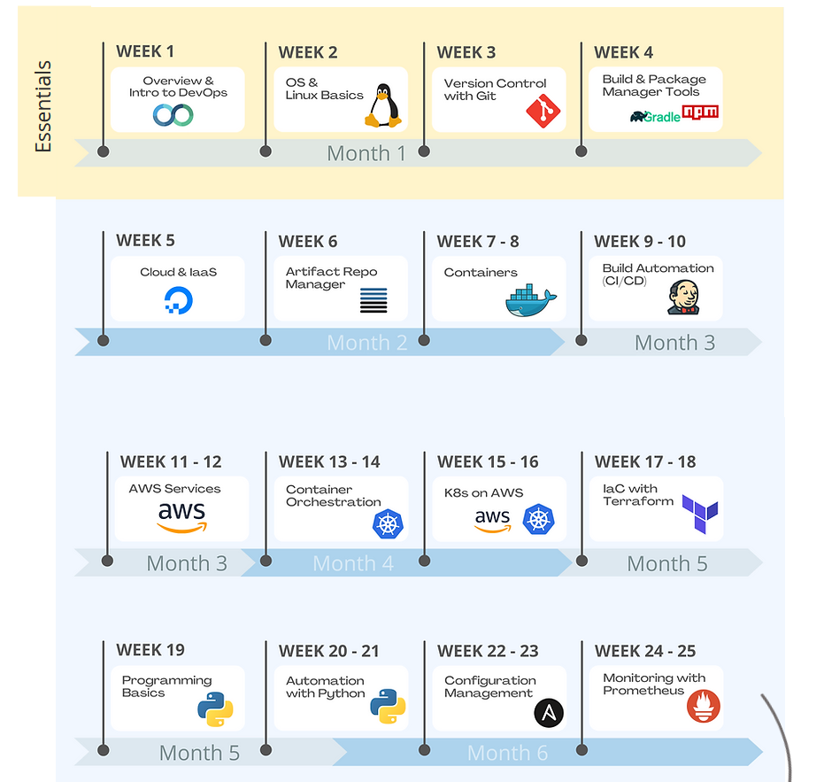

ToC:
1. [nana-techworld-devops-bootcamp (nana-TWD)](https://github.com/jadedjelly/nana-techworld-devops-bootcamp/blob/main/README.md#nana-techworld-devops-bootcamp (nana-TWD))
    - [Notes](https://github.com/jadedjelly/nana-techworld-devops-bootcamp/blob/main/README.md#Notes)
    - [Projects / Demos](https://github.com/jadedjelly/nana-techworld-devops-bootcamp/blob/main/README.md#Projects-/-Demos)
2. [Personal Devop Projects](https://github.com/jadedjelly/nana-techworld-devops-bootcamp/blob/main/README.md#Personal-Devop-Projects)

# nana-techworld-devops-bootcamp (nana-TWD)
Recommended schedule [here](https://www.techworld-with-nana.com/devops-bootcamp)

## Notes:
1. [Devops Tools Explained](notes/01_DevopsTools_Explainer.md)
2. [Operating Systems & Linux Basics](notes/02_OS_linux_basics.md)
3. [Version Control with Git](notes/03_git.md)
4. [Build Tools and Package Manager Tools](notes/04_Build+Package_manager.md)
5. [Cloud & Infrastructure as Service Basics with DigitalOcean](notes/05_Cloud_IaaS.md)
6. [Artifact Repository Manager with Nexus](notes/06_Nexus.md)
7. [Containers with Docker](notes/07_Docker.md)
8. [Build Automation & CI/CD with Jenkins](notes/08_jenkins.md)
9. [AWS Services](notes/09_AWS_Services.md)
10. [Container Orchestration with Kubernetes](notes/10_k8.md)
11. [Kubernetes on AWS - EKS](notes/11_k8_aws.md)
12. [Infrastructure as Code with Terraform](notes/12_terraform.md)
13. [Programming Basics with Python](notes/13_python_basics.md)
14. [Automation with Python](notes/14_automation_python.md)
15. [Configuration Management with Ansible](notes/15_ansible.md)
16. [Monitoring with Prometheus](notes/16_prometheus.md)

## Projects / Demos 
1. [Overview](demo_projects/Demo_README.MD)
2. [Cloud & Infrastructure as Service Basics with DigitalOcean](demo_projects/M5_Cloud_IaaS/M5_Demo_README.md)
3. [Artifact Repository Manager with Nexus](demo_projects/M6_nexus/M6_Nexus_README.md)
7. [Containers with Docker](demo_projects/M7_Docker/M7_Docker_README.md)
8. [Build Automation & CI/CD with Jenkins](demo_projects/M8_jenkins/M8_Jenkins_README.md)
9. [AWS Services](demo_projects/M9_AWS/M9_AWS_README.md)
10. [Container Orchestration with Kubernetes](demo_projects/M10_K8/M10_K8_README.md)
11. [Kubernetes on AWS - EKS](demo_projects/M11_k8_AWS/M11_k8_AWS_README.md)
12. [Infrastructure as Code with Terraform](demo_projects/M12_Terraform/M12_Terraform_README.md)
13. [Programming Basics with Python](demo_projects/M13_Python/M13_Python_README.md)
14. [Automation with Python](demo_projects/M14_Auto_Python/M14_Auto_Python_README.md)
15. [Configuration Management with Ansible](demo_projects/M15_Ansible/M15_Ansible_README.md)
16. [Monitoring with Prometheus](demo_projects/M16_Prometheus/M16_Prometheus_README.md)

## Personal Devop Projects
1. [Jenkins](demo_projects/Demo_README.MD)