# Devops Tools (Explainer)

Story walkthrough of how you start with a small application, where you dont need a large inf, but as you expand, how each Devops tool come in at different stages to help with the different challenges you will face. 

**THIS IS A VERY HIGH LEVEL OVERVIEW** of how all of these tools fit into your inf as well as your development workflows

So your a developer in your own company, and you have this great idea. Your going to build a website that books tickets to Mars in advance. So people to have to pay too much or wait in a queue in the future.

So where do you start, you get coding. you open your editor and start building you idea and hours later you have the 1st version and it’s ready to share it with the world.

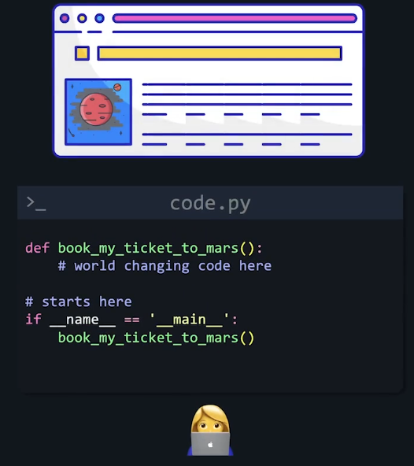

How would you do that? This code is running locally on your laptop and it’s only accessible at http://localhost:8080, even if you could share it via the laptop, at some point you need to shut it down, and no would have the ability to access it. So you need to host your app on a system that never turns off, so you identify a server, whether that be a physical server in a  data centre or a VM in a Data centre or in the cloud and you copy the code to it and run it.

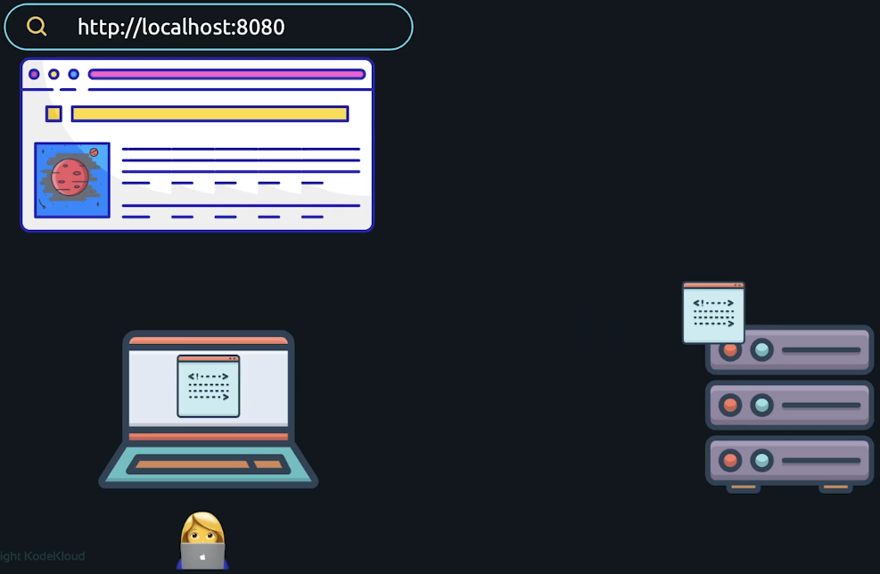

Now you can’t just run an application on a system by just copying the code to it. You need to have the system configured first to be able to run it. For example, if the application was written in python or java or any other programming languages, then you must have one of these languages or runtimes in place on the server too. If the applications uses any lib or packages, then you must have those exact versions of lib’s and packages configured on the server too in the exact same way.

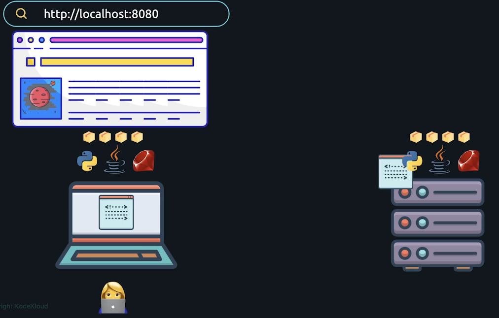

Now you develop your application on your laptop, so that becomes your development environment and the server becomes your production environment. Now once all of that is set up you now have your application running on the server, the server has an IP. So it’s now accessible at that IP, but you dont have to have to share an IP address to people so you purchase a domain name and map that to your server, now you have something to share to the world.

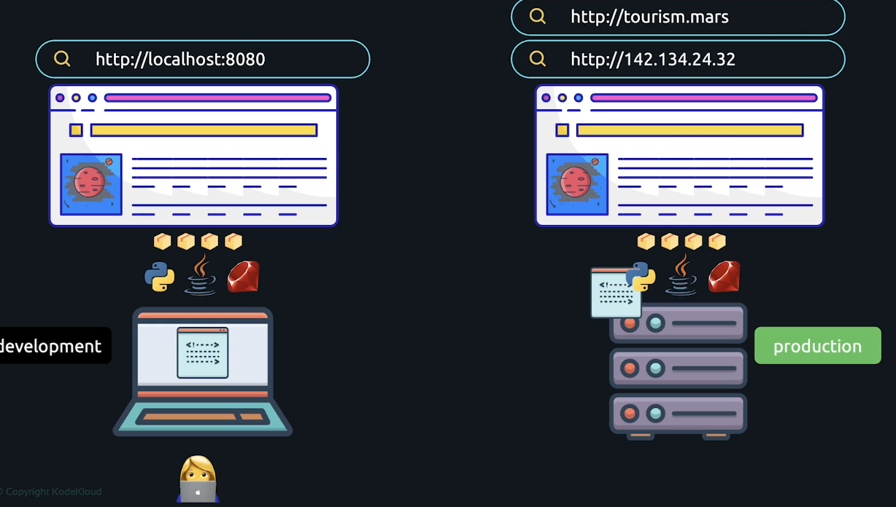

So you tweeted out, tagging a certain person and that person retweets it and off you go….

Your website is now bow famous and you have thousands of users visiting your site and booking their future travel to the red planet.

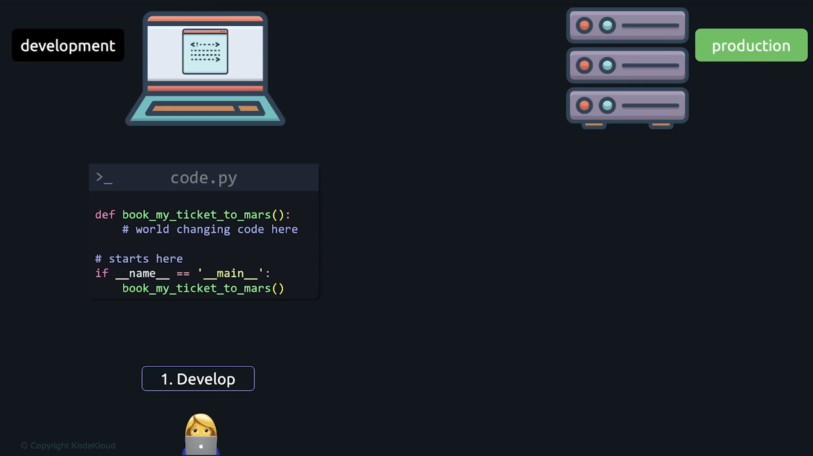

The Current workflow involves the development phase where you write your code on your laptop. This could be your favourite editor. Now the code is text format is not good enough to run it as an application by the end user. It needs to be in an executable / binary format (.exe on windows, etc), and converting code from a text format to a binary or executable format is known as building the code and there are tools available such as python setup tools or Maven or Gradle for other platforms. 

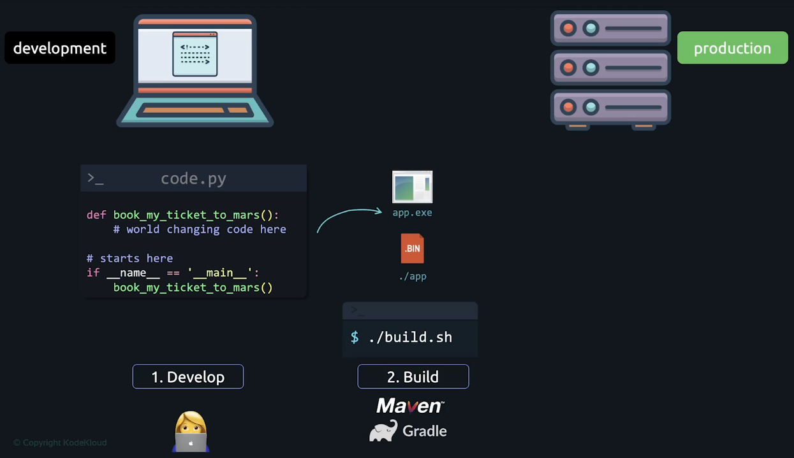

And you usually have a build script that invokes these tools to build the application now once build the executable is moved to a production environment in this case our serve and run in production and that’s referred to as the deploy stage, a simple three-step process.

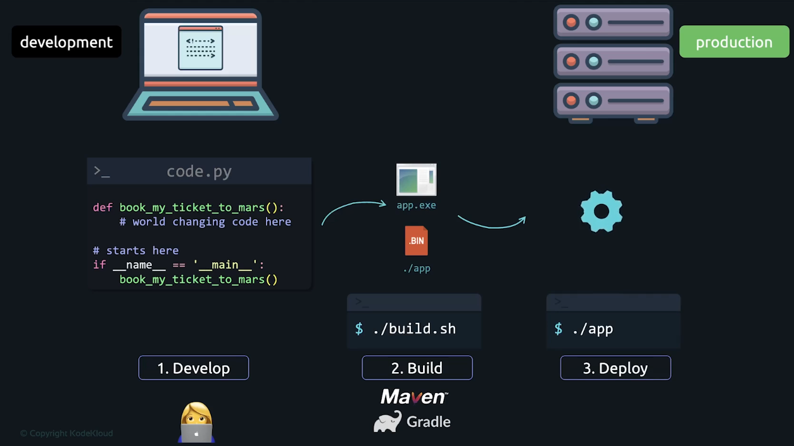

So there are so many variation to this process and different ways and tools used to do this, but we’re keeping it SUPER HIGH LEVEL for now.

You now have thousands of users visiting your site, and are requesting for more features. So you bring in your friends along as additional developers and now everyone is working on their own development environments.

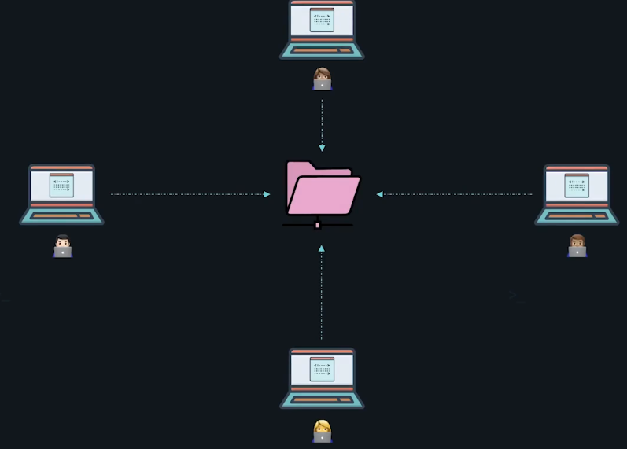

But on the same code base and they all copied their code to a central Hub whenever we’re ready and now they’re stepping on each other’s toes and working on the same files at the same time and creating conflicts and you need a solution that can help collaborate that’s where **GIT** comes in. Git helps all developers to work on the same application at the same time and collaborate efficiently. 

Now everyone installs and configures git on their machines and that’s going to help in easily pulling the latest git code from the central hub using the **git pull** command add their own changes and push it back using the **git push** command and the central Hub is a cloud-based platform that serves as a central location for all code.

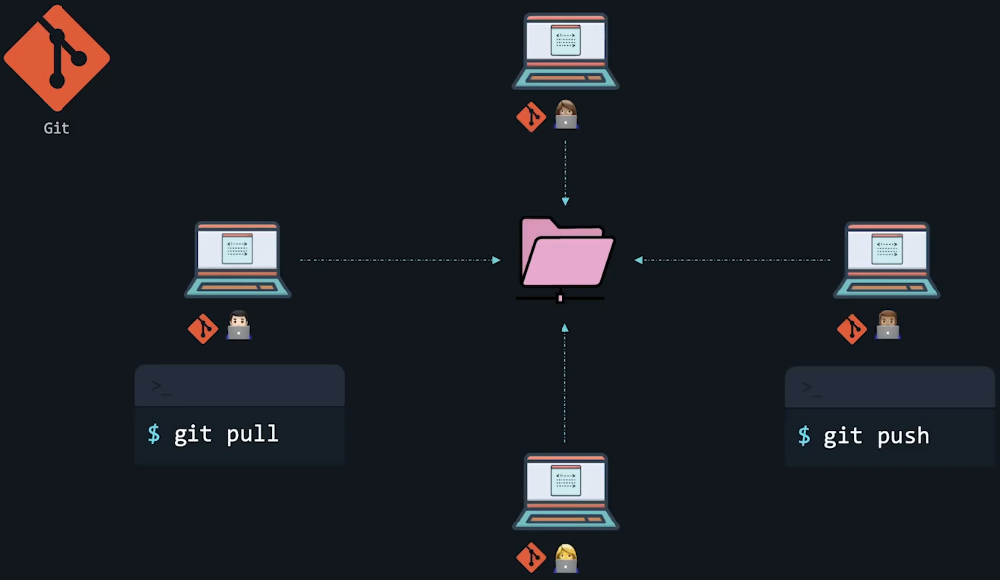

So git is the underlying technology and GITHUB is the publicly hosted git-based central repo of code where you can configure projects, organizations, users and define different access for different users and some other similar platforms are GITLAB & BITBUCKET

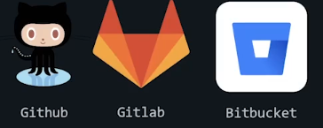

To Summarize, git is the underlying technology that enables versioning of code and collaboration between multiple developers.

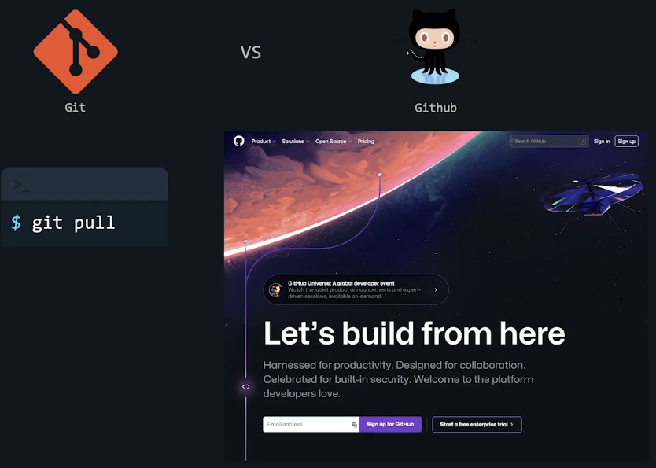

And GitHub is the git based publicly accessible repo of code where you push your code to and it has a web interface where you invite new developers. manage your project, manage issues with your projects add documentation to your code etc.

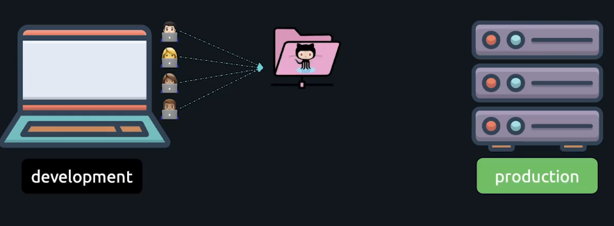

So now with 4 Developers and git & GitHub in place the development issues are sorted. However, we still need to move code manually to the production environment. Every time something new is ready. So the previous workflow involved developing code in your development environment, then building the code to an executable package and then deploying it to production however, now with multiple developers the code needs to be build with the changes contributed by all of the developers. 

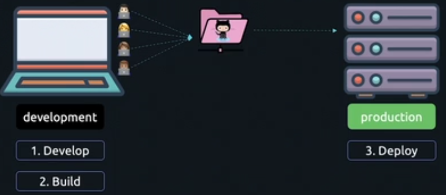

So building on the laptop itself, no longer works as an individuals laptops may not have all the latest changes. 

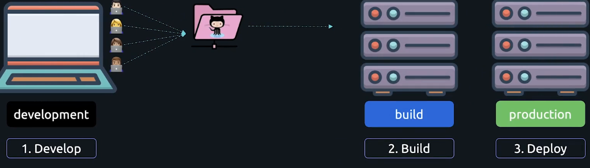

It makes sense to move the build operation to a dedicated build server that gets the latest version of the code and builds it before moving to production. So now pushing new builds to production is risky as it might have introduced new bugs or broken something that worked before, so we need to test it in a test environment, too.

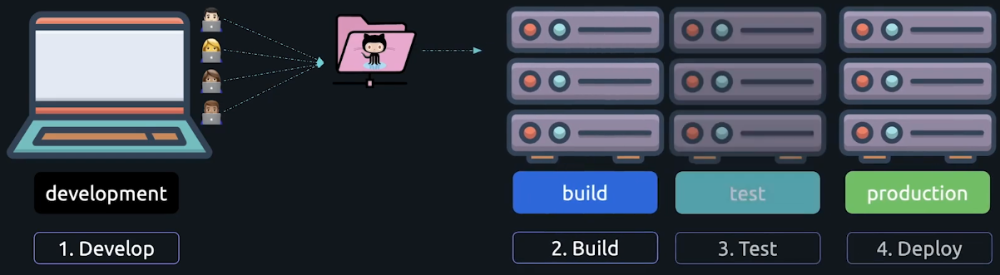

So here’s how the workflow looks now, every developer develops code in their development environment on their own laptops and pushes it to GitHub you then manually copy the code to your build server, and then builds the code to an executable, then manually copy the executable to the test server. And then test the application to make sure that it works as expected and that no new bugs are introduced and then manually copy the executable to the production environment and deploy to and because its’s a manual job and requires a set of manual tasks you decide to move all new code containing new features to the production environment once a week.

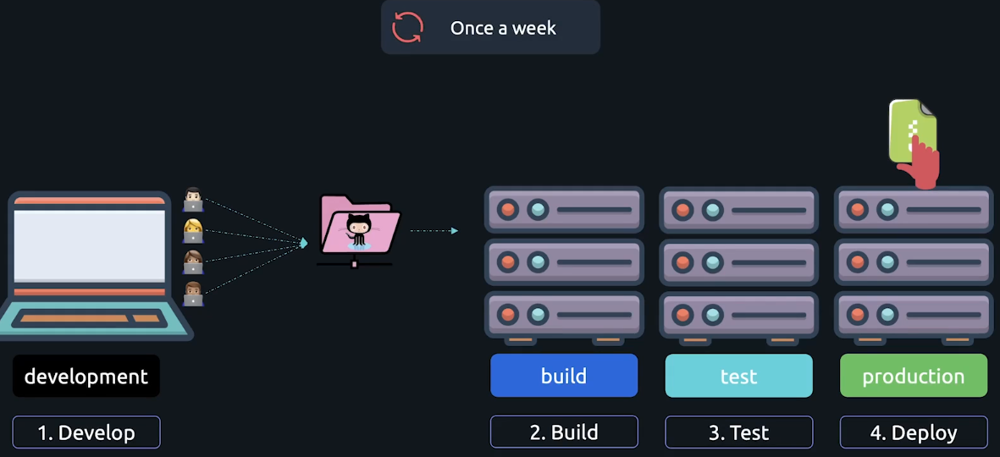

However, that’s not very well accepted by users or by your fellow developers because some of the minor features are ready and don’t necessarily have to wait till the end of the week to be pushed to production and the entire process of manual deployment itself takes a week to execute on its own. When the code base and features grow, you want to be able to release features faster and more frequently with less manual effort and that’s where CI/CD tools come in. 

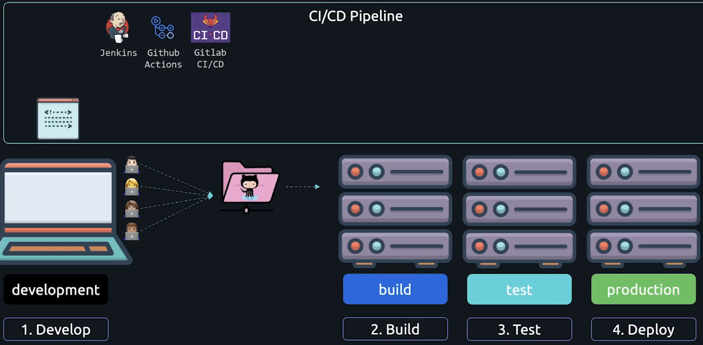

CI/CD stands for continuous integration and continuous delivery or deployment, and tools like **Jenkins**, **GitHub Actions** or GitLab CI/CD help you automate these manual tasks and build a pipeline with one of these tools configured. Every time code is pushed, it is automatically pulled from the repo to the build server and then built, and then the executable is automatically moved to the test server and tested and on successful testing.
It is automatically moved to the production server and deployed.

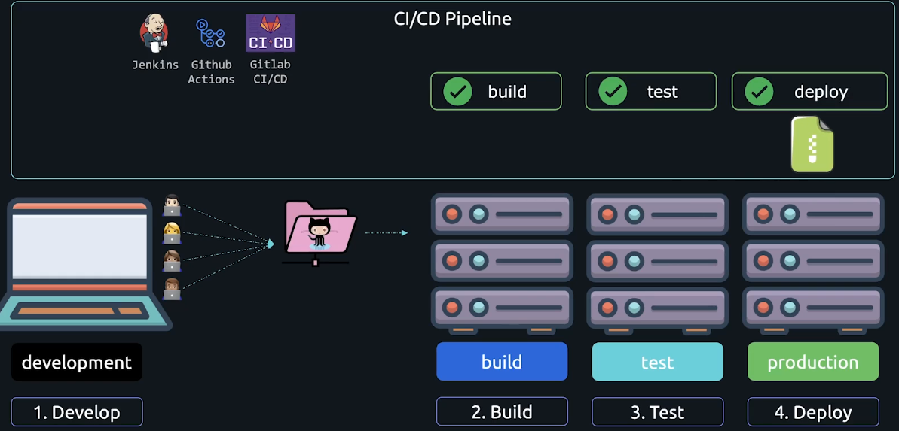

Now this allows changes, features and bug fixes to move faster through the pipeline and be deployed more often with less manual effort, ultimately enabling you & your team to resolve issues quicker, ship features faster and make your users happier.
Now with Git, GitHub, and CI/CD Pipelines in place, we have enabled our team to make changes to our application and get them to production servers seamlessly. However, it’s still not all that seamless!
Remember the dependencies and libraries that we talked about earlier the ones that are required for the application to run on any system.

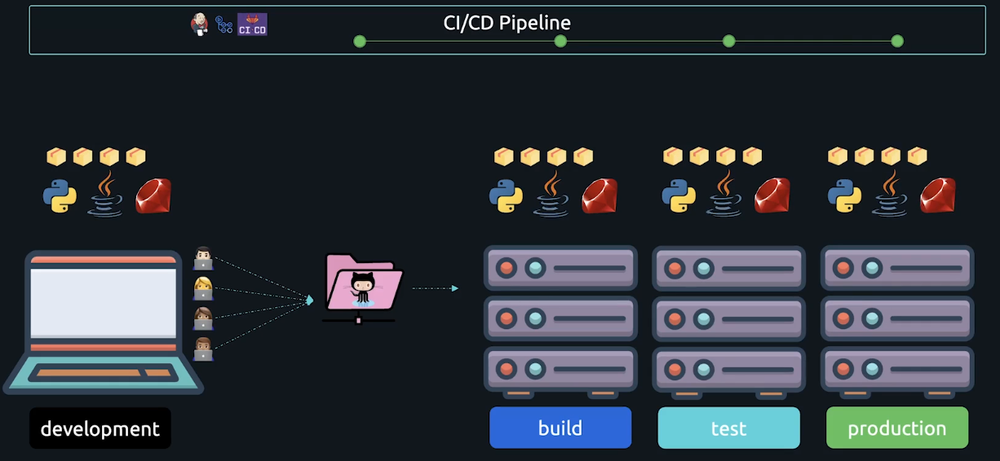

These dependencies need to be configured the exact same way on the servers and this means that if a new package is required this needs to be manually installed & configured on all the servers that this code runs and this now is still a manual task.

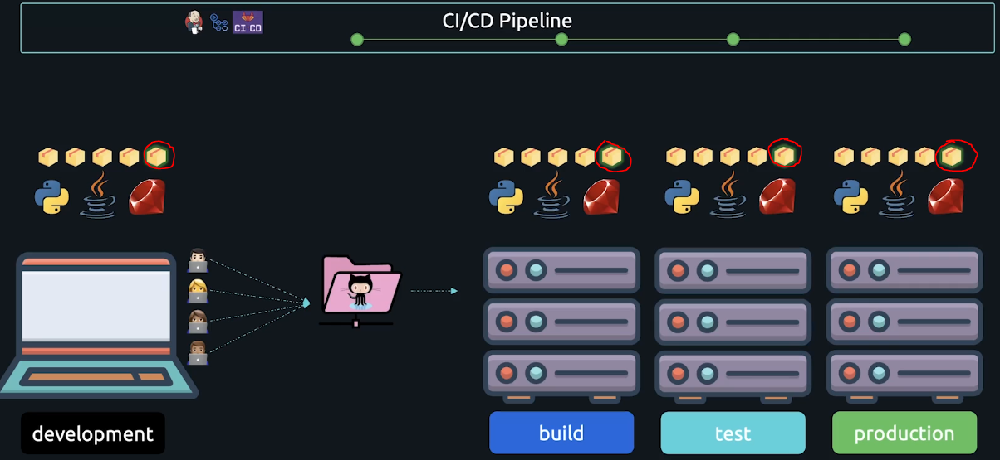

If you misconfigure one of these packages with the wrong version, it will lead to the software not working and resulting in unexpected outcomes on different systems. And that’s where containers come in. 

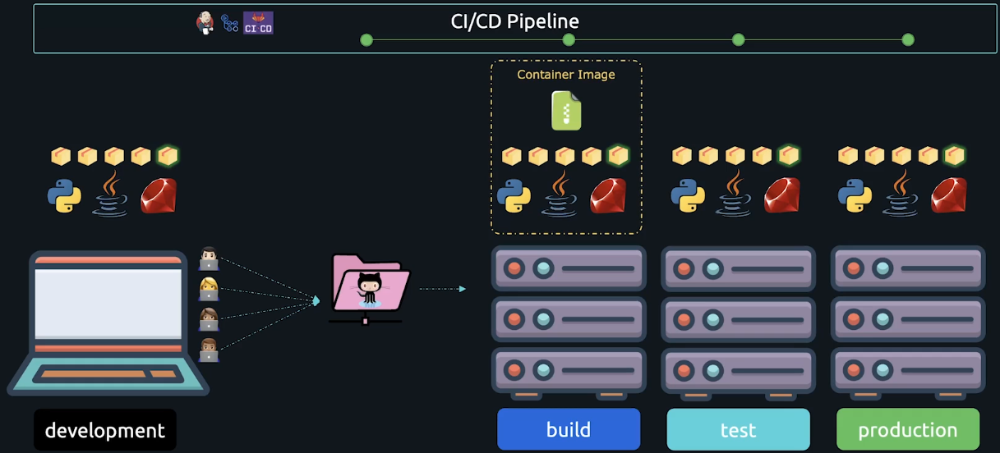

Containers help package the application and it’s dependencies into an image that can be run on any system without worrying about dependencies. So now during the build, you build a container image with the application and its dependencies packaged into it and all other systems can now simply run a container from that image without worrying about installing and configuring libraries and dependencies. One technology that enables working with containers is DOCKER. 

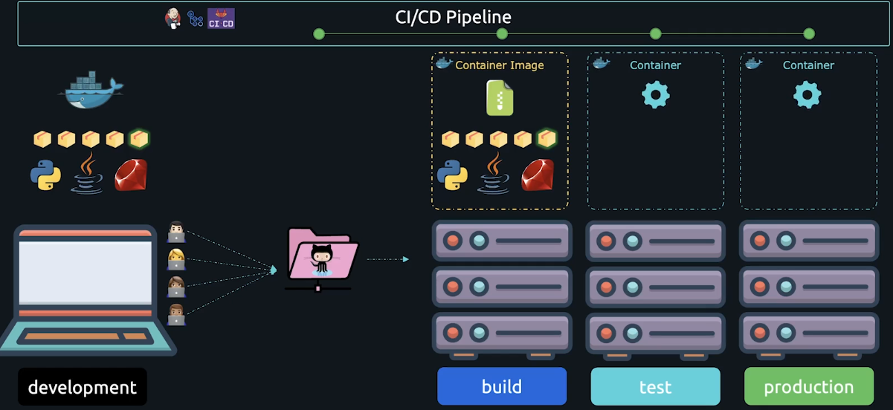

With Docker the developer can create a DockerFile which specifies what the dependencies are and that Dockerfile can be used during the build to build an image and that image can then be run on any server using a simple Docker run command

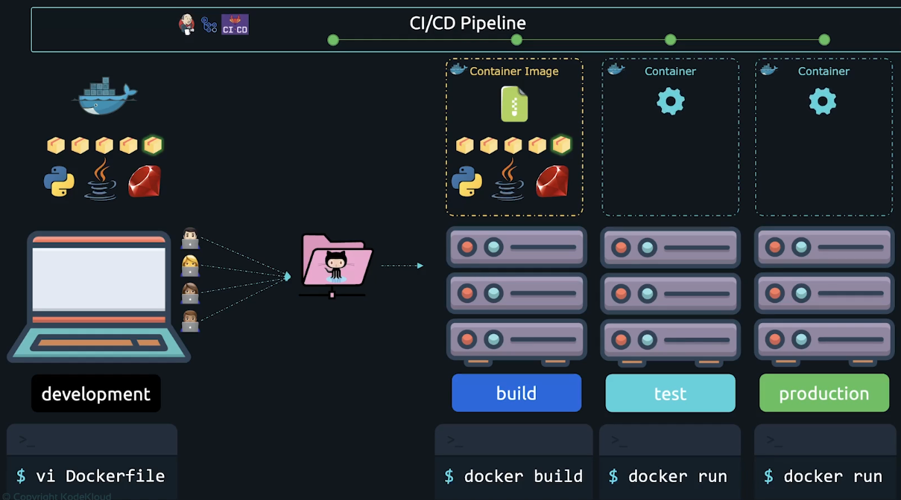

The major functionality of a container is that it enables isolation between processes. So each container is an isolated instance and this allows us to run multiple containers each having its own separate instance of the application on the same server.

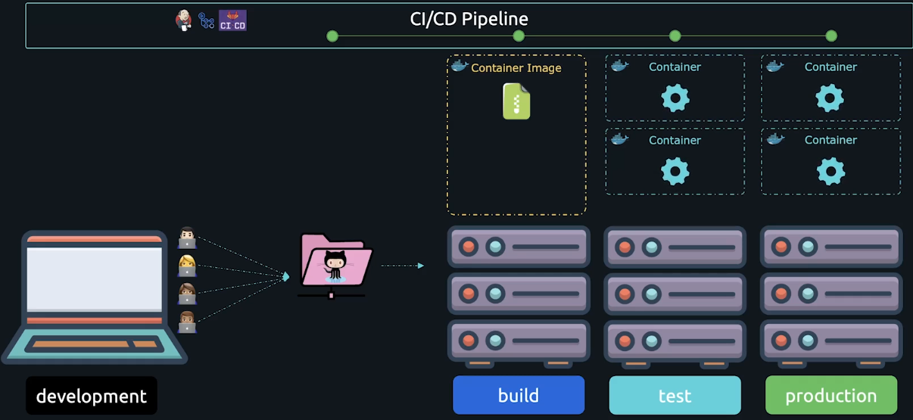

Lets focus on the production side of things, currently we have one server, but with our users increasing we want to be able to add more servers and run our application on all of them. Now that we have containers. All we need to do is run containers on them, but how do you do that the right way so that containers are spun up when the users increase and destroyed when load reduces? How do you ensure if a container fails, it is automatically brought back up? 

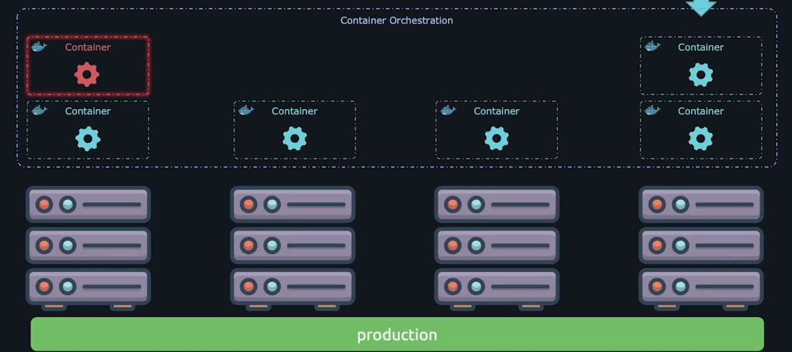

That’s where container orchestration platforms come in. KUBERNETES (K8) is a popular container orchestration platform that helps declare how contains should be deployed and ensure that it is always run in the same way as declared. It can help autoscaling containers as well as the underlying inf based on the need and managed resources on the underlying service to ensure optimal resources utilization.

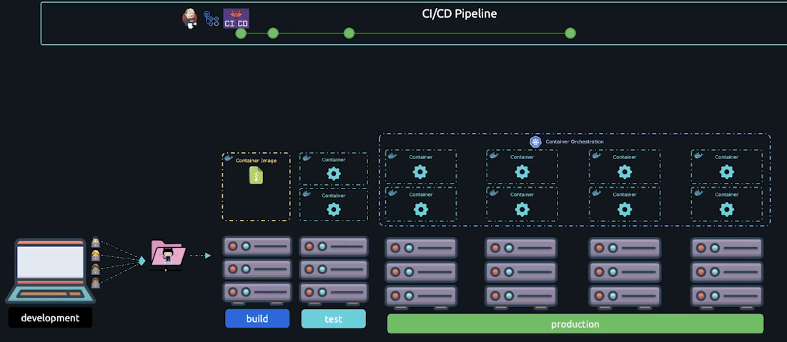

By now, we have developers pushing code to a central repo, the CI/CD pipeline then pulls the code to the build server, builds it to Docker images and then that image is used to test the application in the test environment and finally deployed in a production environment as containers by kubernetes.

The underlying inf is still one big challenge. So every time a new server is to be provisioned. It needs to be set up the exact same way as the others in the cluster.

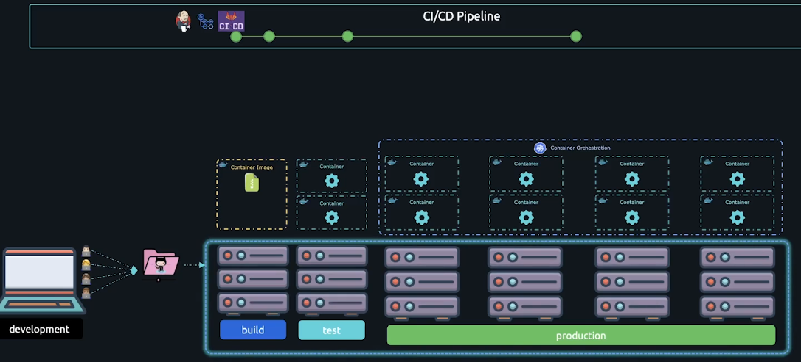

It needs to have the right resources assigned to it, the right version of OS. Probably there is some storage attached to it, and there may be some kernel settings or other software that needs to be pre-configured on it, such as the docker runtime or the necessary K8 packages and all of these need to have the exact same configuration. So this is going to be one big challenge. If you have to click through the cloud platform GUI, each time a server needs to be provisioned and this can take a lot of time and can lead to human errors in misconfiguring inf resulting in having to rebuild the entire server. To automate the provisioning of these servers, tools like TERRAFORM can be used. 

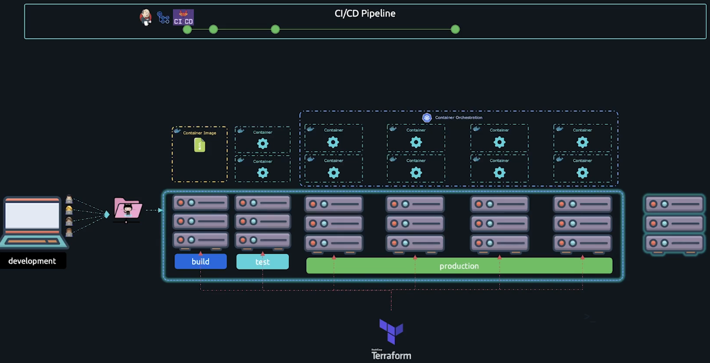

Terraform automates the provisioning and configuration of servers irrespective of what cloud platform they are one and it ensures that the service configured, are always in the same state. If someone manually changes their configuration on a server and not through Terraform, it changes it back to make sure that the state defined is preserved. The state is defined by configuring a terraform manifest file that looks like (below).

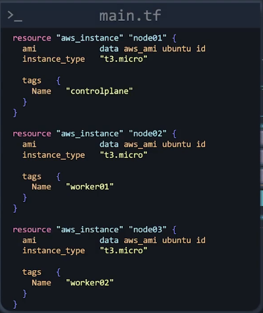

It’s a snipped from a terraform manifest file that has a list of servers and their configuration. It looks like code, because it is code and that’s why it’s called as **Infrastructure as Code** (**IaC**) all of the infrastructure configuration including the VMs, the storage buckets, the VPC etc is now stored in the form of code and is stored in repos. That way it can be considered as any other code and be tracked if changes are needed, then make changes to the code and run the terraform apply command.
Now once the servers are provisioned the configuration of these servers can be automated by tools like **ANSIBLE**.

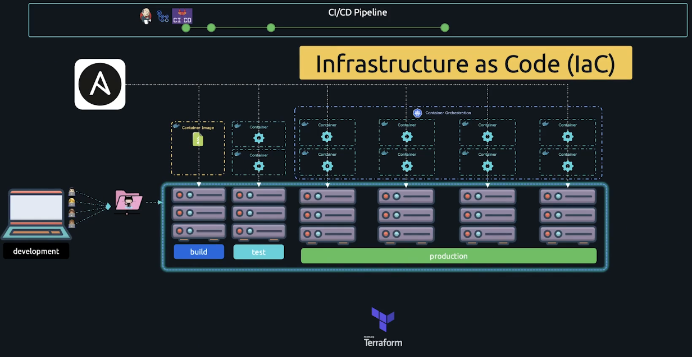

So while terraform is more of an infrastructure provisioning tool, ansible is an automation tools that helps configure these infrastructure once provisioned, note that there are many areas both terraform and ansible overlap. Both of these tools can provision infrastructure and automate software configuration on them. But each has its own benefits in different areas. So while terraform is used mostly for provisioning and deprovisioning infrastructure, Ansible is used for post configuration activities such as the installing the s/w and configuring them on those servers. 

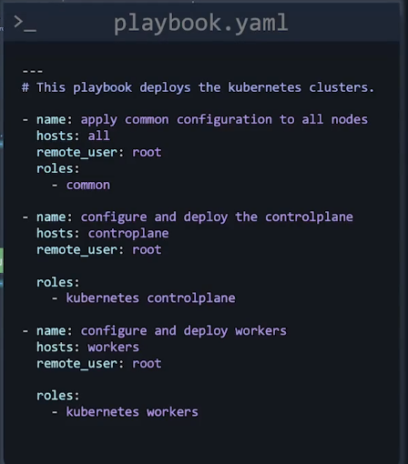

So similar to terraform ansible uses code to configure servers. It’s called Ansible playbooks and this code also goes to a repo on GitHub.
Provisioning is not all, we want to maintain it as well. We want to be able to monitor these servers and take preventive measures, you want to be able to see CPU utilization on the servers, the memory consumption, monitor the processes, identify what processes are causing higher consumption etc.

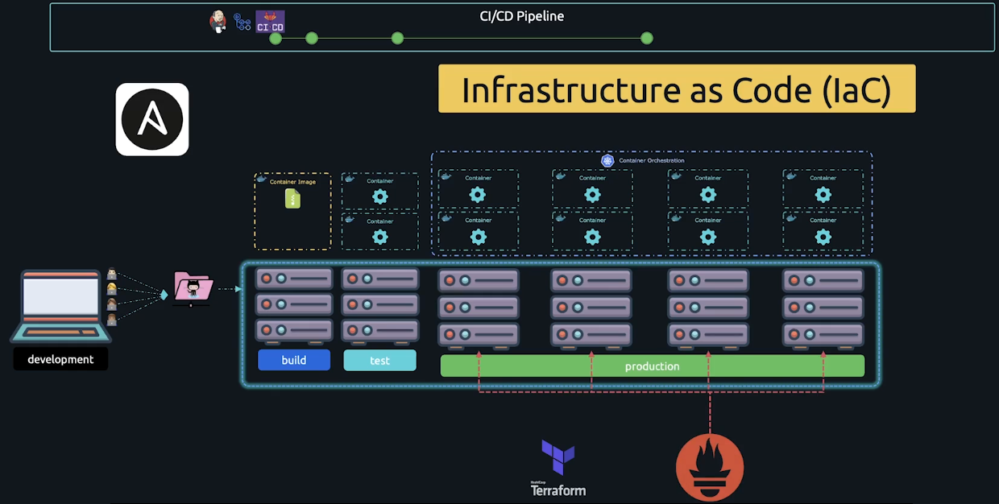

That’s where tools like PROMETHEUS come in. Prometheus collects information or metrics from the different servers and stores it centrally. Not only do we want to collect metrics, we also want to be able to visualize them graphically and that’s where tools like GRAFANA comes in.

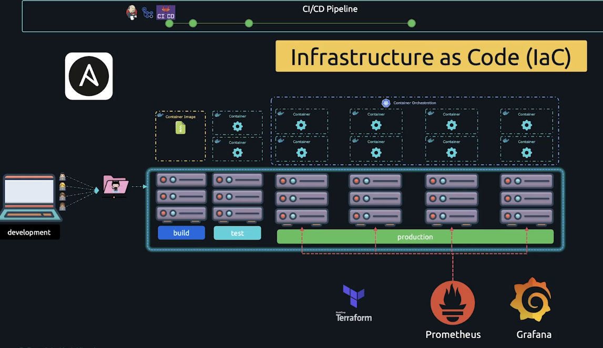

Grafana helps make sense out of the data collected by Prometheus by visualizing it into charts and graphs.

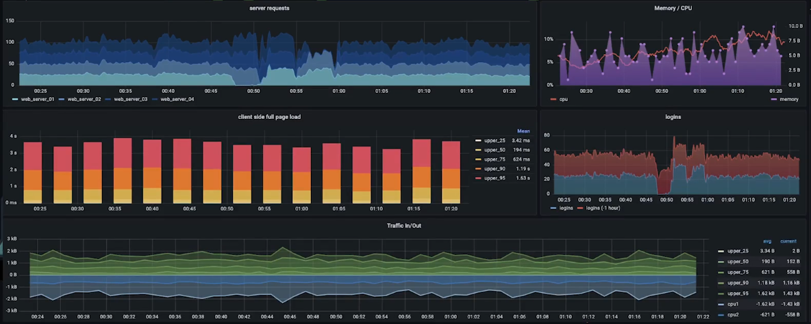

All of that together help is go from an idea to building it, deploying it. Getting it out to our users fast and it doesn’t stop there, getting feedback from our users, reviewing them, brainstorming and coming up with new ideas and implementing those ideas and is now a breeze.

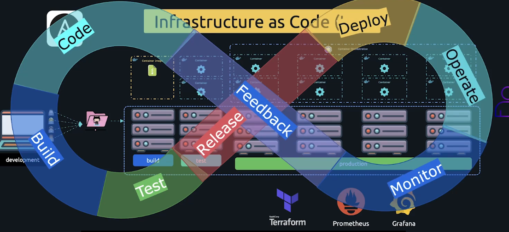

So any code pushed now goes through the pipeline and we that defined and it’s automatically built, tested, and deployed sooner resulting in multiple deploys to production every day and once deployed it is monitored and more feedback is retrieved from the user and this cycle repeats on to infinity.
Devops is a combination of people, processes and tools that work together. Going from an idea to execution, and delivering high quality software consistently.