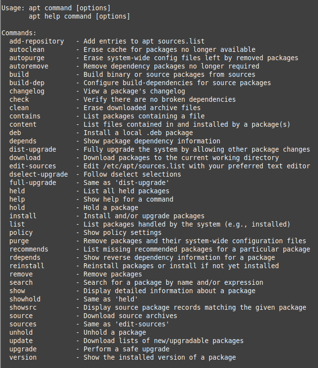

### Table of contents
1. [Operating Systems & Linux Basics](https://github.com/jadedjelly/nana-techworld-devops-bootcamp/blob/main/notes/02_OS_linux_basics.md#Operating-Systems-&-Linux-Basics)
2. [Intro to CLI & basic cmds](https://github.com/jadedjelly/nana-techworld-devops-bootcamp/blob/main/notes/02_OS_linux_basics.md#intro-to-cli--basic-cmds)
3. [Package Manager](https://github.com/jadedjelly/nana-techworld-devops-bootcamp/blob/main/notes/02_OS_linux_basics.md#Package-Manager---Install-S/W)
   - [Package Manager - Demo](https://github.com/jadedjelly/nana-techworld-devops-bootcamp/blob/main/notes/02_OS_linux_basics.md#Demo)
4. [Snap vs apt](https://github.com/jadedjelly/nana-techworld-devops-bootcamp/blob/main/notes/02_OS_linux_basics.md#Snap-vs-apt)
5. [Users & permissions - Part1](https://github.com/jadedjelly/nana-techworld-devops-bootcamp/blob/main/notes/02_OS_linux_basics.md#Users-&-permissions---P1)
6. [Groups & Permissions](https://github.com/jadedjelly/nana-techworld-devops-bootcamp/blob/main/notes/02_OS_linux_basics.md#Groups-&-permissions)
7. [File Ownership & Permissions](https://github.com/jadedjelly/nana-techworld-devops-bootcamp/blob/main/notes/02_OS_linux_basics.md#File-Ownership-&-Permissions)
8. [User Management in practice](https://github.com/jadedjelly/nana-techworld-devops-bootcamp/blob/main/notes/02_OS_linux_basics.md#User-Management-in-Practice)
9. [Managing Users](https://github.com/jadedjelly/nana-techworld-devops-bootcamp/blob/main/notes/02_OS_linux_basics.md#Managing-Users)
10. [Create a new group](https://github.com/jadedjelly/nana-techworld-devops-bootcamp/blob/main/notes/02_OS_linux_basics.md#Create-a-new-group)
11. [Basic Linux Commands - Pipes & redirects](https://github.com/jadedjelly/nana-techworld-devops-bootcamp/blob/main/notes/02_OS_linux_basics.md#Basic-Linux-Commands---Pipes-&-redirects)
12. [Standard I/O](https://github.com/jadedjelly/nana-techworld-devops-bootcamp/blob/main/notes/02_OS_linux_basics.md#Standard-input-and-output)
13. [Intro to Shell Scripting](https://github.com/jadedjelly/nana-techworld-devops-bootcamp/blob/main/notes/02_OS_linux_basics.md#Intro-to-Shell-Scripting)
14. [Bash Scripting](https://github.com/jadedjelly/nana-techworld-devops-bootcamp/blob/main/notes/02_OS_linux_basics.md#Bash-Scripting)
    - [Variables](https://github.com/jadedjelly/nana-techworld-devops-bootcamp/blob/main/notes/02_OS_linux_basics.md#Variables)
    - [Math Function](https://github.com/jadedjelly/nana-techworld-devops-bootcamp/blob/main/notes/02_OS_linux_basics.md##Math-Function)
    - [Using variables in math expressions](https://github.com/jadedjelly/nana-techworld-devops-bootcamp/blob/main/notes/02_OS_linux_basics.md#Using-variables-in-math-expressions)
    - [If-statements](https://github.com/jadedjelly/nana-techworld-devops-bootcamp/blob/main/notes/02_OS_linux_basics.md#If-statements)
    - [Exit Codes](https://github.com/jadedjelly/nana-techworld-devops-bootcamp/blob/main/notes/02_OS_linux_basics.md#Exit-Codes)
    - [While Loops](https://github.com/jadedjelly/nana-techworld-devops-bootcamp/blob/main/notes/02_OS_linux_basics.md#While-Loops)
15. [Nana - Shell Scripting](https://github.com/jadedjelly/nana-techworld-devops-bootcamp/blob/main/notes/02_OS_linux_basics.md#Nana---Shell-Scripting)
    - [Writing Shell Scripts - P1](https://github.com/jadedjelly/nana-techworld-devops-bootcamp/blob/main/notes/02_OS_linux_basics.md#Writing-Shell-Scripts---P1)
    - [Writing Shell Scripts - P2](https://github.com/jadedjelly/nana-techworld-devops-bootcamp/blob/main/notes/02_OS_linux_basics.md#Writing-Shell-Scripts---P2)
    - [Writing Shell Scripts - P3](https://github.com/jadedjelly/nana-techworld-devops-bootcamp/blob/main/notes/02_OS_linux_basics.md#Writing-Shell-Scripts---P3)
    - [Writing Shell Scripts - P4](https://github.com/jadedjelly/nana-techworld-devops-bootcamp/blob/main/notes/02_OS_linux_basics.md#Writing-Shell-Scripts---P4)
    - [Writing Shell Scripts - P5](https://github.com/jadedjelly/nana-techworld-devops-bootcamp/blob/main/notes/02_OS_linux_basics.md#Writing-Shell-Scripts---P5)
16. [Enviornment Variables](https://github.com/jadedjelly/nana-techworld-devops-bootcamp/blob/main/notes/02_OS_linux_basics.md#Enviornment-Variables)


## Operating Systems & Linux Basics


#### Linux File System

- Hierarchical tree structure
    - / (root) is at the top, roots home dir is also located here
        - /bin
            - this is the location with binaries, things like cat, ls, grep, etc are here
        - /sbin
            - this is for binaries that require sudo / root (and also ran by the system) to run like, adduser, chgpasswd, etc
        - /etc
            - sys configs are located here, so like network config, firewall configs, etc
            - system wide configs
        - /home
            - This is where standard users home files are located (think of it as c:\users\ in windows)
        - /boot
            - contains files used for booting the system
        - /dev
            - location of device files, keyboard, hard drive, etc
            - apps & drives will access this location not users
        - /lib
            - holds the libraries for /bin & /sbin
        - /mnt
            - for internal drives
        - /media
            - this is where USB drives / ext / network drives are, so when you add a usb drive, you would navigate like: cd /mnt/s
        - /tmp
            - resources required for some processes, similar to the c:\temp
        - /usr
            - this used to be the location for user home folders, but changed as time went on, its now the location for user useable programs and data (it can grow quite large, but is very important none the less)
            - a folder called /local also resides in here, and this is where programs **you** install are located
        - /opt
            - 3rd party programs you install
                - the difference between /opt & /usr/local?
                    - Some applications don’t split their code / files in different places, so binaries in bin folder, etc (examples: IDEs (installed to /opt))
        
        
        
        - /var
            - contains logs
            - /var/logs contains syslog (everything you do on your machine is logged here)
            - /var/cache
                - contains cached data from apps
    
    There’s also hidden files, these are used to prevent important data from being accidently deleted
    
    Automatically created by programs & OS
    
    they are denoted with a . (dot) infront of their names
    
    .gitignore
    
    .bashrc
    
    .bash_history
    

## Intro to CLI & basic cmds

- Basic commands:
    - ls (long listing)
        - lists all objects / files in working dir
    - ls {dir}
        - lists all objects / files in named dir 
        - eg: ls /etc/
     - cd (change dir)
     - cd .. (go back one folder (ie: say your 5 folders deep inside a folder, executing cd .. puts you up one level being 4 deep))
     - cd ~ (send you to your home dir)
     - mkdir {new dir name} (make directory)
         - can go further, and crate complex structures like: mkdir -p ~/ubuntu/{14,16,18,20,22}.04/{gold.current}


     -  touch {name of file} - creates a file
         - nano {name of file} / vi  {name of file} / vim  {name of file} - create a file & open it in the listed editors 
     - rm {file name} - removes a file (deletes it)
     - rm -r {file name} - removes a dir (add -f if there are children inside )
     - mv {file name} /destination - moves the file
     - mv {file name} {new file name} - renames the file
     - cp {file name} /destination - copies the file to /destination (add -r to copy dir)
     - scp {file name} /destination (eg: scp ascript.sh root@192.168.1.121 /tmp) - secure copy to the remote location
     - history - to view history of all commands executed
         - history 100 - shows the last 100 commands executed
     - cat {file name} - prints file to terminal
- show system & kernel
    - uname -a
        - Kernel info, version, etc
- Display OS release
    - cat /etc/os-release


- check info about your hardware
    - lshw
        - Shows a long list of all your hardware, CPU, inputs, PCI, etc
            - you can grep to look for specifics
    - lscpu
        - to view specific info about your CPU
    - lsmem
        - to view data about ram

## Package Manager - Install S/W

- 9 times out of 10 done via a package manager (like apt, yum, etc)
- rare cases you’ll do via a dpkg package

Installing via apt / yum, the system installs everything the s/w requires (dependencies)

Apt / Yum can not only install, but can update

also it’s only done from the CLI

Because applications are downloaded via these cmds, they are pulled from official repos (you can edit the repo file for 3rd parties repos, but this should be a case by case basis), this also ensures integrity and authenticity of the packages

Also, a package manager will know exactly where to put the files (recall, opt vs /usr etc and splitting files)

Package managers also clean up everything, so when you go to delete an application it removes everything (sort of, there’s a switch you need to add to the line)

#### Demo

running apt on its own will display, all the sub commands available



```bash
apt search java
```

say you looking for a specific package, in this case Java, you could just search Java, however, you’ll get 100s / 1000s of results, and they wont be the java your looking for (it’ll list anything that has “java” in its name)

seeing as we want to install the runtime of java, we use:

```bash
apt search openjdk
```

this outputs a list of openjdk version going back as far as 11, I want the recent version, so I input

```bash
apt search openjdk-21
```

i get 17 results

I would then run:

```bash
sudo apt install openjdk-21-jre-headless
```

in linux, you can also type java straight into the terminal (assuming it doesnt exist already)

and it’ll output the available versions

you can install multiple packages with the below:

```bash
apt install <package_name1> <package_name2>
```

- to Remove a package

```bash
apt remove <package_name>
```

### apt-get vs apt

They are very much alike, however apt is more user friendly (shows progress bars..)

apt-get doesnt have a search function, unlike apt

### repositories

One of the 1st commands you should run, is:

```bash
apt update 
```

this updates the package index

To see what repos linux is using , run the below:

```bash
cat /etc/apt/sources.list.d/official-package-repositories.list
```


The alternatives to using apt (for the purpose of installing apps that are not available from apt)

1. Ubuntu Software centre
2. Snap 
3. Add repository to official list of repos (add-apt-repository)

### Snap vs apt

- Snap
    - Self contained - dependencies contained in the package
    - supports universal linux packages
    - automatic updates
    - larger installation size
- apt
    - dependencies are shared
    - only for specific distros
    - manual updates
    - small installation size

## Users & permissions - P1

3x types of Users

- Root / Super User (sudo)
    - Unrestricted permissions
- Standard user
    - regular user
        - /home/[username]
- Service User
    - Relevant to Linux servers
    - each service will get its own user
        - mysqlUser
    - Best practice
    - Isolation

Always 1x Root user per machine

(Nana goes into reasons why there are 1x root user on a laptop vs a server)

### Groups & permissions

- 2 levels of Permissions
    - User level
        - Give permissions to user directly
    - Group Level
        - But a bunch of users in a group, and apply permissions to the group
        - examples:
            - Devops
            - Admin
            - Developer

## File Ownership & Permissions
- User permissions related to Reading (R), Writing (W), Executing (X)
- Each file & folder has 2x diff owners - User & group
- 3x categories of access:
     - Owner: user that owns the object
     - Group: group that owns the object
     - Others: Ppl that aren't apart of the above
- Default owner is the creater of the object
- Owning group is the primary group

- To change ownership, run:
```bash
chown <username>:<groupname> <filename>
```
- to view file permissions in a folder, simply run 
```bash
ls -l
```


### Permission Structure


| Read | 4 in octal / 100 in binary / r in other |
| --- | --- |
| Write | 2 in octal / 010 in binary / w in other |
| Execute | 1 in octal / 001 in binary / x in other |

Default permissions for files = 666
default in Directories = 777
current umask value affects the default permissions of that wd = 002 (all can read)
==Add a umask value to a login script to persist settings
### Permission objects

| User | Permissions granted to the user owner of the file and no other permissions are applied |
| --- | --- |
| Group | If the current user does not match the User owner, group membership is checked |
| Others | If the current user ID does not match the user owner of belong to the group owner then permissions for others are applied |

### Changing the mode of the file - Chmod

| chmod | used to adjust the file permissions. Using the -v option we are able to display the before and after |
| --- | --- |
|  | Can either use octal (761) or symbolic (o+x) |
|  | If we wanted to change the permission for file_perms to be read&write for everyone we would use 
chmod 666 file_perms |


## User Management in Practice

Access Control Files

- /etc/passwd
    - Stores User account information
    - everyone can read, but root can edit

When we cant this file, each line reps a user (see below)


Taking my account as an example:

```bash
john:x:1000:1000:john,,,:/home/john:/bin/bash
```

USERNAME : PASSWORD : UID : GID : GECOS : HOMEDIR : SHELL

- Username:
    - the username the user signs in with / on
- Password:
    - “x” represents the password (that encrypted password is stored in /etc/shadow file)
- UID:
    - User ID - each user has a unique ID. UID 0 is reserved for Root
- GID:
    - Group ID - Primary group ID (stored in /etc/group file) - groups have their own IDs
- GECOS:
    - Comment field for extra info about users
- HOMEDIR:
    - Home directory location
- SHELL:
    - default shell
- /etc/shadow
- /etc/group

### Managing Users

Dont edit access control files, use the dedicated commands

```bash
sudo adduser <Username>
```

Policy conformant UID & GUI values applied

automatically creates the home directory, w/ skeletal config

when you press enter on the above cmd, it’ll ask for a password (2x to confirm)

on enter, you can add additional info:

- Full name
- Room Number
- Phone number (work & home)
- Other

Then Confirm

if we cat the passwd file we should see tom

Anytime we create a user, it automatically creates a Group with the same name

- you can change the password of a user by running:

```bash
sudo passwd <username>
```

To login as a user, you can sign out and sign in as them or you can do it from the CMD, by running:

```bash
su - tom
```

you can log in as root as well, by not specifying a user, as below:

```bash
su -
```

## Create a new group

Say you want to create a new group called “devops”, you would run, the below:

```bash
sudo groupadd <group_name>
```

So when you have a group, and you add specific users to it, instead of adding permissions to each user individually you would add the permissions to the group instead

- NOTE: The system assigns the next available GID from the range of group IDs specified in the login.defs file

To view a list of groups on the device run the below:

```bash
cat /etc/group
```

So Nana explains that there are differences between:

| Interactive / user friendly | Used in scripts |
| --- | --- |
| adduser, addgroup, deluser, delgroup | useradd, groupadd, userdel, groupdel |

Say we want to change the primary group for Tom to Devops, we use the command usermod

```bash
usermod [options] <username>
usermod -g devops tom
```

since we dont need the group “tom” we can remove it, by running:

```bash
sudo delgroup tom
```

If you need to add a user to multiple groups, we replace the -g with -G then list the groups  separated with , - as below

```bash
sudo usermod -G admin,other tom
```

To add tom to another group w/o overriding the groups he is already apart of, we add -aG as below:

```bash
sudo usermod -aG othergroup tom
```

If you want to see a list of a groups a user is apart of run the below (not adding a user, the sys will list your groups)

```bash
#to view toms groups
groups tom

#to view the current users groups
groups
```

When we are creating users (esp in scripts), we don’t want to have to wait for the user to be added, then go through the whole thing of adding them to groups. During the creation of a user we can add the -G switch to add a user to groups afterwards, as below:

```bash
sudo useradd -G Devops,admin Jenny
```

The system still creates the users primary group as Jenny, but its also added to the other groups (devops & admin)

To remove a user from a group

```bash
sudo gpasswd -d <username> <group>
```

# Basic Linux Commands - Pipes & redirects

So as you know you can use cat to output the contents (text that is) to your terminal, on files that are literally a wall of text you can pipe ( | ) the output of the cat into head (top x amount of lines) or tail (Bottom x amount of lines), as below:

```bash
cat /var/log/syslog | head -n 10
#displays the 1st 10 lines
cat /var/log/syslog | tail -n 10
#displays the last 10 lines

cat /var/log/syslog | less
#this will display the file as a scrollable (similar how you navigate man pages - using spacebar) or one page at a time

```

The short of it is, you can pipe most commands together, the same way you make multiple parent directories and their child ones, or run ls /etc/ | grep cron  or history | grep apt

Say you want to send the output from a command to a file, we can use > or >>

- using > will overwrite the whole file (so if you have a file with 1000s of lines, using > will overwrite it)
- using >> will append it (add it to the last line), to the last line

## Standard input and output

Every program has 3 built-in streams

- STDIN (0) = Standard input
- STDOUT (1) = Standard Output
- STDERR (2) = Standard Error


as you know, when a command runs successfully, its error code is 0, when it doesnt it’s error code (depending on what you were trying to do) will have any code excluding 0

You can use && or ; to chain commands

# Intro to Shell Scripting

Much like anything on your home device, you hated manually having to run things, 
AUTOMATION IS LIFE

| variables | user input |
| --- | --- |
| conditionals | loops |
| passing arguments | functions |

as you know, all .sh should begin with #!/bin/bash (obviously it’s different depending on the flavour)

NOTE: Check NixOS - I can’t recall off the top of my head the location of that binary (also note, you still have to finish that setup!!!)

# Bash Scripting
# Hello World

```bash
#!/bin/bash

echo "Hello World"
```

# Variables

inside the terminal the easiest way to create a variable is:

```bash
myname="John"
#to call the above, type the below in the terminal
echo $myname
```

when referencing variables in Bash, you need to include a $

so creating the variable is without a $ and when using it **is**

Below, we have set 2x variables, “myname” & “myage” then used them in a echo command

```bash
myname="John"
myage="40"

echo "Hello, my name is $myname."
echo "I'm $myage years old."
```


In bash, there’s a difference between using ‘ & “, seems running the echos with a single ‘ then bash doesn't use the variable….

Say you want to store the output from a command in a variable, you would write it like below:

```bash
files=$(ls)
#now you can say
echo $files
```

# Math Function

To run a math problem in bash, you run it by using the “expr” command, as below:

```bash
expr 30 + 10
```

in bash * does not work for multiplication, as * is used for a wildcard

we add a \ to it, as below:

```bash
expr 100 \* 4
```

Sometimes you’ll come across symbols that have other purposes, you use the \ to use it as you intend

### Using variables in math expressions

just the same as using strings for variables, we can use numbers the same way, when it comes to adding the 2x numbers together, we use the expr again, as below:

```bash
mynum1=100
mynum2=200
expr $mynum1 + $mynum2
```


# If statements

if (something is true, do below)

the syntax is below (clearer)

```bash
#!/bin/bash

mynum=200
if [ $mynum -eq 200 ]
then
		echo "the condition is true."
fi
```

NOTE: Spacing is very important

the output from this will obviously be “the condition is true.” as it is true (200 = 200)

adding the else part of the if statement is just as easy

```bash
#!/bin/bash

mynum=201
if [ $mynum -eq 200 ]
then
		echo "the condition is true."
else
		echo "the condition is not true."
fi
```

The below output will be false as 201 does not = 200

```bash
#!/bin/bash

mynum=201
if [ ! $mynum -eq 200 ]
then
		echo "the condition is true."
else
		echo "the condition is not true."
fi
```

the ! is the 3rd line, reverses the condition. So, what it is saying now (in the condition) is:

if $mynum does not equal 200 then echo “the condition is true”

Just as there is in python, there’s a bunch of operators we can use:

| eq | ne | equal / not equal |
| --- | --- | --- |
| gt | lt | greater than / less than |
| ge | le | greater or equal to / less than or equal to |

another use case is checking whether files exist on the filesystem

```bash
#!/bin/bash

if [ -f ~/myfile ]
then
	echo "the file exists."
else
	echo "the file doesn't exist!"
fi
```

- -d = directory
- -f = file

Below we write a script to check if htop exists, if it does state it does, if it doesn’t then install it

```bash
#!/bin/bash

if [ -f /usr/bin/htop ]
then
	echo "htop is already installed"
else
	echo "htop isn't installed, I'll install it now"
	sudo apt update && sudo apt install htop -y
fi
```

Below we make this file more efficient, we also remove the condition, sort of, using the “command -v” command, this shows the current binary of the noted application. It has the same fucntion as “which” however, according to stackoverflow, the “which” command works outside the shell, and “command -v” doesn’t.
*command -v tests the existence of a command*

The below script works identical to the previous script, but is more efficient

```bash
!/bin/bash

command=htop
if command -v $command 
then
        echo "$command is already installed"

else
        echo "$command isn't installed, I'll install it now"
        sudo apt update && sudo apt install $command -y
fi
$command
```

When running if statements, the [ ] act as the test command

# Exit Codes

When a command runs without error its output (as in error code) is defined as 0 (zero), if we run a command that does create an error, say like running ls -l /misc (there’s no such dir as /misc) we get an error, if we use

```bash
echo $?
```

this will display the error code of the previously run command. so example:

running:

- ls -l /etc
    - the “error” code is 0
    - which means there was none
- ls -l /misc
    - the error code is 2, which translates to “ENOENT No such file or directory”

Error codes are defined in the below link:

**[error and warning messages](https://wiki.ubuntu.com/error%20and%20warning%20messages)**

the below, installs htop, and then prints out it’s exist code

```bash
#!/bin/bash

package=htop

sudo apt install $package

echo "the code for the package install is: $?"
```

this obvs, installs htop, running it again, giving a zero

if we change the package name to noexist, and as below:

```bash
#!/bin/bash

package=noexist

sudo apt install $package

echo "the code for the package install is: $?"
```

we get an error code of 100 (which is defined as: *100 ENETDOWN Network is down*)

The tutor adds an append statement to the script file, using the >> symbols

```bash
#!/bin/bash

package=htop

sudo apt install $package >> package_install_log.log

if [ $? -eq 0 ]
then
        echo "The installation of $package was succcessful."
        echo "The new command is available here:"
        which $package
else
        echo "$package failed to install" >> package_fail_log.log
fi
```

so instead of printing what its doing to the terminal, it adds it to a file

if you only add one > each line overwrites the previous

so instead of having 10 lines of output, you have 1

NOTE: Remove htop

The output from running the script is as below:


This output is fine, as the logs were aimed at the sudo apt line (where we would get the wall of it installing), then if it fails, we would get the output in the file we specified (…fail_log.log)

Catting the package_install_log.log we see the below (recall this is the wall of installation info)


to get the error output, we change the package to something that doesnt exist


The tutor goes on to say that this next part coming up will be something that appears in the real world that will be frustrating

If your running blocks defined by an exit code, you need to query the code after the check, in this case right after the if [ -d $directory ]

You can force an exit code, in the below example, we run an echo with “Hello World” & the exit code, in the one below that, we added “exit 1” between both echos 

```bash
#!/bin/bash

echo "Hello world"
echo $?
```

exit code = 0

```bash
in/bash

echo "Hello world"
exit 1
echo $?
```

it prints the hello world, however when we manually run the $? 

we get 1 (as in the exit code)

# While Loops

A common thing to do with while loops is to show a menu

```bash
#!/bin/bash

myvar=1

while [ $myvar -le 10 ]
do
        echo $myvar
        myvar=$(( $myvar +1 ))
        sleep 0.5
done
```

(self explanatory what it’s going to do - though sleep 0.5 not as much)

watching the script run, it takes 0.5 seconds between print outs of 1 - 10

he creates a new script, with the below:

```bash
#!/bin/bash

while [ -f ~/testfile ]
do
	echo "the test file exists"
done

echo "the file no longer exists. Exiting"
```

This look is going to look for the “testfile”

I assume because the file doesnt exist, it’ll echo the “…doesnt exist”, then we create the file, in which case it’ll print “it does exist”….

as I predicted it worked as I thought

The tutor recommends playing with while loops before the next module

# Nana - Shell Scripting

Why create scripts?
- Avoid repetitve work
- Keep history of config
- share instructions
- Login & bulk operations

Automate your work:
Backup Script > Monitoring Scripts > Server Configuration Scripts

The 1st line of any script should include the shebang !#
| sh | BASH | ZSH |
| --- | --- | --- |
|#!/bin/sh|#!/bin/bash|#!/bin/zsh|

## Writing Shell Scripts - P1
### Variables
- Used to **store data** & can be ref'd later
- the same as variables in programming languages
- store output of a command in a variable:
    - varibale_name=$(command)

### Conditionals
- Allows you to alter the control flow of the program
    - Execute a command only if a condition is true 
    - (see if statements)

### Built-in commands
- Square brackets enclose expressions
    - Shorthand for the Test command

### Boolean
- Data type that can only have 2 values:
    - TRUE or FALSE

## Writing Shell Scripts - P2

Full List of test operators:
- 

#### File test operators
| switch | Descriptions / Effect |
| --- | --- |
| -t file | Check whether the file descriptor is associated with the terminal or not. |
| -u file | Checks for "set-user-ID" (SUID) permission set on a specific file. |
| -r file | Used to find whether the file is readable or not. |
| -w file | Checks for whether the file is write permissions or not. |
| -x file | It checks for the executable permissions for a specified file. |
| -s file | Used to find whether the file size is greater than zero or not. |

#### Relational Operators
| switch | Descriptions / Effect |
| --- | --- |
| -eq | equal to |
| -ne | not equal to |
| -gt | greater than |
| -lt | less than |
| -ge | greater or equal to |
| -le | less than or equal to |

#### String Operators
| switch | Descriptions / Effect |
| --- | --- |
| = | equal (gives boolean value) |
| != | not equal (gives boolean value) |
| -z | The String is null |
| -n | The String is not null |
| str | checks if the string is not empty |

#### Writing Shell Scripts - P3

- Passing arguments to a script:
  - you can pass arguments when executing scripts, using special variables
- Positional Parameters
  - Arguments passed to script processed in the order recieved
  - indexing starts at 1: $1
  - $* - reps all the arguments as a single string
  - $# - Total number of arguments provided

#### Writing Shell Scripts - P4

- Loops
  - Execute a set of commands repeatedly till stopped / cancelled etc
  - different types of loops (While, for, until, select)

#### Writing Shell Scripts - P5

- Functions
  - Break down logical code blocks
  - can be called, anywhere in the script, multiple times
  - can accept parameters, rep'd by $1, $2, etc

## Environment Variables

- KEY=Values Pairs
- available system wide
- store info, that can be changed
- Convention - names are defined in UPPERCASE

#### 2x Use cases for env variables

##### OS stores info about the env
- When you have multiple users on a computer, each user can config their own env / acc via prefs

- OS stores all configs in env variables

##### Create your own Env Variables
(*use Case: Sensitive data for apps*)

- it's not secure ti hardcode creds directly into source code, etc
- Can set data as env vars on a server
  - creating them as env vars, we make them available in the env, all apps and processes will have access

(*use Case: Make app more flexible*)

- if your app connects to a DB, you need diff creds for diff dev, test, prod envs
- setting as env vars on each server
- now no need to change app code as the values are dynamically set


#### Setting Env vars

- *export* command is used to set env vars
```bash
export MY_VAR="myvalue"
```
**NOTE**:Env Vars created like this, are only available in the current session (closing this shell, the vars will be lost!)

displays env var in the terminal
```bash
printenv
```

#### Persisting env variables

- make env vars persistent by defining them in a shell config files(s)
- these are shell specific config files
   - EG: ~/.bashrc (if your using bash)
- Vars set here are loaded whenever a bash login shell is created
To load the new env vars into the current shell, run
```bash
source ~/.bashrc
```
- shell config files are user specific
- Set system-wide env vars in /etc/environment file

#### PATH

- PATH is an Env Var
- Value incl a list of dirs to exec files, seperated by :
```bash
/usr/local/sbin:/usr/local/bin:/usr/sbin:/usr/bin:/sbin:/bin:/usr/games:/usr/local/games:/snap/bin
```
- tells the shell which dirs to search for the executables, when you run a cmd, the sys searches for them on a 1st come 1st served


## Last 2 areas:
Networking (goes over basic stuff: what is DNS, Ports, firwalls, etc - Think Network+ basics)
Plus some comds: ifconfig, netstat, etc
SSH (goes over basic info about SSH)


