# Built Tools & Package Manager

1. [What does a package manager do?](https://github.com/jadedjelly/nana-techworld-devops-bootcamp/blob/main/notes/04_Build+Package_manager.md#What-does-a-package-manager-do?)
    - [Clone & Open Java Gradle app in Intellij](https://github.com/jadedjelly/nana-techworld-devops-bootcamp/blob/main/notes/04_Build+Package_manager.md#Clone-&-Open-Java-Gradle-app-in-Intellij)
    - [Gradle project](https://github.com/jadedjelly/nana-techworld-devops-bootcamp/blob/main/notes/04_Build+Package_manager.md#Gradle-project)
    - [Clone & open Node App in Intellij](https://github.com/jadedjelly/nana-techworld-devops-bootcamp/blob/main/notes/04_Build+Package_manager.md#Clone-&-open-Node-App-in-Intellij)
2. [Build an Artifact](https://github.com/jadedjelly/nana-techworld-devops-bootcamp/blob/main/notes/04_Build+Package_manager.md#Build-an-Artifact)
    - [Build a Maven Project](https://github.com/jadedjelly/nana-techworld-devops-bootcamp/blob/main/notes/04_Build+Package_manager.md#Build-maven-project)
3. [Build tools for Development](https://github.com/jadedjelly/nana-techworld-devops-bootcamp/blob/main/notes/04_Build+Package_manager.md#Build-tools-for-Development)
    - [Managing Dependencies](https://github.com/jadedjelly/nana-techworld-devops-bootcamp/blob/main/notes/04_Build+Package_manager.md#Managing-Dependencies)
4. [Run the Application](https://github.com/jadedjelly/nana-techworld-devops-bootcamp/blob/main/notes/04_Build+Package_manager.md#Run-the-Application)
5. [Build-JS-Application](https://github.com/jadedjelly/nana-techworld-devops-bootcamp/blob/main/notes/04_Build+Package_manager.md#Managing-Dependencies)
    - [NPM repo](https://github.com/jadedjelly/nana-techworld-devops-bootcamp/blob/main/notes/04_Build+Package_manager.md#NPM-repo)
    - [What the zip/tar file include](https://github.com/jadedjelly/nana-techworld-devops-bootcamp/blob/main/notes/04_Build+Package_manager.md#What-the-zip/tar-file-include)
6. [Other programming languages](https://github.com/jadedjelly/nana-techworld-devops-bootcamp/blob/main/notes/04_Build+Package_manager.md#Other-programming-languages)
    - [What are build tools for other programming languages](https://github.com/jadedjelly/nana-techworld-devops-bootcamp/blob/main/notes/04_Build+Package_manager.md#What-are-build-tools-for-other-programming-languages)
    - [Patterns in all of these tools](https://github.com/jadedjelly/nana-techworld-devops-bootcamp/blob/main/notes/04_Build+Package_manager.md#Patterns-in-all-of-these-tools)
7. [Publish an Artifact](https://github.com/jadedjelly/nana-techworld-devops-bootcamp/blob/main/notes/04_Build+Package_manager.md#Publish-an-Artifact)
    - [push / publish artifact into artifactory](https://github.com/jadedjelly/nana-techworld-devops-bootcamp/blob/main/notes/04_Build+Package_manager.md#push-/-publish-artifact-into-artifactory)
8. [Build tools & docker](https://github.com/jadedjelly/nana-techworld-devops-bootcamp/blob/main/notes/04_Build+Package_manager.md#Build-tools-&-docker)
9. [Build tools for Devops](https://github.com/jadedjelly/nana-techworld-devops-bootcamp/blob/main/notes/04_Build+Package_manager.md#Build-tools-for-Devops)


## What does a package manager do?

When we need to deploy an app to a production server, the app needs to packaged so it can be used, this is where a package manager comes in. It Packages the application into a **single moveable file** (*artifact*) aka “**building the code**”

- What is an artifact?
    - This includes the app code + all it’s dependencies
- Building the code, means?
    - Compiling the code
    - compressing the code
    - package heaps of files into 1

Remember when we were running Jenkins, we build the basic java file so we could deploy it, that what that is…

- What is an artifact repo?
    - Storage for artifacts
        - Nexus, JFrog
    - Deploy artifacts multiple times

Different artifact files for different languages

- Java > JAR / WAR files
- JS > Zip or Tar files

Different build tools for different languages:

- Java > Gradle / Maven
- JS > NPM

Nana uses Intellij - pretty good features, automatically downloaded Maven & dependencies during the indexing of the project

NOTE:

1. When running Java apps, you’ll need to set the JDK in Project settings
2. The Git tab, also shows all Git commits (very cool)
3. **You are not going to be working with the code, but around it!!**

The next part is to install Maven - I did it via apt and had no issues (inc no dependency issues)

once installed, run the following inside the terminal of Intellij

```bash
mvn package
```

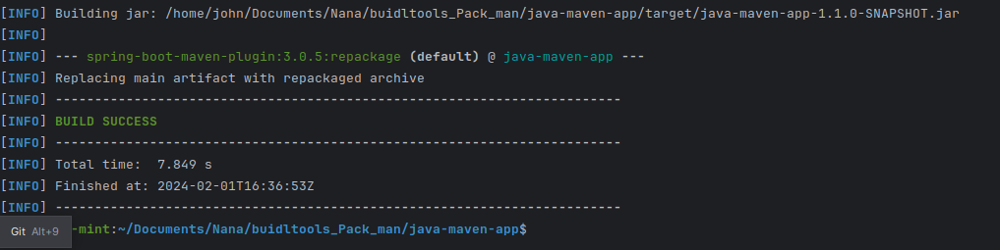

### Clone & Open Java Gradle app in Intellij

- Download intellij from their site
- open the “java-maven-app”
    - This will automatically install maven, and other dependencies
- Then we install openjdk 17 with brew,
    - Dont forget you need to set the path for java
- install maven with the below command:
    - brew install —ignore-dependencies maven
- now from inside the project folder, we run
    - mvn package

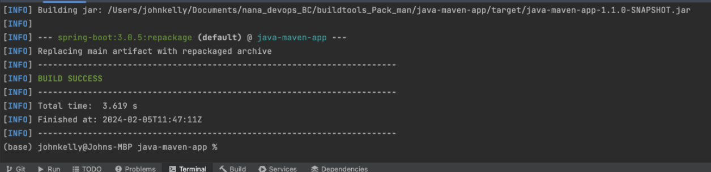

We close the project ( File > close project)

### Gradle project

- From terminal run
    - brew install gradle

Clone the Java-app

set the gradle properties to the correct folder

then from Intellijs terminal, run the below:

- gradle build

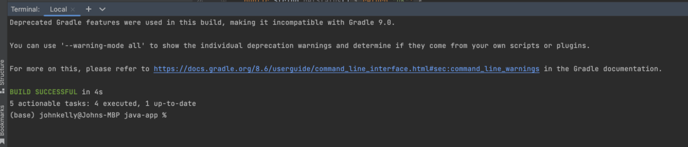

### Clone & open Node App in Intellij

Open “react-nodejs-example”

we need to install nodejs & npm

npm gets installed along side node

- from inside the api folder, run
    - npm start
    - this opens up port 3080

# Build an Artifact

How do you build an artifact?

- Using a build tool
    - like Maven, gradle, npm, etc
- These will specific to the programming language
    - Java
        - Maven / Gradle
- These tools install the dependencies
- Compile and compress your code

Whats the difference, between Maven & gradle?

| Maven | Gradle |
| --- | --- |
| Uses xml | uses groovy |
| both use cli |  |

as we saw in the example above, to build with Gradle, simply run (from inside the project)

- gradle build

After we run the command, we can see a new folder that has been created, 

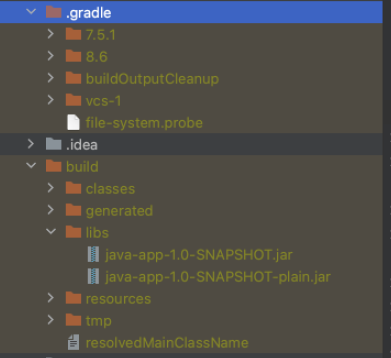

and as you can see, theres a jar file “java-app-1.0-snapshot.jar”

### Build Maven Project

and just as above, we run (again inside the project folder)

mvn package

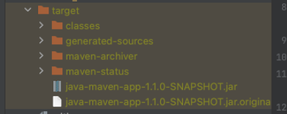

again, a new folder is created “target”, and again jar files have been created

# Build tools for Development

### Managing Dependencies

You will need these build tools locally when developing the app, you need to be able to run the app, run tests, and to publish the artifact to repos

Maven & Gradle have their own dependencies files

- In maven:
    - They are in the “pom.xml” file

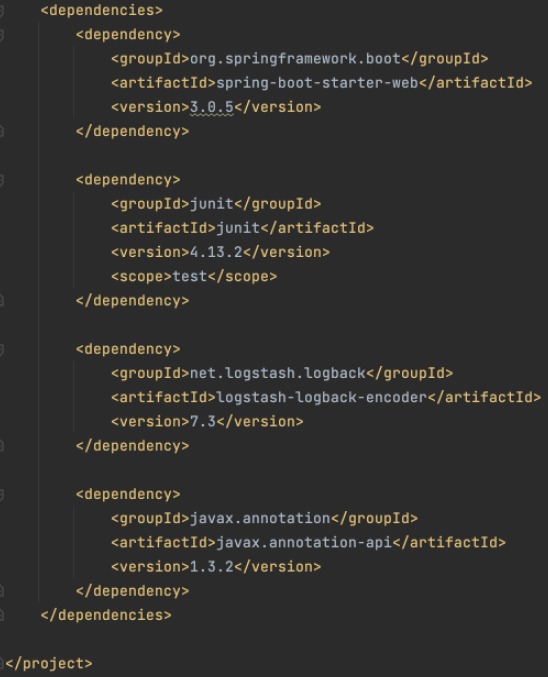

- In gradle,
    - They are in the build.gradle file

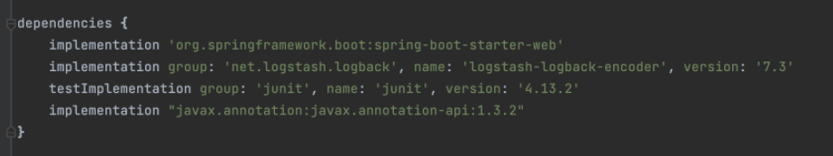

Where do these dependencies come from?

They can be found at (gradle uses the same) - mvn Repositories

[https://mvnrepository.com/](https://mvnrepository.com/)

These dependencies work the same as they do in your python / powershell scripts, you download & install them locally, you call them 

```python
import beautifulsoup
```

dependencies can be found in a hidden folder called “.m2”

# Run the Application

How to run the application

You would have the application on a server, along with the required (in this case) java runtime, you would then run:

- java -jar [the name of the jar file]

# Build JS Application

- JS apps, dont have special artifacts, so they can be made into:
    - TAR or ZIP files
- The alternatives to build JS apps, as we do for Java files, are:
    - NPM & Yarn
- package.json file is used for dependencies

NOTE: npm & yarn are package managers and not build tools (similar to homebrew or apt), used to install dependencies for transpiling (*the process of converting source code from one high-level programming language to another*) JS code

From inside the nodejs project, via intellij

we run

*npm install*

this will install the dependencies as they are listed in the package.json file

### NPM repo

npm & yarn use their own dependencies

[npm | Home](https://www.npmjs.com/)

npm has it’s own commands, like:

```python
npm start #start the app
npm stop #stop the app
npm test #test the app
npm publish #publish the artifact
```

### What the zip/tar file include

- app code, but not dependencies
    - this means if you want to run that artifact on a server, the server itself will need those dependencies installed locally
- so you install the dependencies > unpack the zip/tar file > run the app

to create an artifact with npm, you run the below:

npm pack

this creates the tar file as below:

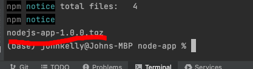

When it comes to packaging code, you need to package the frontend and backend **separately**

 or you can have a “common” package for both

So if your backend & frontend are both JavaScript, you can either have a separate package.json file or a common package.json file

Using the “react-nodejs-example”

the folder called “api” is the frontend stuff and “my-app” is the backend stuff. Each has it’s own package.json file

Unlike nodejs, frontend/react code needs to be transpiled (converted from one high level language to another)

Browsers don’t support latest JS versions or other fancy code decorations, like JSX

It also needs to be compressed / minified, the reason behind this is, the larger the files the longer it takes to load (obvs)

we use separate tools for that:

**Build Tools / Bundler**

The most well known is “Webpack” w/ react

Transpiles | minifies | bundles | compresses the code

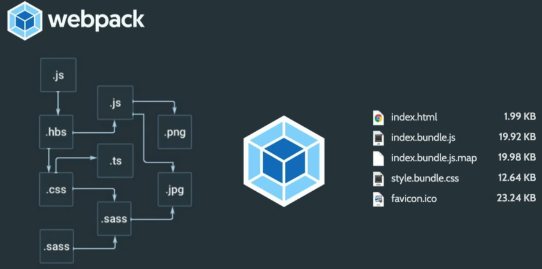

The saw it sounds, you can configure the tool for what files need to be included, which ones need to be bundled, etc

From intellij, in order to install the dependencies for the frontend stuff, we need to cd into the api/ file 

then run

```python
npm install
```

with that, all the dependencies are downloaded, as well as “webpack”

we then run

```python
npm run build 
```

what the above does, is it calls the webpack, as its defined under scripts

A new file is created called “server.bundle.js” - heavily compressed, and uglified (as Nana puts it)

if youre running a react frontend and a java backend, you package everything into a WAR file, using npm / Yarn to handle dependencies

# Other programming languages

### What are build tools for other programming languages

- for Python
    - You use pip to install dependencies
    - zip / tar the app, unpack on a server, install the dependencies and away you go

## Patterns in all of these tools

- Each uses a dependency file
    - package.json | pom.xml | build.gradle
- All have some sort of Repo for dependencies
- Each has it’s own Command line tools
    - Test | start app | stop App | etc
- each uses it’s own package managers
    - pip | gradle | maven | npm | yarn

Which ever languages companies use, the concepts should be the same 

# Publish an Artifact

### push / publish artifact into artifactory

the Build tools we used (Maven, gradle, etc) they have the ability to do that, when you need them you would use curl, wget, etc

You wouldn’t do above to push to a server, instead you would use Docker (I thought it odd, till she cleared that up)

# Build tools & docker

Docker made building & distributing artifacts easier

you work with a single artifact type

Docker image

These are build from the applications

no need for multiple repos

no need to install dependencies

….

Nana is going into the advantages of Docker over using build tools etc to deploy applications. You would still use them but not to the same extent. 

Researching Maven / Gradle apps with Docker, it looks to be you still use these tools at the “ENTRYPOINT” value

as the video went on, its highlighted that you **STILL** need to **BUILD** the java Application

so ye, it’s going to be used (the jar file that is) for the entrypoint value (java - jar [etc])

timeline of building a java app w/ Docker:

Use maven to build artifact > docker image (this section will include the DockerFile, which handles how the app is built) > deploy with Docker

whereas previously:

maven > artifact repo > push to server > install dependencies locally > run app

(DockerFile example for nodejs app)

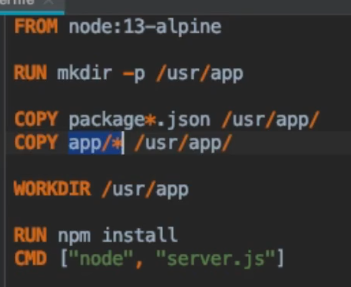

as you can see npm is still in use (as part of the RUN command

(DockerFile below for the Java app)

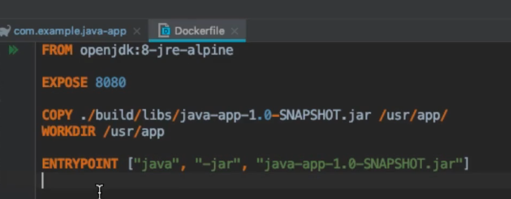

# Build tools for Devops

So the question is, as a devops Eng why would you need to know these Build tools? Well seeing as the developers writing the code use them to Run the app or test the app, they configure the dependencies, it’s your job as the Devops Engineer to build the apps! You need to know how the dev would build it, how they run tests etc, plus if something breaks you need to know where it breaks so you can pass along the question to the devs (basically what you did in Arkk on a regular basis)

Take Jenkins (or another CICD tool)

Build Docker Image > Push to repo > Run on server

Its your job to configure the build automation (using a CICD tool), in order to build the application and deploy to a server

Just as we did for the Jenkins tutorials on youtube, we installed dependencies > ran code checks and other tests > built the app > pushed to repo or deploy to a server