# Cloud IaaS w/ Digital Ocean
1. [Intro to Cloud & IaaS](https://github.com/jadedjelly/nana-techworld-devops-bootcamp/blob/main/notes/05_Cloud_IaaS.md#Intro-to-Cloud-&-IaaS)
   - [DEMO: Setup a Server on DigitalOcean](https://github.com/jadedjelly/nana-techworld-devops-bootcamp/blob/main/notes/05_Cloud_IaaS.md#DEMO:-Setup-a-Server-on-DigitalOcean)
   - [DEMO: Deploy Application on Droplet](https://github.com/jadedjelly/nana-techworld-devops-bootcamp/blob/main/notes/05_Cloud_IaaS.md#DEMO:-Deploy-Application-on-Droplet)
   - [Create & configure a linux user on a cloud server](https://github.com/jadedjelly/nana-techworld-devops-bootcamp/blob/main/notes/05_Cloud_IaaS.md#Create-&-configure-a-linux-user-on-a-cloud-server)

# Intro to Cloud & IaaS

Demos:

- Create a virtual server
- Deploy app on server & config access
- common concepts and best practices

You know what IaaS is…. you worked on Azure for 5 years - this is being skipped

### DEMO: Setup a Server on DigitalOcean

on DO, servers are called Droplets, based on Ubuntu

(using jk_ansible key)

- created ubuntu droplet
- used jk-ansible key
- ssh’d into it

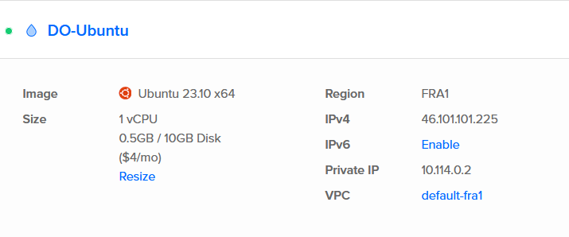

- we configure the firewall
    - we set it that the MacBooks ext IP address is the only device that can access ssh
- the UI is basic, if you needed another droplet to the rule, you can search and add it from Firewall > droplets > add it here

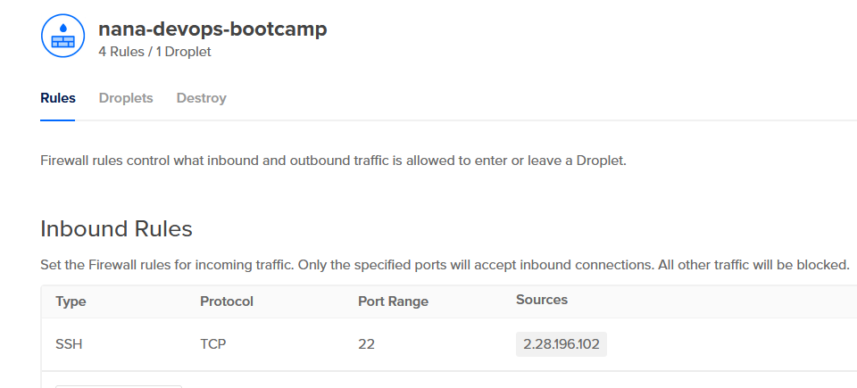

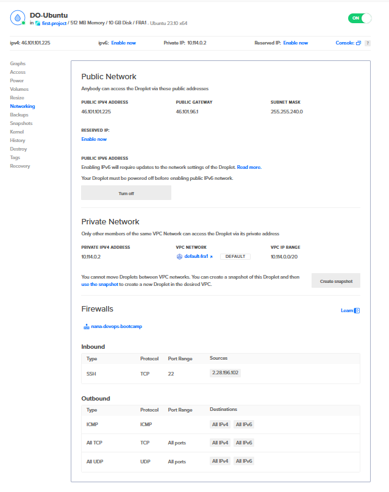

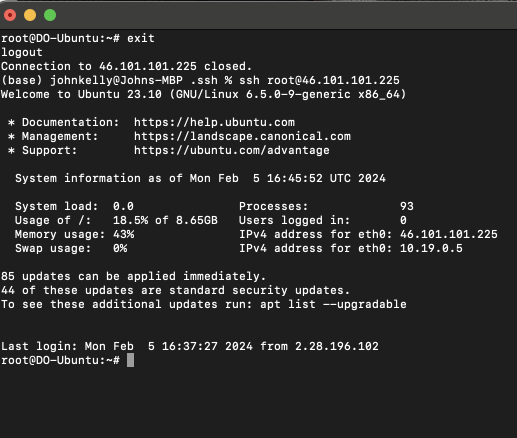

we’ll install java now (version 8, as its version is required by nexus)

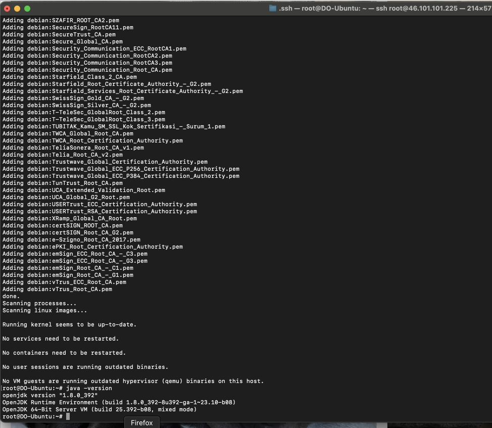

### DEMO: Deploy Application on Droplet

clone the repo for the “java-react-example”

[https://gitlab.com/twn-devops-bootcamp/latest/05-cloud/java-react-example.git](https://gitlab.com/twn-devops-bootcamp/latest/05-cloud/java-react-example.git)

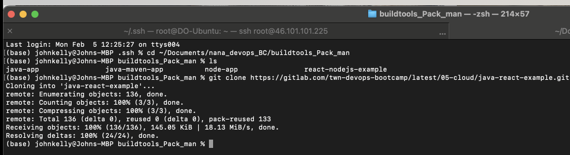

cd (from terminal) to the projects folder, we will run the build command 

gradle build

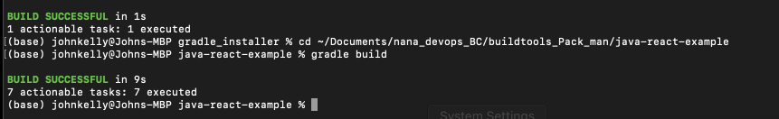

Then we upload it to the server via scp

```bash
#scp <local file> <destination>
scp build/libs/java-react-example.jar root@46.101.101.225:/root
```

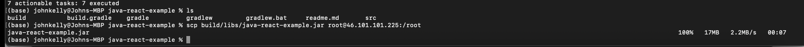

we run ls on the server:

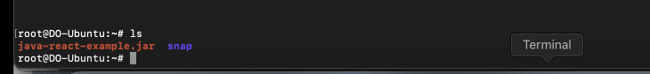

running:

java -jar java-react-example.jar we can see the app running:

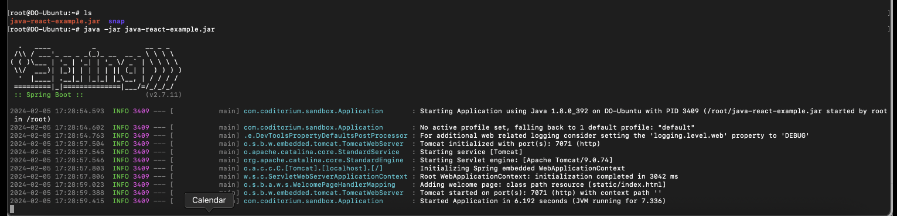

since we need to access port 7071 from the browser, we need to open the firewall rules now and add port 7071

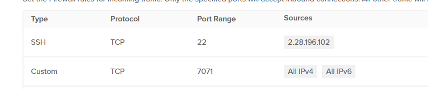

and now when we head to the servers ip address + the port (ipaddress:port)

we get this:

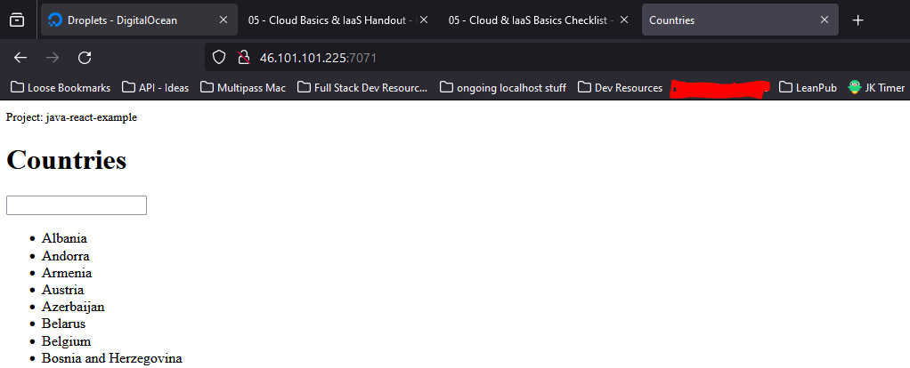

NOTE: adding & at the end of the java -jar line we can run the app in detached mode allowing us to use / play with the terminal

if we run:

```bash
ps aux | grep java
```

we can see the app is running, in my case 3438

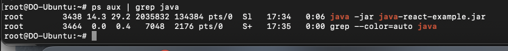

for some reason installing net-tool killed the java app

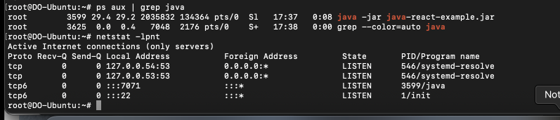

### Create & configure a linux user on a cloud server

obvs, apps shouldn't be running as Root, they should either be running as their own dedicated user or as a service

we create a new user using “adduser” (password set as qwerty)

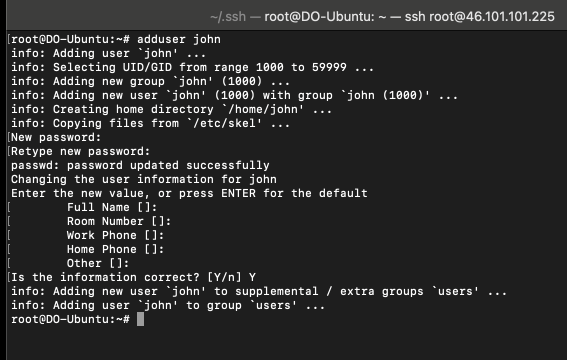

Seeing as we need this new user to be able to execute commands that root can, so we 

add the user to the sudoers group, by using 

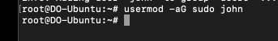

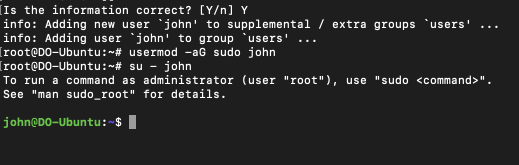

we copy the public key from the local mac to the newly created .ssh/authorized_keys file, save it and now we can ssh in with the user “john”

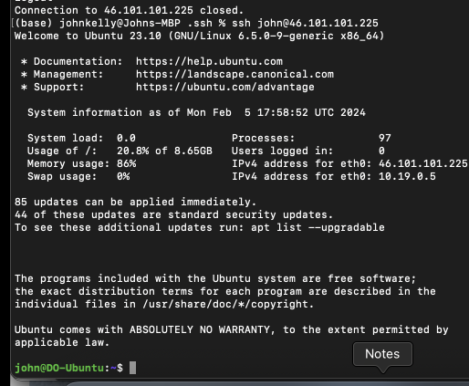