# Artifact Repo manager w/ Nexus
-------------------------------------------------------------------------------------------------------------------
1. [Intro to Artifact Repository vs Manager](https://github.com/jadedjelly/nana-techworld-devops-bootcamp/blob/main/notes/06_Nexus.md#Intro-to-Artifact-Repository-vs-Manager)
   - [What is a Manager?](https://github.com/jadedjelly/nana-techworld-devops-bootcamp/blob/main/notes/06_Nexus.md#What-is-a-Manager?)
   - [Features of Repo Manager](https://github.com/jadedjelly/nana-techworld-devops-bootcamp/blob/main/notes/06_Nexus.md#Features-of-Repo-Manager)
2. [DEMO: Install & run Nexus on a cloud Server](https://github.com/jadedjelly/nana-techworld-devops-bootcamp/blob/main/notes/06_Nexus.md#DEMO:-Install-&-run-Nexus-on-a-cloud-Server)
3. [Intro to Nexus](https://github.com/jadedjelly/nana-techworld-devops-bootcamp/blob/main/notes/06_Nexus.md#Intro-to-Nexus)
4. [Repository Types](https://github.com/jadedjelly/nana-techworld-devops-bootcamp/blob/main/notes/06_Nexus.md#Repository-Types)
   - [Proxy Type](https://github.com/jadedjelly/nana-techworld-devops-bootcamp/blob/main/notes/06_Nexus.md#Proxy-Type)
   - [Hosted Repo](https://github.com/jadedjelly/nana-techworld-devops-bootcamp/blob/main/notes/06_Nexus.md#Hosted-Repo)
   - [Groups](https://github.com/jadedjelly/nana-techworld-devops-bootcamp/blob/main/notes/06_Nexus.md#Groups)
   - [Create New Repo](https://github.com/jadedjelly/nana-techworld-devops-bootcamp/blob/main/notes/06_Nexus.md#Create-New-Repo)
5. [Demo: Publish Artifact to Repository](https://github.com/jadedjelly/nana-techworld-devops-bootcamp/blob/main/notes/06_Nexus.md#Demo:-Publish-Artifact-to-Repository)
   - [Demo: Gradle Project w/ Nexus](https://github.com/jadedjelly/nana-techworld-devops-bootcamp/blob/main/notes/06_Nexus.md#Demo:-Gradle-Project-w/-Nexus)
   - [Demo: Maven Project](https://github.com/jadedjelly/nana-techworld-devops-bootcamp/blob/main/notes/06_Nexus.md#Demo:-Maven-Project)
6. [Nexus REST API](https://github.com/jadedjelly/nana-techworld-devops-bootcamp/blob/main/notes/06_Nexus.md#Nexus-REST-API)
   - [How to Access the REST Endpoints](https://github.com/jadedjelly/nana-techworld-devops-bootcamp/blob/main/notes/06_Nexus.md#How-to-Access-the-REST-Endpoints)
7. [Blob Store](https://github.com/jadedjelly/nana-techworld-devops-bootcamp/blob/main/notes/06_Nexus.md#Blob-Store)
8. [Creating a new Blob Store](https://github.com/jadedjelly/nana-techworld-devops-bootcamp/blob/main/notes/06_Nexus.md#Creating-a-new-Blob-Store)
   - [what should you consider when creating a Blob Store](https://github.com/jadedjelly/nana-techworld-devops-bootcamp/blob/main/notes/06_Nexus.md#what-should-you-consider-when-creating-a-Blob-Store)
   - [DEMO: Assigning a blob store](https://github.com/jadedjelly/nana-techworld-devops-bootcamp/blob/main/notes/06_Nexus.md#DEMO:-Assigning-a-blob-store)
9. [Components vs Assets](https://github.com/jadedjelly/nana-techworld-devops-bootcamp/blob/main/notes/06_Nexus.md#Components-vs-Assets)
10. [Cleanup Policies & scheduled tasks](https://github.com/jadedjelly/nana-techworld-devops-bootcamp/blob/main/notes/06_Nexus.md#Cleanup-Policies-&-scheduled-tasks)
    - [Creating a cleanup policy](https://github.com/jadedjelly/nana-techworld-devops-bootcamp/blob/main/notes/06_Nexus.md#Creating-a-cleanup-policy)
    - [DEMO: Attach policy to repo](https://github.com/jadedjelly/nana-techworld-devops-bootcamp/blob/main/notes/06_Nexus.md#DEMO:-Attach-policy-to-repo)
    - [Demo: Configuring on Cleanup policy](https://github.com/jadedjelly/nana-techworld-devops-bootcamp/blob/main/notes/06_Nexus.md#Demo:-Configuring-on-Cleanup-policy)
    - [Manually execute both tasks](https://github.com/jadedjelly/nana-techworld-devops-bootcamp/blob/main/notes/06_Nexus.md#Manually-execute-both-tasks)

# Intro to Artifact Repository vs Manager

Remember:

Artifacts = Apps built into a **SINGLE** file

JAR, WAR, ZIP, TAR, etc

an Artifact Repository = Storage for those artifacts

Similar to DockerHub

Artifact Repo → for specific formats

### What is a Manager?

Say your company develop many different apps in different languages, you would need a different artifact repo for each, looking after all these would be a ball ache, this is where an artifact manager comes in. a Single ui to manage all these different repos (one ring to bind them all)

This is where Nexus comes in (there are many repo managers, Nexus is the most popular)

- upload, store, pull artifacts of different types
- central storage
- Much like DockerHub / MVN / NPM repo, these are private and public repo Managers
    - Libraries/Frameworks you use as dependencies are public repos
- can host internal repos, can also setup a proxy repo for public
- Open source or Commercial versions
- Below are the supported formats for Nexus:

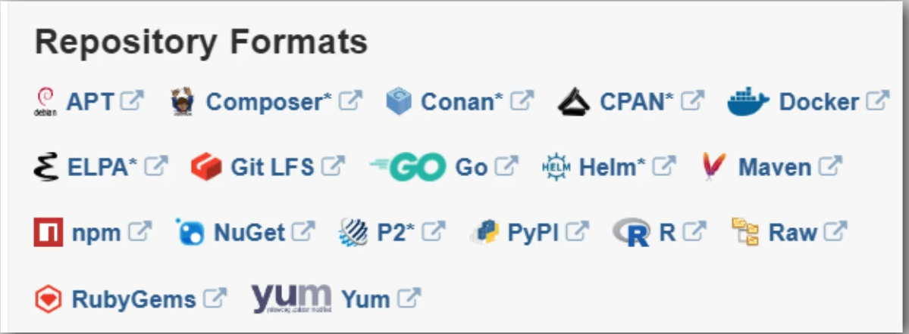

### Features of Repo Manager

- Integrates with LDAP
- REST API for integration w/ other tools
    - Automation is life!

NOTE: Below is an example of a GitLab CICD pipeline using an artifact repo

NOTE2: Also look at Gitlab CICD vs Jenkins (should be a plugin for jenkins)

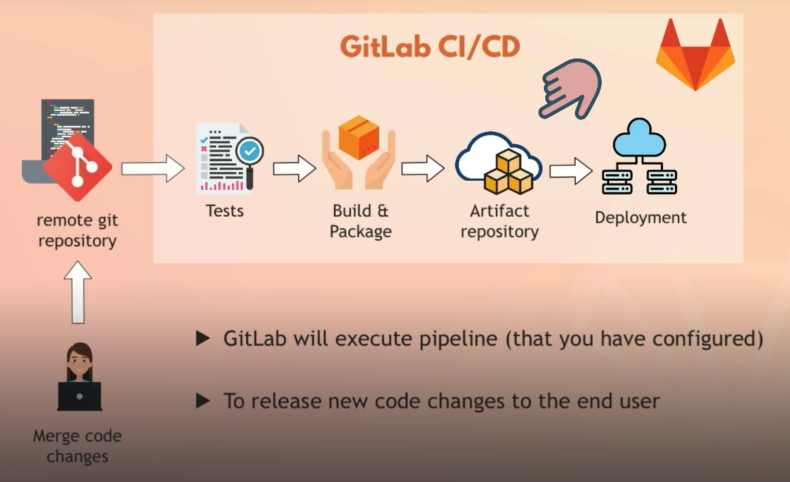

- Backup & Restore
- Multi-format support
- metadata tagging (labelling, versions, etc)
- cleanup policies
    - merging to mains (during git commits)
    - automatically delete files that match a condition
- Search functionality
- User token support for system user authentication
    - Jenkins, etc

# DEMO: Install & run Nexus on a cloud Server

*Nexus has resource requirements, for the Demo we are using the 8GB ram & 160GB storage*

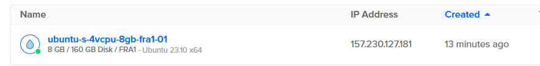

- Once the droplet is created, we set the firewall rules
    - Using the Firewall rule from the previous demo
- Installing Java Version 8
- running the below:

```bash
apt update
apt install openjdk-8-jre-headless
apt install net-tools
```

- change to opt/
- run wget to grab the tar file
    - [https://download.sonatype.com/nexus/3/nexus-3.64.0-04-unix.tar.gz](https://download.sonatype.com/nexus/3/nexus-3.64.0-04-unix.tar.gz)
- extract using
    - tar -zxvf latest-unix.tar.gz
- The extraction creates some new dirs
    - Nexus-[version]
        - Contains runtime and application of Nexus
    - Sonatype-work
        - Contains own config for Nexus and data
    - These folders are separated for times when you need to upgrade Nexus
    - Inside the Sonatype-work Folder
        - If you install plugins inside Nexus, this will create a new directory
        - it will also contain IP addresses that accessed Nexus
        - also contains logs
        - files with Metadata
        - You can use this folder to **backup** Nexus data
- Before we start the nexus service, we need to create a user for it
    - Remember best practice is to give applications their own dedicated users, so create a user called “nexus”
- run the file ownership commands:
    - chown -R nexus:nexus nexus-3.64.0-04
    - chown -R nexus:nexus sonatype-work

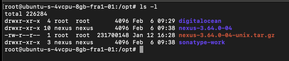

Running history on the vm, we see the commands ran on the vm:

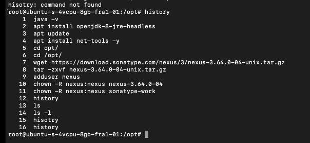

- We will now set it that Nexus will run as the nexus User, as below:
    - I prefer Nano, Nana uses vi

```bash
nano nexus-3.64.0-04/bin/nexus.rc
```

- uncomment the line, and add the newly created nexus user between the “”
- change to the nexus user
- and now we start nexus as that user
    - /opt/nexus-3.64.0-04/bin/nexus start
- when we run “ps aux | grep nexus” we’ll see it running as below:

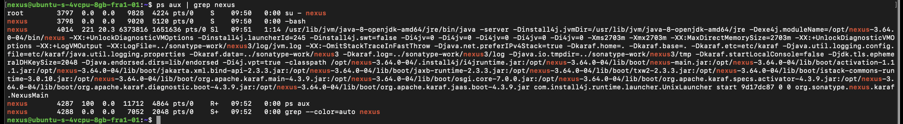

- and we can see what it’s listening on by running
    - netstat -lnpt
        - took a few mins for it to show fully

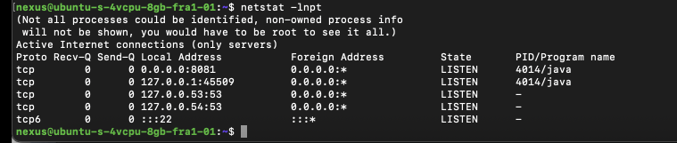

- dont forget to open the port on the firewall
    - 8081

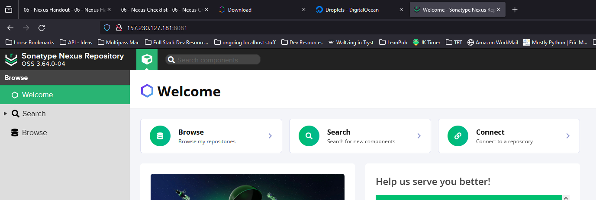

# Intro to Nexus

When you setup Nexus for the first time, its admin password is found at 

cat /opt/sonatype-work/nexus3/admin.password

Once in, the setup wiz will prompt for a new password

qwerty1983

obv - disable anonymous access

Nana allowed this…. not sure why

click on the cog > for the administration section

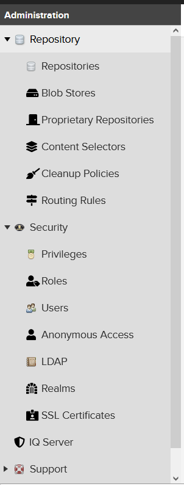

when you scroll down on this menu, you’ll also see “system” which has the below

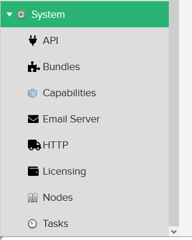

- Important areas we’ll touch are:
    - Repositories
    - Blob Store
    - Cleanup policies

# Repository Types

When Nexus is setup, out of the box, it creates (probably) the most popular repos automatically (Maven & NuGet)

From the list you will see each repo has a type:

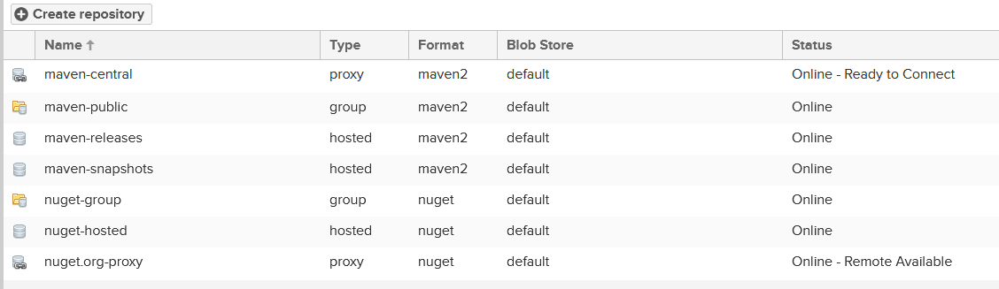

- Types:
    - Proxy
    - Group
    - Hosted

## Proxy Type

This is a type that is linked to a remote repo, in this case (as it’s labelled “Maven central”) it’s linked to the mvn repo ([https://mvnrepository.com/](https://mvnrepository.com/))

So if your using a dependency, it will go through the proxy instead of direct, and that’s only if it’s not available locally

As with any tool that uses proxies, it gets downloaded once, and is forever found in the cache, saving time if it gets called again

- Clicking into it, we can see all the configurations:
    - Using certificates (trust)
    - default blob store
    - Routing rules
    - cache lifespan
    - Cleanup
    - etc
- This gives Devs the ability to only have to access a single endpoint for dependency requests

**Setting up Proxy repos, is a best practice, dont need to explain why, that’s obvious!**

### Hosted Repo

A Hosted Repository is a repository that is hosted by the repository manager. Nexus Repository Manager ships with the following configured hosted repositories:

- maven-releases & maven-snapshots both have integrated version policies
    - maven-releases is where your company should deploy releases, you can also have 3rd party releases that are not available to public repos via proxies

### Groups

They allow you to combine multiple repositories and other repository groups of the same repository format in a single repository group. This single group and the associated URL can then be used as a single access point to all components in a specific format sourced from an number of repositories.

## Create New Repo

- click “create Repo..”
- Select recipe > select a type (group, hosted, proxy), covering all the types supported
- (we choose docker proxy - pro easiest to setup, just link it to dockerhub)
- the next window gives you all the same information as you we saw in the maven proxy one:
    - url
    - security
    - API
    - etc

# DEMO: Publish artifact to Repository

- java Gradle App - [here](https://gitlab.com/twn-devops-bootcamp/latest/06-nexus/java-app)
- java maven app - [here](https://gitlab.com/twn-devops-bootcamp/latest/06-nexus/java-maven-app)

Demo points:

- Create new user on Nexus w/ permission to upload artifacts
- maven project: Build jar & upload to nexus
- gradle project: Build jar & upload to nexux
    - Special command to push to repo
- Need to configure both tolls to connect to nexus
    - nexus repo url & credentials

- Create a user, enabled anonymous access
- We create a role for the user, hopefully that will counter the admin level I gave it

NOTE: As always, give users only the permissions they need

*Access of least privilege* 

the diff between “admin” and “view” seems to be different than it would in an ops realm, view seems to not only be read-only abilities (need to research that)

- so once you press save, you can go back to the users, and add the newly created role “nx-java” to the new user
- p/w fh0fjjvrjigjf

### Demo: Gradle Project - Config w/ Nexus

- Open the gradle project in intellij (obvs clone it)
    - open build.gradle
    - add the additional information, as below:
        - Publishing
        - Repositories
            - url for the nexus server
            - and the credentials, which will be handled by a Gradle properties file

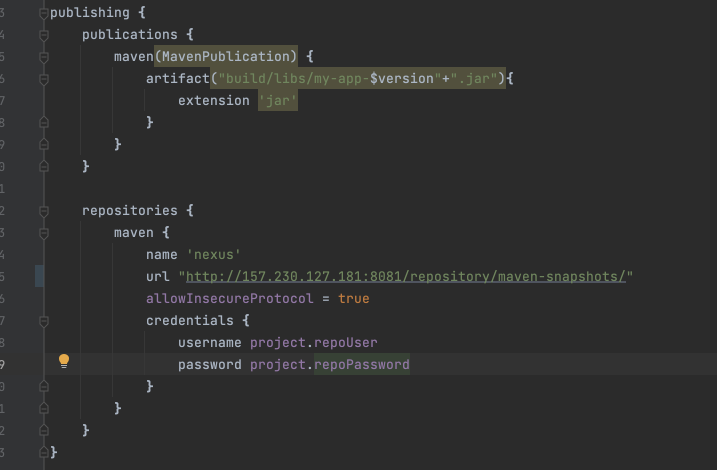

Now that everything is set, we will open the terminal within Intellij and run the gradle commands

- gradle build
- Now we move back into the java-app folder

To upload the jar file to Nexus, run the following:

```bash
#this gets installed by the line in the "build.gradle" file
#apply plugin: 'maven-publish'
gradle publish
```

gradle knows what to publish, because we have configured the build.gradle file specify it

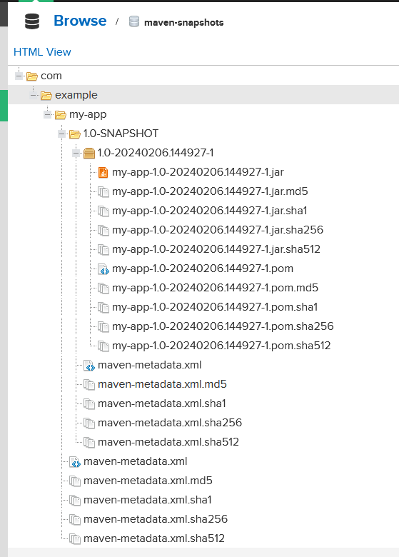

when we head back to the User view of the repositories, we can see out app in the “maven-snapshot” asset

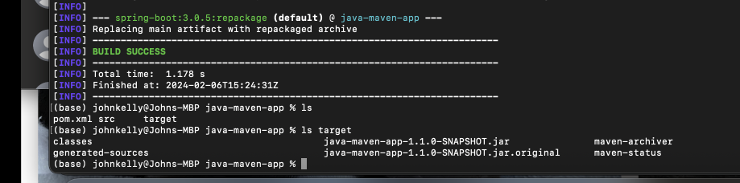

### DEMO: Maven Project

Just the same as the gradle project, we need to add a plugin, which gets added to the pom.xml file

```xml
<plugin>
<!-- the below is defining the plugin & its version -->
                <groupId>org.apache.maven.plugins</groupId>
                <artifactId>maven-deploy-plugin</artifactId>
                <version>3.1.1</version>
            </plugin>
<!-- the below is making use of the above plugin -->
            <plugin>
                <groupId>org.apache.maven.plugins</groupId>
                <artifactId>maven-deploy-plugin</artifactId>
            </plugin>
```

then we add in the repo info, under distribution management

```xml
<distributionManagement>
        <snapshotRepository>
            <id>nexus-snapshots</id>
            <url>http://157.230.127.181:8081/repository/maven-snapshots//repository/maven-snapshots/</url>
        </snapshotRepository>
    </distributionManagement>
```

This is also updated with my own ip address

we setup credentials from the .m2 dir located in your home of your local

we create a file called settings.xml

```xml
<settings>
  <servers>
     <server>
      <id>nexus-snapshots</id>
      <username>john</username>
      <password>fh0fjjvrjigjf</password>
     </server>
  </servers>
</settings>
```

with that saved, we are going to build the jar file, then push to nexus

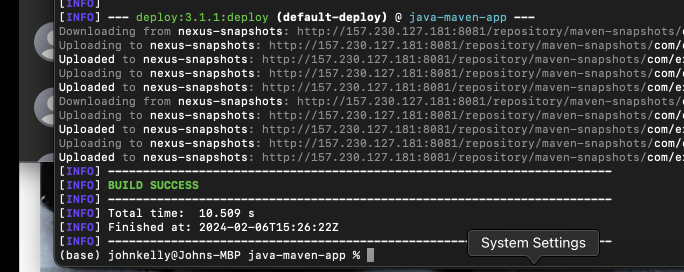

to push the jar file to the repo, we run

mvn deploy

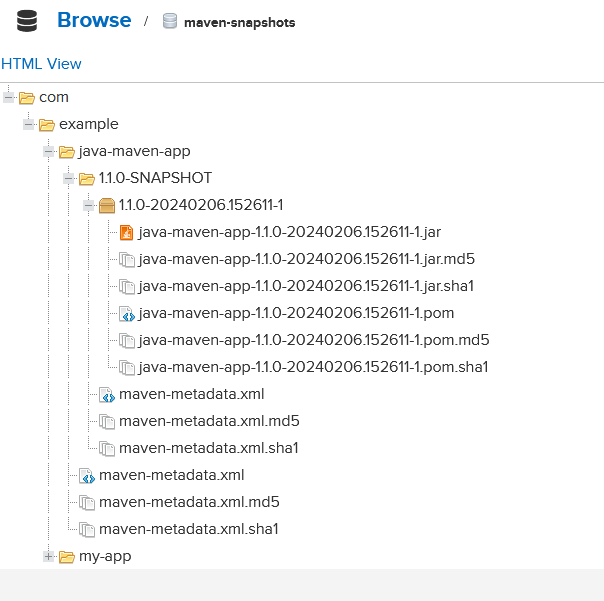

and from the repos

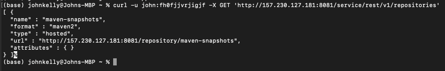

# Nexus REST API

- query Nexus repos for different information
    - which components
    - version
    - repos
- This is info that can be used with pipelines
    - assuming it gets used inside a JenkinsFile
- very flexible

## How to access the REST endpoints?

- use a tool like curl or wget to execute http requests
- provide user and credentials of a nexus user
    - User will need permissions

Using the following command

```bash
curl -u john:fh0fjjvrjigjf -X GET 'http://157.230.127.181:8081/service/rest/v1/repositories'
```

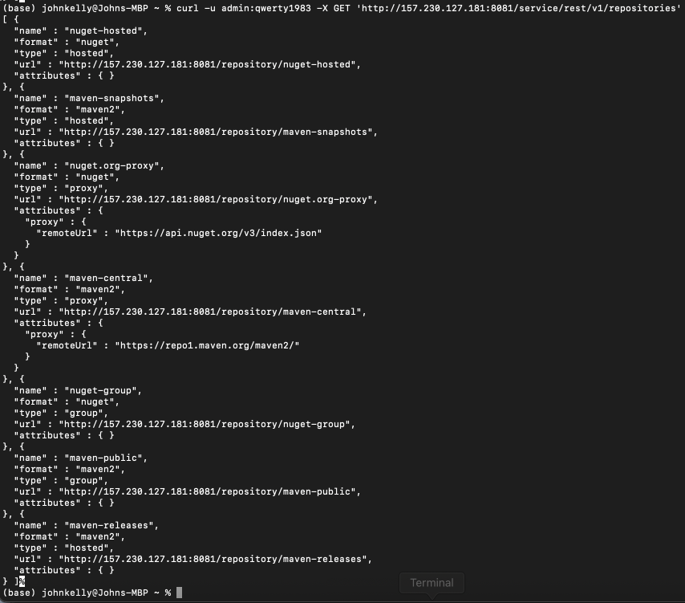

Although there are several repos available, the user “john” only has maven-view permissions (recall we set the nx-java role the wildcard view for maven snapshots)

if we run the same command, but with admin creds, we see everything

```bash
curl -u admin:qwerty1983 -X GET 'http://157.230.127.181:8081/service/rest/v1/repositories'
```

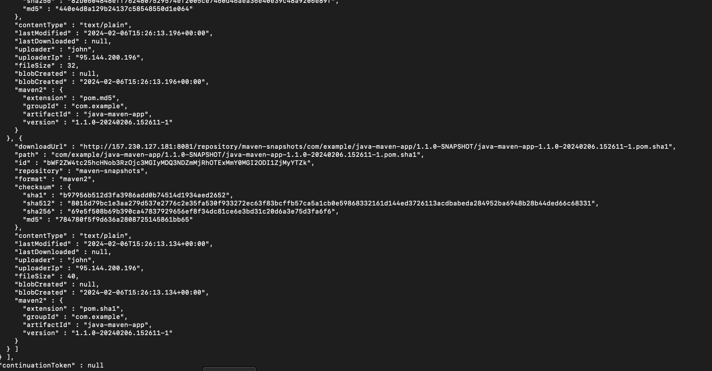

another very useful query is, listing components in a specific repo:

```bash
curl -u john:fh0fjjvrjigjf -X GET 'http://157.230.127.181:8081/service/rest/v1/components?repository=maven-snapshots'
```

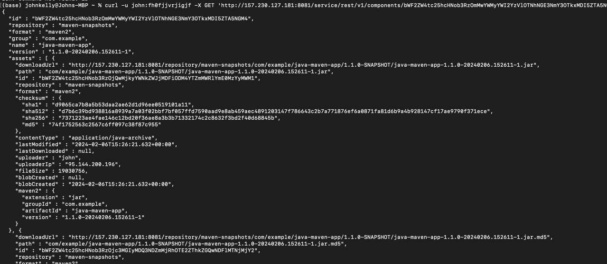

with this you get a huge list of components

NOTE:
Try out, python with Nexus API calls

If needed, we can print out a specific component, by using the components ID

```bash
curl -u john:fh0fjjvrjigjf -X GET 'http://157.230.127.181:8081/service/rest/v1/components/bWF2ZW4tc25hcHNob3RzOmMwYWMyYWI2YzVlOTNhNGE3NmY3OTkxMDI5ZTA5NGM4'
```

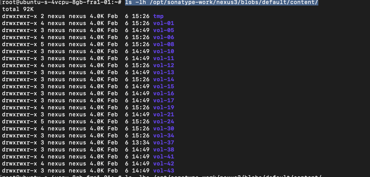

# Blob Store

Blob stores is what Nexus 

- Nexus storage to store all the uploaded files
- storage of binary files
- local or cloud (like S3)
    - depending on where you have Nexus setup
- If you go to the server where Nexus is installed, and navigate to

```bash
/opt/sonatype-work/nexus3/
```

you’ll see a folder called “blobs”, digging in here we can see the content by running the below:

```bash
ls -lh /opt/sonatype-work/nexus3/blobs/default/content/
#/default/ (is the name of the default blob in Nexus)
```

which displays the below:

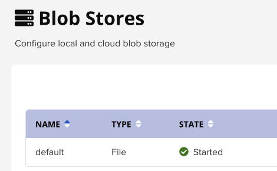

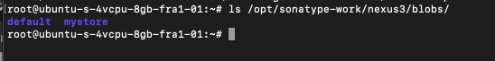

- File is a type, so “file” is a local location
- S3 is the other type
- If you click create “Create Blob store”, you get 2x optiosn for a type:
    - file (recommended & is default)
        - when selected requires information for local paths
    - s3
        - when selected requires info for an S3 location, inc region, bucket name, expiration (in days), authentication, encryption used, etc
- State:
    - represents whether the store is running
- Blob count
    - the amount of blobs currently stored
    - vol-1, etc in the above image

# DEMO: Creating a new Blob Store

- Click the cog in the top field
- click “Blob Stores” under Repositories
- Select “file”,
    - Name: mystore
    - path: will amend itself pending on what you call it “/opt/sonatype-work/nexus3/blobs/mystore”
        - This location has to be fully accessible by the OS a/c (nexus user)

NOTE:

1. Once a blob store is created, it can’t be modified
2. Blob store used by a repo can’t be deleted

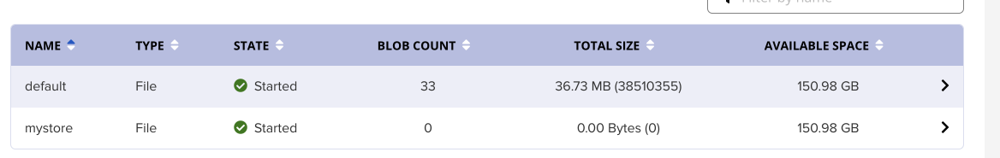

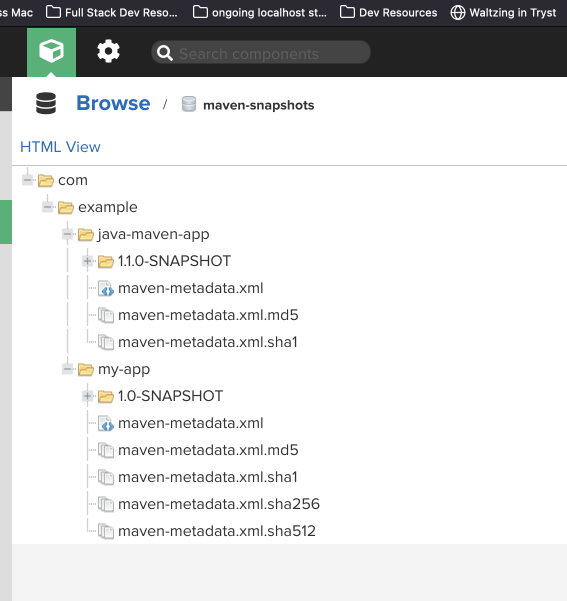

### What should you consider when creating a blob store?

1. How many blob stores will you create?
2. what size?
3. Which ones will you use for which repos?
4. You need to know approx how much space each repo will need
    1. How many jar files
    2. how often am I going to push
    3. etc
5. clean up policies

### DEMO: Assigning a blob store

1. Create a new repo
    1. Docker (hosted)
    2. if you scroll down, there’s an option for storage and you can select your new blob there

Nana points out that if you open an existing repo, there is no option to change the storage

# Component vs Assets

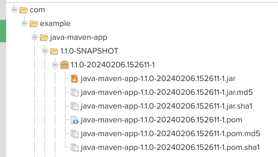

In Nexus, the components are described as 

“*A component is a 
resource like a library or a framework that is used as part of your 
software application at run-time, integration or unit test execution 
time or required as part of your build process.*”

so the xml.md5 / xml.sha1 / sha1 / sha256 etc, these are the components of the “my-app” and “java-maven-app”

- Abstract
- high level
- can also refer to any type or format (Docker image, JAR, Tar, etc)

The assets on the other hand, are the files actual binaries (jar files and associated xml & pom files)

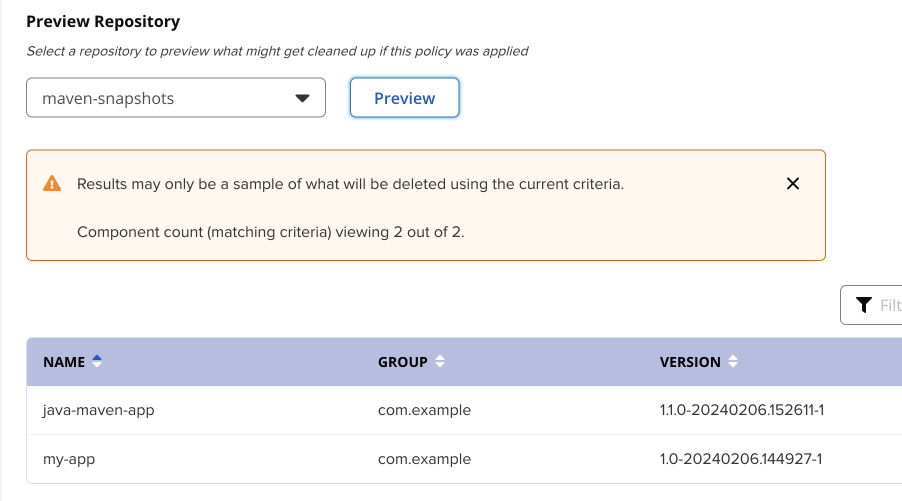

- Actual physical packages / files we are uploading

In Docker, it treats assets as layers, recall when we did the deep dive on Docker, we saw that one layer was the OS (in one example, sometimes it won’t be that), then the next layer, might be s/w you install via pip (if its python), then another layer and another, etc

# Cleanup Policies & scheduled Tasks

If you are not cleaning out old and unused components, your repositories will grow quickly; over time, this will present risks to your deployment:

- Storage costs will increase
- performance is impacted
- artifact discovery will take longer
- Consuming all available storage will results in server failure

### Creating a cleanup policy

- click “create cleanup policy”
- name:
    - maven
- Format
    - this will be the type, so maven, docker, helm, etc
- description
    - probably best to describe the rules of it here
- release type:
    - releases
    - pre-releases / snapshots
    - releases & pre-releases/Snapshots
- component age
    - ones published 0-999 days ago
- component usage
    - component downloaded 0-999 days ago
- asset Name matcher
    - remove if name = xxx
- Preview repo
    - handy option to see what will be effected by rules before you save

in the preview we see:

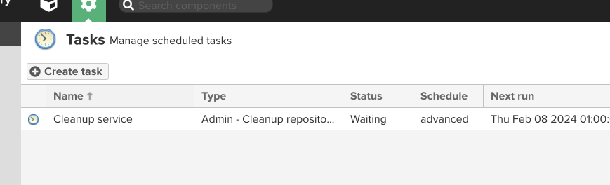

### DEMO: Attach Policy to repo

- Head to the admin view of Repositories
- open “maven-snapshots”
- scroll down to “Cleanup”, and move the newly created policy “maven” to the applied list
- click save

### DEMO: Configuring on Cleanup Policy

- From administration > scroll down to System, select “tasks”
- we see a list of scheduled tasks

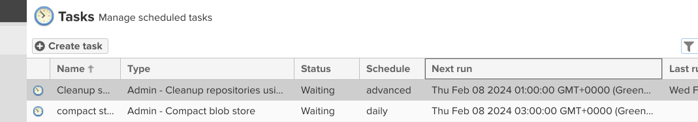

- by default, this gets executed in the middle of the night

*NOTE: You can create Tasks from here, by clicking “create tasks” - there’s a lot of different options to choose from “admin - Compact blob store” to “statistics - recalculate vulnerabilities statistics”*

Nana points out that items don’t get deleted (technically) they are marked for soft delete, so if we needed to free up space by deleting these files, we would to create a task called “*admin - Compact blob store*”

*admin - Compact blob store:*

- Gives a lot of options, like: frequency of deletion (which has it’s own options, once selected (daily, hourly, monthly, and even CRON - by writing an expression)), what store to run it on, notification email (if a condition is met from the options below: Failure is default, other option is on “success or failure” )

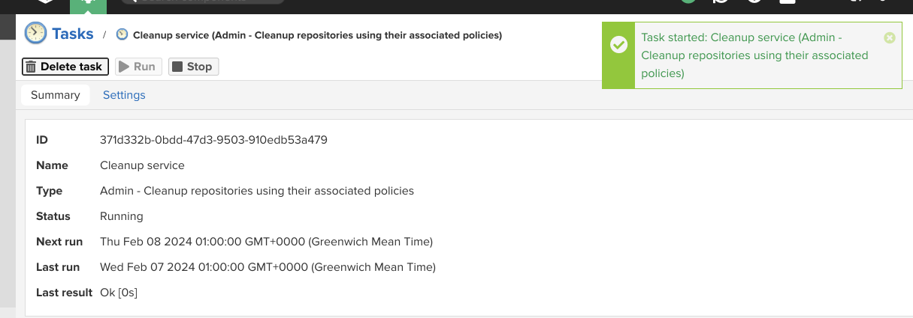

### Manually Execute both Tasks

- open a task & click “run” to execute now

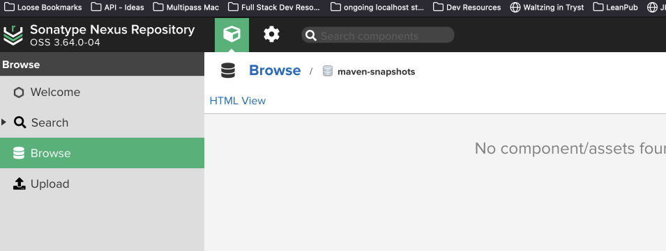

“last result” is ok

and when we go back to Maven-snapshot now, both apps are gone:

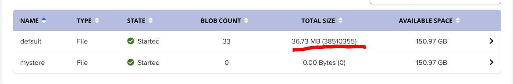

However, as Nana mention they are only marked as deleted and are soft deleted, so we’ll run the compact tasks to actually delete them, freeing up disk space

Before we run the compact, we view the size of the store as “36.73 MB”

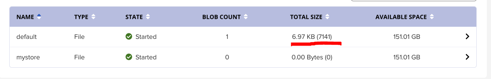

- so same again, Admin > settings > tasks
- open the “admin - compact…” task > click run
- The default blob store is now “6.97kb”


