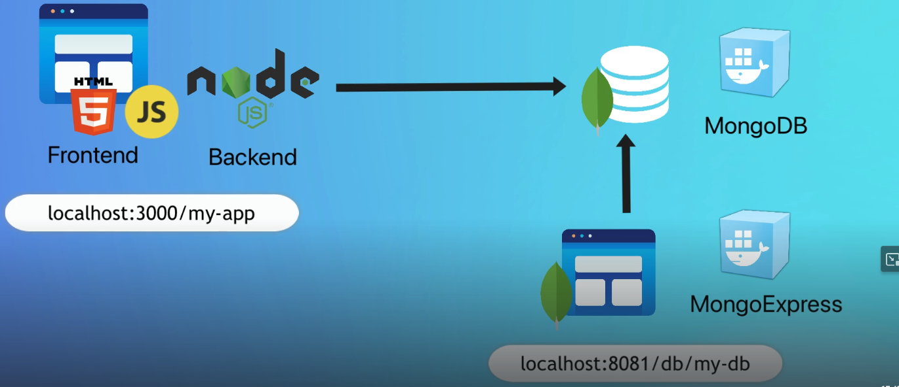
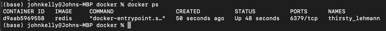

# Docker (Docker Deep Dive & Nana Devops Bootcamp Notes)
----------------------------------------------------------------------------------------------------------------------
1. [Commands](https://github.com/jadedjelly/nana-techworld-devops-bootcamp/blob/main/notes/07_Docker.md#Commands)
2. [Images](https://github.com/jadedjelly/nana-techworld-devops-bootcamp/blob/main/notes/07_Docker.md#Images)
   - [Digests](https://github.com/jadedjelly/nana-techworld-devops-bootcamp/blob/main/notes/07_Docker.md#Digests)
   - [Manifests](https://github.com/jadedjelly/nana-techworld-devops-bootcamp/blob/main/notes/07_Docker.md#Manifests)
   - [Deleting images](https://github.com/jadedjelly/nana-techworld-devops-bootcamp/blob/main/notes/07_Docker.md#Deleting-images)
3. [Containers](https://github.com/jadedjelly/nana-techworld-devops-bootcamp/blob/main/notes/07_Docker.md#Containers) 
   - [VMs vs Containers](https://github.com/jadedjelly/nana-techworld-devops-bootcamp/blob/main/notes/07_Docker.md#VMs-vs-Containers)
   - [running containers](https://github.com/jadedjelly/nana-techworld-devops-bootcamp/blob/main/notes/07_Docker.md#running-Containers)
   - [container lifecycle](https://github.com/jadedjelly/nana-techworld-devops-bootcamp/blob/main/notes/07_Docker.md#Container-lifecycle)
4. [Self healing w/ restart policies](https://github.com/jadedjelly/nana-techworld-devops-bootcamp/blob/main/notes/07_Docker.md#Self-healing-w/-restart-policies) 
5. [Webserver Example](https://github.com/jadedjelly/nana-techworld-devops-bootcamp/blob/main/notes/07_Docker.md#Webserver-Example)
   - [Inspecting Containers](https://github.com/jadedjelly/nana-techworld-devops-bootcamp/blob/main/notes/07_Docker.md#Inspecting-Containers)
       - [Chapter Commands](https://github.com/jadedjelly/nana-techworld-devops-bootcamp/blob/main/notes/07_Docker.md#Chapter-Commands) 
6. [Containerizing an app](https://github.com/jadedjelly/nana-techworld-devops-bootcamp/blob/main/notes/07_Docker.md#Containerizing-an-app)
   - [Dockerfile](https://github.com/jadedjelly/nana-techworld-devops-bootcamp/blob/main/notes/07_Docker.md#Dockerfile)
       - [Building the app - Docker Deep Dive](https://github.com/jadedjelly/nana-techworld-devops-bootcamp/blob/main/notes/07_Docker.md#Building-the-app---Docker-Deep-Dive) 
       - [Running the app](https://github.com/jadedjelly/nana-techworld-devops-bootcamp/blob/main/notes/07_Docker.md#Running-the-app)
7. [Moving to production with multi-stage builds](https://github.com/jadedjelly/nana-techworld-devops-bootcamp/blob/main/notes/07_Docker.md#Moving-to-production-with-multi---stage-builds)
   - [step by step multi-stage Dockerfile](https://github.com/jadedjelly/nana-techworld-devops-bootcamp/blob/main/notes/07_Docker.md#step-by-step-multi---stage-Dockerfile)
   - [Demo](https://github.com/jadedjelly/nana-techworld-devops-bootcamp/blob/main/notes/07_Docker.md#Demo)
   - [multi-platform Builds](https://github.com/jadedjelly/nana-techworld-devops-bootcamp/blob/main/notes/07_Docker.md#multi---platform-Builds)
       - [Tooltip!](https://github.com/jadedjelly/nana-techworld-devops-bootcamp/blob/main/notes/07_Docker.md#Tooltip!)
       - [Commands from the chapter](https://github.com/jadedjelly/nana-techworld-devops-bootcamp/blob/main/notes/07_Docker.md#Commands-from-the-chapter)
8. [Docker Networking](https://github.com/jadedjelly/nana-techworld-devops-bootcamp/blob/main/notes/07_Docker.md#Docker-Networking)
   - [Theory](https://github.com/jadedjelly/nana-techworld-devops-bootcamp/blob/main/notes/07_Docker.md#Theory)
   - [The Container Network Model](https://github.com/jadedjelly/nana-techworld-devops-bootcamp/blob/main/notes/07_Docker.md#The-Container-Network-Model)
   - [LibNetwork](https://github.com/jadedjelly/nana-techworld-devops-bootcamp/blob/main/notes/07_Docker.md#LibNetwork)
---------------------------------------------------------------------------------------------------------------------
1. [Nana - Devops Bootcamp - Docker Module](https://github.com/jadedjelly/nana-techworld-devops-bootcamp/blob/main/notes/07_Docker.md#Nana---Devops-Bootcamp---Docker-Module)
   - [What is a container](https://github.com/jadedjelly/nana-techworld-devops-bootcamp/blob/main/notes/07_Docker.md#What-is-a-container) 
   - [where are containers hosted?](https://github.com/jadedjelly/nana-techworld-devops-bootcamp/blob/main/notes/07_Docker.md#where-are-containers-hosted?) 
   - [App Development before & after Docker](https://github.com/jadedjelly/nana-techworld-devops-bootcamp/blob/main/notes/07_Docker.md#App-Development-before-&-after-Docker) 
   - [Most popular container tech](https://github.com/jadedjelly/nana-techworld-devops-bootcamp/blob/main/notes/07_Docker.md#Most-popular-container-tech)
   - [Image vs Container](https://github.com/jadedjelly/nana-techworld-devops-bootcamp/blob/main/notes/07_Docker.md#Image-vs-Container)
       - [Demo: Install Docker Desktop](https://github.com/jadedjelly/nana-techworld-devops-bootcamp/blob/main/notes/07_Docker.md#Demo:-Install-Docker-Desktop)
       - [Demo: Docker run postgres13:10](https://github.com/jadedjelly/nana-techworld-devops-bootcamp/blob/main/notes/07_Docker.md#Demo:-Docker-run-postgres13:10)
       - [Demo: Docker run postgres14:7](https://github.com/jadedjelly/nana-techworld-devops-bootcamp/blob/main/notes/07_Docker.md#Demo:-Docker-run-postgres14:7)
   - [Container vs VM](https://github.com/jadedjelly/nana-techworld-devops-bootcamp/blob/main/notes/07_Docker.md#Container-vs-VM)
   - [Docker Arch & its components Part 1](https://github.com/jadedjelly/nana-techworld-devops-bootcamp/blob/main/notes/07_Docker.md#Docker-Arch-&-it's-omponents-Part-1)
   - [Docker Arch & its components Part 2](https://github.com/jadedjelly/nana-techworld-devops-bootcamp/blob/main/notes/07_Docker.md#Docker-Arch-&-it's-omponents-Part-2)
   - [Docker Arch & its components Part 3](https://github.com/jadedjelly/nana-techworld-devops-bootcamp/blob/main/notes/07_Docker.md#Docker-Arch-&-it's-omponents-Part-3)
   - [Docker Installation](https://github.com/jadedjelly/nana-techworld-devops-bootcamp/blob/main/notes/07_Docker.md#Docker-Installation)
   - [Docker Commands](https://github.com/jadedjelly/nana-techworld-devops-bootcamp/blob/main/notes/07_Docker.md#Docker-Commands)
       - [Demo: Main Docker Commands](https://github.com/jadedjelly/nana-techworld-devops-bootcamp/blob/main/notes/07_Docker.md#Demo:-Main-Docker-Commands)
   - [Ports in Docker Part 1](https://github.com/jadedjelly/nana-techworld-devops-bootcamp/blob/main/notes/07_Docker.md#Ports-in-Docker-Part-1)
   - [Ports in Docker Part 2](https://github.com/jadedjelly/nana-techworld-devops-bootcamp/blob/main/notes/07_Docker.md#Ports-in-Docker-Part-2)
       - [Demo: Running containers w/ port bindings](https://github.com/jadedjelly/nana-techworld-devops-bootcamp/blob/main/notes/07_Docker.md#Demo:-Running-containers-w/-port-bindings)
       - [Demo: Docker Debug Commands](https://github.com/jadedjelly/nana-techworld-devops-bootcamp/blob/main/notes/07_Docker.md#Demo:-Docker-Debug-Commands)
       - [Demo: Developing with Docker](https://github.com/jadedjelly/nana-techworld-devops-bootcamp/blob/main/notes/07_Docker.md#Demo:-Developing-with-Docker)


# Commands

Pulling an image (without version pulls latest)

```docker
docker pull redis
```

pull a specific version (7.2.3 alpine)

```docker
docker pull redis:7.2.3-alpine
```

pull an image from a unoffical repo

```docker
docker pull jadedjelly/Wit-demo:v2
```

To pull from a google repo (example) you append the url

```docker
docker pull gcr.io/google-containers/ubuntu:19.23
```

(probably useful if you have 100s of images locally)

filter images

```docker
docker image --filter=reference="ubun*"
```

NOTE on filtering:

```
  -f, --filter value    Filter output based on conditions provided (default [])
                        - dangling=(true|false)
                        - label=<key> or label=<key>=<value>
                        - before=(<image-name>[:tag]|<image-id>|<image@digest>)
                        - since=(<image-name>[:tag]|<image-id>|<image@digest>)
                        - reference=(pattern of an image reference)
```

Format results  by repo, tag and size

```docker
docker images --format "{{.Repository}}: {{.Tag}}: {{.Size}}"
```


to search docker for images

```docker
docker search redis
```


you can search docker for anything, inc companies (red hat)


or microsoft:


# Images

Docker images are made of layers, simply, say you have a python application (packaged), you add that to a ubuntu image, the py package is now added as a layer to that image.

“Its a Burger”

you can inspect the layer of an image by running:

```docker
docker inspect ubuntu:latest
```

this will output json, as below (cut shot as its long)


running history on an image is another way, though this is easier to read, “add file” “add demo.tar.xz” etc


Note:

All docker images have a base layer, and as changes are made they are new layers are added on top. Multiple images can share layers (more efficient for space and performance)

## Digests

you can also pull by digest (SHA256 - as always digest rules apply. Image 1 has a sha of 123456, something is changed and its sha is changed to 789654). During the pull command, the image being pulled has 2x hashs (the uncompressed and the compressed has [distributed hash]) this is because, after a pull request, docker checks that the pull you received is the same pull you received (in case there was tampering en route)

## Manifests

Images support multiple architectures (arch) (ARM, x64, PowerPC, etc), when you pull an image from any platform / arch, Docker will pull the correct image, this is done via manifest lists, each entry in a manifest list points to a manifest containing image and layer data for that arch.

running a grep on a manifest inspect will output the support arch

```docker
docker manifest inspect golang | grep 'architecture\|os'
```


you can create your own builds for different archs, by using buildx (docker cli plugin) & manifest create (more on that later)

## Deleting images

When you no longer need an image, you can run the rmi command, to make it easier, you can use the 1st 3x digits of an image ID (1dc - alpine:latest)

note: image cannot be in use

```docker
docker rmi 1dc
```


you can remove multiple by inputting id numbers

running the below, will delete all images

```docker
docker images -q
```

# Containers

A container is the runtime instance of an image

*think of containers as VMs and images as VM templates*

### VMs vs Containers

VMs require a hypervisor, share resources with the host system and any other VM on that device (processes, filesystem, etc), the host needs to be booted, patch management, etc etc. Each VM (inc host) needs licenses, and it increases the attack surface (for each)

Containers on the other hand, have a single OS kernel, so only one OS for updating, booting, etc etc 

Start times between containers and VMs is also massive.

## Running containers

assuming you dont have any images / containers (if you do, you can delete, or just remove one (we’ll add it back)

running: (the it switch puts into interactive, and attaches it to your current terminal)

```docker
docker run -it ubuntu:latest /bin/bash
```


when then changes your terminal to that of the now running container 

we can run some commands but not all, ps, touch, echo etc but the likes of ping wont 

type exit, to exit

to stop it:

```docker
docker stop [container id]
```

to remove it:

```docker
docker rm [container id]
```

### Container lifecycle

We’ll go through the whole lifecycle of a container

run the below, adding “—name” allows us to name this container, instead of it being random

```docker
docker run --name bob -it ubuntu:latest /bin/bash
```

When it opens, change to the tmp folder, create a new file with some text, verify the file is there and contains the text. press Ctrl+PQ (this doesn't kill the container, it detaches the terminal, typing exit kills the container)


now we stop the container, by running:

```docker
docker stop [container id / name]
```

when we run docker ps it shows running containers, none should be showing, adding the -a switch will show hidden / stopped / exited containers

Stopping a container is like stopping a VM, configs and content still exist


to prove this, restart the container and access it with exec


The file still exists and contains the data

### Important notes:

1. data created in this example was in the docker hosts local filesystem
2. containers are designed to be “immutable”, meaning:
    1. *a container won’t be modified during its life, if you must update app code, create a new image and redeploy, making deployments safer and repeatable* (according to best practices)

Docker volumes exist for the above reasons (more on volumes later), they are outside the containers and can be mounted

removing the container, can be done by running:

```docker
docker stop [container id / name]
```

removing the container amend stop with rm

```docker
docker rm [container id / name]
```


Running the stop command is effectively a SIGTERM (signal terminate) or you can kill it with -f with is SIGKILL

# self healing with restart policies

as you can imagine having an app running in containers, will at times need to restart (for obvious Sysops issues that exist), so it’s always a good idea to have restart policies when things hit the fan. 

These are added on a per container basis, by either adding a keyword to the run command or inside a yaml file (more advanced setups via swarm, compose or k8). There are 3 keywords to restart: (rather easy to see what does what)

- always
- unless-stopped
- on-failure

running the command looks like below:

```docker
docker run --name bob -it -restart always ubuntu bash
```


the output says the container was created 32 seconds ago but been up 3 seconds, that’s because exit kills it and docker brings it back up (due to the —restart)

Nigel p, goes on to explain the difference between “always” and “unless-stopped”. He uses the systemd stop service cmd, and sure as the “always” container bounces back into action, while the “unless-stopped” doesn’t.

If your working with Docker compose or Docker stacks you can create what looks like a service and give a condition of “always | unless-stopped | on-failure”

# Webserver example

NOTE:

host-port:container-port (80:8080)

Below, we run the docker run command with some changes, the -d switch runs the container in detached mode, -p allows us to map the port 80 to the containers 8080 port (remember host-port:container-port) the \ allows us to add the repo of the app in this case Nigel Ps nodejs app (incudes all the configs and dependencies (NOTE: this gets updated once a year and is vulnerable)

```docker
docker run --name webserver -d -p 80:8080 / nigelpoulton/ddd-book:web0.1
```

when we run the above, and then the ps command we can see the caontainer is running and can look up the localhost:80 address to see it in action, as below:


as always we can use the stop, pause, etc cmds

## Inspecting containers

In the previous example, we didnt say “nodejs” as we did with the /bin/bash or /bin/sh commands in other examples, that’s because the docker image has embed instructions that lists the default app, to see this we use Docker inspect as below:

```docker
docker inspect nigelpoulton/ddd-book:web0.1
```

this outputs a json of the image (dont forget “Burger” - base layer | app code | etc), this is cut short to display the embed default app


Nigel P, uses a command to clean up, though this shouldnt be done on prod as it deletes everything without warning (don’t be that guy that gets fired, for being lazy!)

Better yet, practice stop and rm

### Chapter Commands!

- docker run
    - used to start a new container
        - docker run -it ubuntu:latest /bin/bash
- Ctrl-PQ
    - will detach you from the current shell leaving it to run in the background
- docker ps
    - lists all running containers, add the -a to see the stopped / exited etc
- docker exec
    - runs a new process inside a container
        - docker exec -it ubuntu bash
- docker stop
    - stops a running container
- docker start
    - restarts a stopped container
- docker rm
    - removes a stopped container
- docker inspect
    - outputs detailed information & configuration of a container

# Containerizing an App

clone the books repo @ [https://github.com/nigelpoulton/ddd-book.git](https://github.com/nigelpoulton/ddd-book.git)

Containerizing is the process of taking the app source code and getting it running in a container. Containers make apps easy to “build, ship & run” the end to end looks like below:

- Start with your code & dependencies
- Crate a dockerfile, describing / give instruction for:
    - your app
    - dependencies
    - how to run
- Build into an image
- Push to an image repo
- run a container from the image

This dir is called the *build context* and contains everything you need, it’s common practice to keep the DOCKERFILE here


## Dockerfile

Describes an application and how Docker should built it, the file is also a great document with the information it describes, allowing devs and ops to know what an image needs. Dockerfile supports the following instructions: (according to official doc, not in the order they should appear in a file)

- ADD
    - add local or remote files
- ARG
    - Use build-time variables
- CMD
    - Specify default commands
- COPY
    - Copy files and directories
- ENTRYPOINT
    - Specify default executable
- ENV
    - Set environment variables
- EXPOSE
    - Describes which port your app listens on
- FROM
    - Create a new build stage from a base image
- HEALTHCHECK
    - Check a containers health on startup
- LABEL
    - Add metadata to an image
- MAINTAINER
    - Specify the author of an image
- ONBUILD
    - Specify instructions for when the image is used in a build
- RUN
    - Execute build commands
- SHELL
    - Set the default shell for an image
- STOPSIGNAL
    - Specify the system call for exiting a container
- USER
    - Set user and group ID
- VOLUME
    - Create volume mounts
- WORKDIR
    - Change working directory

running cat on the Dockerfile we can see the contents


So line by line, we break it down: - this app is a linux app, if it was windows we would define it

FROM alpine (this is our base image) 

LABEL - best practice to note, who the maintainer is so other users can report bugs / issues

RUN installs node and npm (via the apk - alpine package manager, like apt) - *it’s also a **Layer***

COPY . / src - copies in the app & dependencies from the build context dir - *it’s also a **Layer***

- The image is now 3 layers

WORKDIR /src - this sets the working dir - does not create a new layer

RUN npm install - runs the installer within the context of the above working dir and also installs the dependencies listed in the package.json - *it’s also another layer*

EXPOSE 8080 - this “opens” the 8080 port for the app

ENTRYPOINT [”node” …] - this sets the app to run when started as a container

### Building the app - Docker Deep Dive

We run the below command, the . at the end of the line tells Docker to use the working directory

```docker
docker build -t ddd-book:ch8.1 .
```


We run docker images to check the image exists


Woot! The app is containerized!

running the below, we can inspect the image, and get the output:

```docker
docker inspect a854
```

(The output is too long to see here, but we can see working directories, Volumes, entrypoint, ports, etc)

It’s a good idea to push images to a repo so others can use, etc. You’ll need a docker ID and password to do this

Before we can push to a repo, the image needs to be appropriately tagged, this is due to important reg related info:

- Registry DNS name
- Repo name
- Tag

Note: by default pushs go to Dockerhub, if you want to push somewhere else add the url at the beginning. the format is “docker push url(if 3rd party)/image name)”


In the above example, if we were to push the new image (ddd-…), docker would attempt to push the image to a repo on dockerhub called “ddd-book” which doesnt exist, we need to tidy this up

NOTE: If we don’t do this, and attempt to push the image, we get the below error (jadedjelly, being my private repo):


Running the below, we can amend the image so when we do push, it goes to the correct place:

```docker
docker tag ddd-book:ch8.1 jadedjelly/ddd-book:ch8.1
```


layout of the push url

| Default registry | Repo | Image tag |
| --- | --- | --- |
| docker.io | jadedjelly/ddd-book | :ch8.1 |

Running the below, will now output the following, below that is how it appears in my repo

```docker
docker push jadedjelly/ddd-book:ch8.1
```


### Running the app

The following command, will start a new container called c1 based on the ddd-book:ch8.1 

it maps port 80 (on the host) to 8080 (on the container), so when we run it, we can access it on our local device, by opening a browser and going to [localhost:80](http://localhost:80) 

```docker
docker run -d --name c1 -p 80:8080 ddd-book:ch8.1
```


When we run docker ps, we can see the app is running and on port 80


So looking at the Dockerfile a little closer, if an instruction adds content (files / programs) it adds a layer, if it adds instructions how to build and run its metadata and not a layer. Instructions don’t have to be written in UPPERCASE, but it makes it easier to read.

You can view the instructions that were used to build the image, but running the history command as below, each line corresponds to an instruction (starting from the bottom up). The lines with bytes, are layers those without is meta


# Moving to production with multi-stage builds

Docker images should be small, as big ones means:

- slow
- more potential vulnerabilities
- bigger attack surface

Multi-stage builds have multiple FROM instructions, each FROM getting from the previous

At a high level:

1. Build an image with all the build and compilation tools
2. copies in your app code and builds it
3. creates a small production ready image with just the bits needed to run the code

The example below is from the books repo page, it’s written for a GO app


Each one of the FROM instructions is a distinct **build stage** (AKA INTERMEDIATE IMAGE) and docker numbers them starting from 0 (zero), each stage also has a friendly name

- Stage 0 is called *base*
- Stage 1 is called *build-client*
- stage 2 is called *build-server*
- stage 3 is called prod

The goal of the base stage is to create a reusable build image, only used to build the app, not to be used in production

### step by step multi-stage Dockerfile

Pulls goland:alpine > sets working dir to /src > copies in the go.mod & go.sum files (lists the dependencies & hashes) > installs the dependencies & copies the app code into the image

*When this build stage completes it outputs a very large image, next*

The build-client stage doesnt pull a new image, instead it uses the FROM base AS build-client instruction to use the image from the previous stage > Uses the RUN instruction to build the app into an executable binary, which will later be referenced in a later build stage.

The build-server instruction, does the same but for server components of the app, again will be referenced in a later build stage.

*The build-client & build-server stages run in parallel*

The prod stage, uses the minimal scratch of the image > COPY instrcution copies the build-client & build-server stages, it outputs the final image, which is in a tiny image

### Demo

(use the Dockerfile, from the Books github, it’s inside the “multi-stage” folder


## Multi-platform builds

Docker build lets you build images for multiple platforms, so while the build may happen on (in my case) a M1 chip, we can setup a build for others, using the docker buildx command (ships with the latest docker)

1. Create a builder called “docker” that uses the *docker-container* endpoint

```docker
docker buildx create --driver=docker-container --name=container
```

1. Run the following, which builds images for the following platforms (changing the dockerID to your own!!)
    1. linux/amd64 
    2. linux/arm64 
    3. linux/arm/v7 

NOTE: This command does not work, email bug to NigelP!

### Tooltip!!

When your building linux images, use the “no-install-recommends” this makes sure only the required installations are installed and not the suggested / recommended

This can greatly decrease the size of your image!

### Commands from the chapter

- docker build
    - the command that reads a Dockerfile and containerizes an app, -t tags the image, the -f lets you name the container
- The Dockerfile
    - Tells docker how to build the image
        - FROM, COPY, WORKDIR, RUN, EXPOSE, ENTRYPOINT

# Volumes and Persistent data

2x types of data in docker volumes:

- Persistent
    - Data we need to keep, financial records, logs, etc
- non-persistent data
    - Data we dont need to keep

non-persistent data has it’s own storage locally in the container, however, if you delete the container it also deletes the storage

Persistent data needs to be stored on volumes, these are objects outside of the container and are independently managed.

There’s 2x ways we can create volumes, either via docker volume create or from a docker run command where we add the flag —mount source …

Notes, about Docker Volumes:

- Volumes are independent objects and are not tied to the lifecycle of a container
- volumes can be mapped to specialized external storage via a plugin (more on this later)
- Volumes enable multiple containers on different docker hosts to access and share the same data (pros & cons)

## Creating and managing docker volumes

create a docker volume, by running

```docker
docker volume create [volume name]
```


By default docker creates new volumes with the *local-driver* (meaning it’s local and can only be used by this host), use the switch -d to specify a different one, 3rd party rivers are installed via a plugin, best to get these from the docker hub > extensions and filter by plugin


To inspect a volume, run

```docker
docker volume inspect [volume name]
```


To delete volumes, there are 2x ways:

1. docker volume prune
    1. CAUTION: prune deletes **all** volumes
    2. Docker will prompt, “are you sure”
2. docker volume rm [volume name]


## Demo: Volumes with containers & services

Create a container and mount a volume to it

```docker
docker run -it --name voltainer --mount source=bizvol,target=/vol alpine
```

since neither the image nor the volume exist, docker pulls and creates the volume, if the volume existed it would just attach it!


Although volumes are outside the container, you cannot delete a volume that is in use

We exec into sh and create a file with some txt on the volume


We exit the container and force remove it, then list all containers


when we run docker volume ls, we can see the volume is still there


run volume inspect


With some fiddling around (Unable to do to this inside of mac!!), we can view the file by running

```docker
docker run -it --privileged --pid=host debian nsenter -t 1 -m -u -n -i sh
```

then ls /var/lib/docker/volumes/bizvol/_data


### Commands from this chapter

- docker volume create
    - used to create a volume
- docker volume ls
    - used to list volumes
- docker volume inspect
    - used to view the configuration of a volume
- docker volume prune
    - CAUTION: Will delete all volumes!!!
- docker volume rm
    - deletes only the specified volume
- docker plugin install
    - installs the specified plugin
- docker plugin ls
    - lists the installed plugins

## Docker Networking

*NOTE: Nanas explanation of Docker Networking, is basic at best. Below notes are taken from “Docker Deep Dive”*

Docker has solutions for container-to-container networks, as well as connecting to existing networks and VLANs. The latter is VIP for containerized apps that need to communicate with externals services / VMs or physical servers.

Docker ships with a set of network drivers for the most common requirements:

- single host
- bridge networks
- multi-host overlays
- options for plugging into existing VLANs

Ecosystem partners can extend this with their own set of drivers

Libnetwork provides native service discovery and basic load balancing

## Theory

At it’s highest level, Docker networking comprises of 3x major components:

- Container Network Model (CNM)
    - Design specs & outlines the building blocks of a Docker Network
- Libnetwork
    - is a real-world implementation of the CNM, part of the Moby Project & used by Docker and other projects
- Drivers
    - extend the model implementing specific network topologies, such as VXLAN overlay networks

## The Container Network Model

Outlines the fundamental building blocks of a Docker network, full spec [here](https://github.com/moby/libnetwork/blob/master/docs/design.md) (*recommended reading*)

At a high level, the spec defines 3x building blocks:

- Sandboxes
    - Isolated network stack in a container, inc Eth interfaces, ports, routing tables & DNS config
- Endpoints
    - virtual network interfaces, these like physical interfaces are responsible for making connections
- Networks
    - SDN of a switch, as such they group together and isolate a collection of endpoints that need to communicate

Network model is all about providing networking to containers, sandboxes are placed inside of containers to provide connectivity



Container **A** has a single interface (EndPoint) and is connected to Network **A**. Container **B** has 2x interfaces and is connected to Network **A** **and** Network **B**. The 2x containers can communicate because they are both connected to Network **A**. However, the 2x EndPoints in Container **B** cannot communicate with each other without the assistance of a Layer 3 Router.

It’s also important to know, that EndPoints behave like normal network interfaces, meaning the ycan only access a single network, therefore a container needed to communicate to multiple networks will need multiple EndPoints!


Although Container A & Container B are running on the same host, their network stacks is completely isolated at the OS level

## LibNetwork


# Nana - Devops Bootcamp - Docker Module

## What is a container?

- package an app w/ all it’s dependencies & configs
- standardized artifact for dev, shipment & deployment
- more efficient for dev & deployment

## Where are containers hosted?

- hosted in container repos
    - Public
        - Dockerhub
    - private

## App development before & after Docker

| Before | After |
| --- | --- |
| Installation process different for each OS | single isolated Env |
| Many steps where things can go wrong | Packaged w/ all needed configs |
| config of the server needed | 1 cmd to install the app |
| Documentation for deployment | Easily run app /w different versions |
|  | Dev & ops work together to package app in a container |
|  | No Env config needed on server, except for container runtime |

## Most popular container tech

- Docker reigns King
    - Others:
        - ContainerD
        - Cri-o

## Image vs Container

| Image | Container |
| --- | --- |
| actual package | Starts the app |
| can be moved around | is a running env |
| Not in “running” state | virtual file system |
| consists of several layers | Port binding |
| Mostly linux base, app on top |  |

### DEMO: Install Docker Desktop

- [https://docs.docker.com/desktop/install/mac-install/](https://docs.docker.com/desktop/install/mac-install/)
- move dmg to apps folder
- sign in


### DEMO: Docker run postgres13:10

- Head to dockerhub, find postgres in the search bar
- we want a specific version, in this case 13:10
- scroll down to the documentation, under “start a postgres instance”
    - we want this version to be 13.10, so we add it to the end of the line
        - -e = is an environment switch in this case its the password

```bash
docker run -e POSTGRES_PASSWORD=mysecretpassword -d postgres:13.10
```

Since a local version doesn’t exist, Docker (check 1st for a local copy),  downloads from Dockerhub

Each line, as below is a layer, these layers are shared if they use the same, otherwise it will download the correct layer


- running docker ps
    - we can see postgres is running


### DEMO: Docker run postgres14.7

Same as before, but replace 13.10 with 14.7


## container vs VM

| container | VM |
| --- | --- |
| abstraction at the app layer | abstraction of physical h/w |
| Multiple containers share OS kernel | each vm incs full copy of os |

Can’t run Linux container on Windows (unless you go through WSL2, but it’s error prone)

otherwise you can install Docker Desktop lcoally

## Docker Arch & it’s components Part 1

Docker Engine:

- Server
    - Pulling images
    - managing images & containers
- API
    - interacts with Docker server
- CLI
    - client to execute commands

## Docker Arch & it’s components Part 2

Server:

- Container Runtime
    - Pulling images
    - manging lifecycle
- Volumes
    - persistent data
    - separate from container
- Network
    - Config network for container comms
- Build images

## Docker Arch & it’s components Part 3

Docker has many functionalities in a single app:

- API
- CLI
- Server
- Network
- Volumes
- Container Runtime

Alternatives, if you only need the runtime:

- containerD ([here](https://containerd.io/))
- CRI-o ([here](https://cri-o.io/))

and to build images only:

- buildah ([here](https://buildah.io/))

## Docker installation

- Linux
    - apt / yum etc
- windows /Mac
    - Docker desktop, though I run it via cli…

## Docker commands

- docker run
    - create a container from an image
- docker pull
    - pulls image from DockerHub (default, can change it by using a url)
- docker start
    - starts one or more stopped containers
- docker stop
    - stops one or more stopped containers
- docker images
    - lists all local images
- docker ps
    - lists running containers
- docker ps -a
    - lists all containers regardless of state
- docker logs
    - fetch logs of a container
- docker exec -it
    - creates a new bash / sh / zsh (os pending) session in the container

### DEMO: Main Docker Commands

```bash
docker pull redis
```


```bash
docker run redis
# pulls image and starts the container
```


```bash
docker ps
#to see the running redis DB
```


```bash
docker run -d redis
# -d is to run an image in detached mode
```




```bash
docker stop 973
# stops container
#some reason Nana puts in the whole ID, you only need the 1st 3-5 digits
```


```bash
docker start 973
# restarts container
```


```bash
docker ps -a
#shows all containers regardless of state
```


```bash
docker run redis:6.2
```


## Ports in Docker part 1

- Multiple containers can run on your host machine
    - issues, your system only has certain ports available
        - conflicts occur if the same port is attempted to be used
        - use the -p (for port) to map a port (hostport:containerport)

## Ports in Docker part 2

- container port > port used on container
- host port > your devices port

### DEMO: Running containers w/ port bindings

We stop the redis container, as we need to bind a port to it so we can access it

```bash
docker run -p 6000:6379 redis
```


we start it in detached mode

```bash
docker run -p 6000:6379 -d redis
```


```bash
docker run -p 6001:6379 -d redis:6.2
```


### DEMO: Docker Debug Commands

```bash
docker logs <docker name / id>
```


```bash
docker % docker exec -it 675 /bin/bash
# i = interactive mode, t = terminal
```


### DEMO: Developing with Docker

Typical workflow when using docker


- mongo DB = NoSQL DB
- MongoExpress = UI for DB

Git repo [here](https://gitlab.com/twn-devops-bootcamp/latest/07-docker/js-app.git)

- pull the MongoDB & Mongoexpress images from docker
- 

