# Learn Jenkins Fast! A Simple Jenkins CI Tutorial for Beginners w/ Cameron McKenzie
----------------------------------------------------------------------------------------------------------------------
1. [Jenkins Tutorial - Complete crashcourse w/ git, Docker, Maven, Github & more](https://github.com/jadedjelly/nana-techworld-devops-bootcamp/blob/main/notes/08_jenkins.md#Jenkins-Tutorial---Complete-crashcourse-w/-git,-Docker,-Maven,-Github-&-more)
2. [1st Jenkins build job](https://github.com/jadedjelly/nana-techworld-devops-bootcamp/blob/main/notes/08_jenkins.md#1st-Jenkins-build-job)
3. [Hello world Jenkins Pipeline](https://github.com/jadedjelly/nana-techworld-devops-bootcamp/blob/main/notes/08_jenkins.md#Hello-world-Jenkins-Pipeline)
4. [Parameterized Jenkins Build Jobs](https://github.com/jadedjelly/nana-techworld-devops-bootcamp/blob/main/notes/08_jenkins.md#Parameterized-Jenkins-Build-Jobs)
5. [User input Jenkins pipeline](https://github.com/jadedjelly/nana-techworld-devops-bootcamp/blob/main/notes/08_jenkins.md#User-input-Jenkins-pipeline)
6. [How to call a job from a pipeline](https://github.com/jadedjelly/nana-techworld-devops-bootcamp/blob/main/notes/08_jenkins.md#How-to-call-a-job-from-a-pipeline)
7. [Jenkins Github Integration](https://github.com/jadedjelly/nana-techworld-devops-bootcamp/blob/main/notes/08_jenkins.md#Jenkins-Github-Integration)
8. [Jenkins Tools (aka plugins)](https://github.com/jadedjelly/nana-techworld-devops-bootcamp/blob/main/notes/08_jenkins.md#Jenkins-Tools-(aka-plugins))
9. [Maven, Github Jenkins Pipeline](https://github.com/jadedjelly/nana-techworld-devops-bootcamp/blob/main/notes/08_jenkins.md#Maven,-Github-Jenkins-Pipeline)
10. [Pipeline-as-code](https://github.com/jadedjelly/nana-techworld-devops-bootcamp/blob/main/notes/08_jenkins.md#Pipeline---as---code)
11. [Jenkins Plugins](https://github.com/jadedjelly/nana-techworld-devops-bootcamp/blob/main/notes/08_jenkins.md#Jenkins-Plugins)
    - [Demo: Static Code Analysis Results](https://github.com/jadedjelly/nana-techworld-devops-bootcamp/blob/main/notes/08_jenkins.md#Demo:-Static-Code-Analysis-Results)
    - [Demo: Static Code Analysis Results](https://github.com/jadedjelly/nana-techworld-devops-bootcamp/blob/main/notes/08_jenkins.md#Demo:-Static-Code-Analysis-Results)
12. [Advanced CI/CD Jenkins Pipelines](https://github.com/jadedjelly/nana-techworld-devops-bootcamp/blob/main/notes/08_jenkins.md#Advanced-CI/CD-Jenkins-Pipelines)
    - [Jenkins Credentials & Security (VIP)](https://github.com/jadedjelly/nana-techworld-devops-bootcamp/blob/main/notes/08_jenkins.md#Jenkins-Credentials-&-Security-(VIP))
    - [Spring boot & Jenkins](https://github.com/jadedjelly/nana-techworld-devops-bootcamp/blob/main/notes/08_jenkins.md#Spring-boot-&-Jenkins)
    - [Jenkins, Docker, Maven & Github](https://github.com/jadedjelly/nana-techworld-devops-bootcamp/blob/main/notes/08_jenkins.md#Jenkins,-Docker,-Maven-&-Github)
---------------------------------------------------------------------------------------------------------------------
1. [Nana - Devops Bootcamp - Jenkins Module](https://github.com/jadedjelly/nana-techworld-devops-bootcamp/blob/main/notes/08_jenkins.md#Nana---Devops-Bootcamp---Jenkins-Module)
    - [Intro to build automation](https://github.com/jadedjelly/nana-techworld-devops-bootcamp/blob/main/notes/08_jenkins.md#Intro-to-build-automation)
    - [Install Jenkins](https://github.com/jadedjelly/nana-techworld-devops-bootcamp/blob/main/notes/08_jenkins.md#Install-Jenkins)
    - [Intro to Jenkins UI](https://github.com/jadedjelly/nana-techworld-devops-bootcamp/blob/main/notes/08_jenkins.md#Intro-to-Jenkins-UI)
    - [Install Build tools in Jenkins](https://github.com/jadedjelly/nana-techworld-devops-bootcamp/blob/main/notes/08_jenkins.md#Install-Build-tools-in-Jenkins)
    - [Jenkins Basics Demo - Freestyle job](https://github.com/jadedjelly/nana-techworld-devops-bootcamp/blob/main/notes/08_jenkins.md#Jenkins-Basics-Demo---Freestyle-job)
    - [Docker in Jenkins](https://github.com/jadedjelly/nana-techworld-devops-bootcamp/blob/main/notes/08_jenkins.md#Docker-in-Jenkins)
    - [Freestyle to pipeline job](https://github.com/jadedjelly/nana-techworld-devops-bootcamp/blob/main/notes/08_jenkins.md#Docker-in-Jenkins)
    - [Intro to pipeline job](https://github.com/jadedjelly/nana-techworld-devops-bootcamp/blob/main/notes/08_jenkins.md#Intro-to-pipeline-job)
    - [Jenkinsfile Syntax](https://github.com/jadedjelly/nana-techworld-devops-bootcamp/blob/main/notes/08_jenkins.md#Jenkinsfile-Syntax)
    - [Create complete pipeline](https://github.com/jadedjelly/nana-techworld-devops-bootcamp/blob/main/notes/08_jenkins.md#Create-complete-pipeline)
    - [Intro to Multibranch pipeline](https://github.com/jadedjelly/nana-techworld-devops-bootcamp/blob/main/notes/08_jenkins.md#Intro-to-Multibranch-pipeline)
    - [Jenkins Jobs Overview](https://github.com/jadedjelly/nana-techworld-devops-bootcamp/blob/main/notes/08_jenkins.md#Jenkins-Jobs-Overview)
    - [Credentials in Jenkins](https://github.com/jadedjelly/nana-techworld-devops-bootcamp/blob/main/notes/08_jenkins.md#Credentials-in-Jenkins)
    - [Jenkins shared library](https://github.com/jadedjelly/nana-techworld-devops-bootcamp/blob/main/notes/08_jenkins.md#Jenkins-shared-library)
    - [Webhooks - Trigger pipeline Jobs automatically](https://github.com/jadedjelly/nana-techworld-devops-bootcamp/blob/main/notes/08_jenkins.md#Webhooks---Trigger-pipeline-Jobs-automatically)
    - [Dynamically Increment Application Version in Jenkins pipeline - part 1](https://github.com/jadedjelly/nana-techworld-devops-bootcamp/blob/main/notes/08_jenkins.md#Dynamically-Increment-Application-Version-in-Jenkins-pipeline---part-1)
    - [Dynamically Increment Application Version in Jenkins pipeline - part 2](https://github.com/jadedjelly/nana-techworld-devops-bootcamp/blob/main/notes/08_jenkins.md#Dynamically-Increment-Application-Version-in-Jenkins-pipeline---part-2)

# Resources:

- Cameron McKenzie ([here](https://www.youtube.com/watch?v=OXP8YBPBdgw)) perfection!
- Projects:
    - **automation of nodejs application using webhook integration! ([Here](https://blog.devops.dev/complete-jenkins-ci-cd-project-with-documentation-e20f3494d376))**
    - deploy Django notes app to ec2 ([here](https://aws.plainenglish.io/devops-project-01-1c0f83d279b7))
    - deploy node.js app to ECS and ECR ([here](https://aws.plainenglish.io/devops-project-05-73f92fc6445a))
    - docker containers as build slaves ([here](https://devopscube.com/docker-containers-as-build-slaves-jenkins/))
    - deploy a webserver ([here](https://www.tutorialworks.com/devops-project-ideas/#project-1-a-website))
    - create an application with an API and deploy to K8 ([here](https://www.tutorialworks.com/devops-project-ideas/#project-6-create-an-application-with-an-api-and-deploy-it-to-kubernetes))

# Jenkins Tutorial - Complete crashcourse w/ git, Docker, Maven, Github & more ([link](https://www.youtube.com/watch?v=OXP8YBPBdgw))

Install jenkins & java (17 as of time of writing), go through the whole thing with the temp password etc
# 1st Jenkins build job

- Name:
    - My-first-jenkins-build-job
- type:
    - Freestyle
        - This is the central feature of Jenkins. Jenkins will build your project, combining any SCM with any build system, and this can be even used for something other than software build.
- ok
- The project has a heap of options for git, discarding old builds etc
- Build triggers are also available,
    - here you can make your configurations
        - like: Github hook triggers
            - anytime there’s a change you can set it that it’ll pull and run a job
        - Build periodically, this uses chron syntax
            - [minute hour DOM (Day of month) Month DOW (Day of week)]
                - * */ 3* * * * * - meaning it runs every 3 minutes
                    - Look up Chron jobs (cos you dont know it!!)
- Build environment
    - delete workspaces
    - Use secret files
    - add timestamps
    - etc
- Build Steps

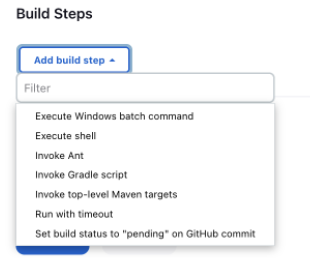

These are your build steps your job will go through

- Post Build instructions

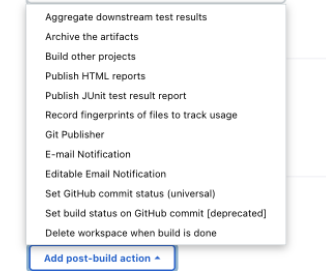

Post is what will happen after a job has run, popular options is to send an email notification / public a report

Add the “Execute Shell” (if on linux) or “Execute Windows Batch command” (if on Windows) and run a simple Hello world from jenkins build

- Click Save
- Build now, and the output will be:

Under build history, the 1st job will appear

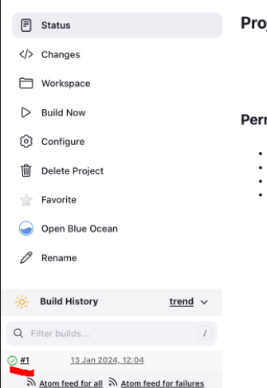

When we click on this, it brings us into the job, with the following information

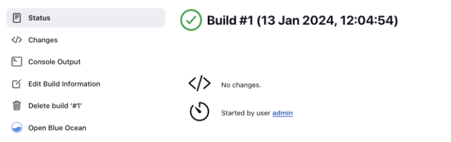

click console output to see what happened:

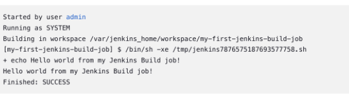

Going back to the dashboard, we can see the last successful / last failure and late duration of a job
# Hello world Jenkins Pipeline

- New item
- name it:
    - my-first-jenkins-pipeline
- select:
    - pipeline
        - Orchestrates long-running activities that can span multiple build agents. Suitable for building pipelines (formerly known as workflows) and/or organizing complex activities that do not easily fit in free-style job type.
    - We will print out “hello world” again, except we will also use Env variables
- click save
- There’s slightly more options, with the same for a build job (triggers, deleting workspaces, etc):
    - Pipeline speed / durability
    - parameterised
        
        *Parameters allow you to prompt users for one or more inputs that will be passed into a build. For example, you might have a project that runs tests on demand by allowing users to upload a zip file with binaries to be tested. This could be done by adding a File Parameter here.
        Or you might have a project that releases some software, and you want users to enter release notes that will be uploaded along with the software. This could be done by adding a Multi-line String Parameter here.*
        
- There’s no option to add a build step, instead it shows either:
    - Pipeline script
    - Pipeline script from SCM
- There’s also a drop down menu, as below:
    - this uses Groovy Jenkins DSL Syntax
    
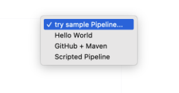

- Hello world
```groovy
pipeline {
agent any
stages {
stage('Hello') {
steps {
echo 'Hello World'
}
}
}
}
```
- github & maven
```groovy
pipeline {
agent any
tools {
// Install the Maven version configured as "M3" and add it to the path.
maven "M3"
}
stages {
stage('Build') {
steps {
// Get some code from a GitHub repository
git 'https://github.com/jglick/simple-maven-project-with-tests.git'
// Run Maven on a Unix agent.
sh "mvn -Dmaven.test.failure.ignore=true clean package"
// To run Maven on a Windows agent, use
// bat "mvn -Dmaven.test.failure.ignore=true clean package"
}
post {
// If Maven was able to run the tests, even if some of the test
// failed, record the test results and archive the jar file.
success {
junit '**/target/surefire-reports/TEST-.xml'
archiveArtifacts 'target/.jar'
}
}
}
}
}
```
- Scripted Pipeline
```groovy
node {
def mvnHome
stage('Preparation') { // for display purposes
// Get some code from a GitHub repository
git 'https://github.com/jglick/simple-maven-project-with-tests.git'
// Get the Maven tool.
// ** NOTE: This 'M3' Maven tool must be configured
// ** in the global configuration.
mvnHome = tool 'M3'
}
stage('Build') {
// Run the maven build
withEnv(["MVN_HOME=$mvnHome"]) {
if (isUnix()) {
sh '"$MVN_HOME/bin/mvn" -Dmaven.test.failure.ignore clean package'
} else {
bat(/"%MVN_HOME%\bin\mvn" -Dmaven.test.failure.ignore clean package/)
}
}
}
stage('Results') {
junit '**/target/surefire-reports/TEST-.xml'
archiveArtifacts 'target/.jar'
}
}
```
- We use the “hello world” sample

```groovy
pipeline {
    agent any

    stages {
        stage('Hello') {
            steps {
                echo 'Hello World from a jenkisn pipeline'
            }
        }
    }
}
```

This is a declarative pipeline, running complex code should be done via a “shared Library”, CICD rules state:

“Keep it simple Stupid” - is the vibe I’m getting

- click save, then run the job and test that it works. Then we come back in and add some Env variables

In a pipeline, it shows you the build time in a stage view, as below:

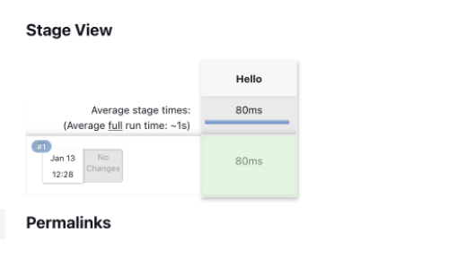

moussing over the green box, we can view the logs for this

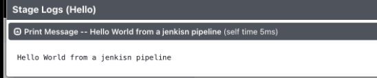

if we click the actual job (bottom left corner as last time) and click “output console” we can see the stages it went through

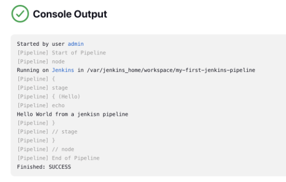

One of the benefits is we can add the pipeline code to a source control management tool like git, and keep a history of changes made etc. Obviously, this would be more important with pipelines rather than single build jobs.

We go back into the configuration page for the pipeline job

Scroll down to the pipeline code (the simple Hello world)

and the Tutor is going to add some Env Variables

we take a copy of the stages {, etc, as below:

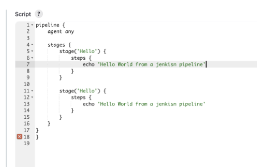

we will edit the second stage, and make it Environment, changes can be seen below:

to get a list of available Environment variables, you can navigate to ([http://localhost:8080/env-vars.html/](http://localhost:8080/env-vars.html/))

- Examples:
    - BUILD_NUMBER
    - BUILD_ID
    - GIT_BRANCH
    - etc
- The more plugins that are installed the more Env variables that are available, install Docker and those would be available etc

NOTE: when typing env. (press Ctrl + space), and a submenu inside the Jenkins IDE, will appear and this lists not just environment variables, but objects / classes/ etc that can be used

One of the areas within Jenkins aka JENKINS_HOME Env variable is locally on the device, this is where Jenkins saves files / information about objects downloaded for use within the pipeline, which can be quite handy in the future

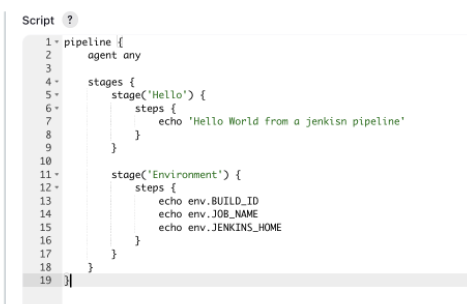

- Click save, and “Build now”
- once run, the stage view changes (we added a second stage called “Environment”)

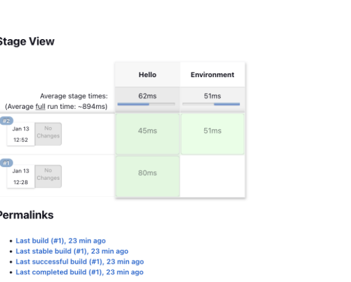

And again, moussing over the green area, we can select “logs”

which displays the output from the echos

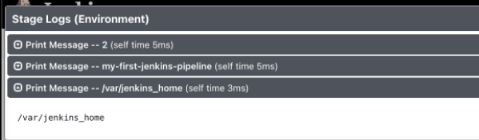

and again going to “Console output” displays:

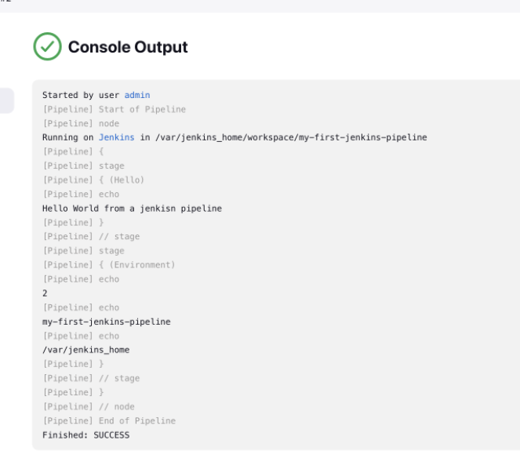

So if we use the info from the JENKINS_HOME echo, we can see all the files

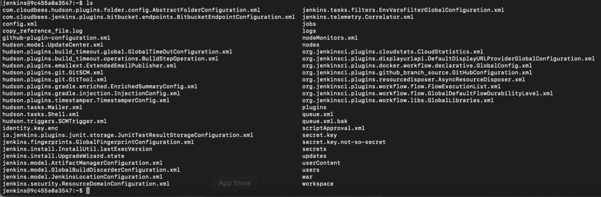
# Parameterized Jenkins Build Jobs

*Parameters allow you to prompt users for one or more inputs that will be passed into a build. For example, you might have a project that runs tests on demand by allowing users to upload a zip file with binaries to be tested. This could be done by adding a File Parameter here.
Or you might have a project that releases some software, and you want users to enter release notes that will be uploaded along with the software. This could be done by adding a Multi-line String Parameter here.*

we will create a parameterized build job!

the idea here is we want to print out the version of java, maybe we want to verify that java is installed we want to know that we are using the right version

We may not want this to be enabled, so we want to be able to disabled when needed

There was an option in pipeline, where you can run a build based on another job (probable use)

- create a new item, called “parameterized-version-build-job”
- select the “freestyle job”
- ok
- click the “This project is parameterized”
    - This will create a submenu, as below:

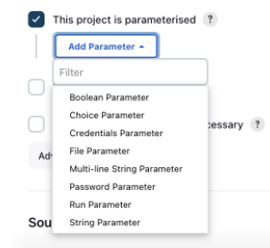

- In this case we choose “Choice parameter”
    - name:
        - shouldWePrintitOut
    - Choices (one choice, per line):
        - Yes
        - No
    - Then scroll down to “Build Steps” and add “Execute Windows …”
    
    ```bash
    if "%shouldWePrintitOut%" == "Yes" (
       java -version
    )
    if "%shouldWePrintitOut%" == "No" (
       echo "Ok, I'll be quite!"
    )
    ```
    

Anytime someone runs this job, they have to provide the input of Yes or No!

On “Build with parameters” the below displays:

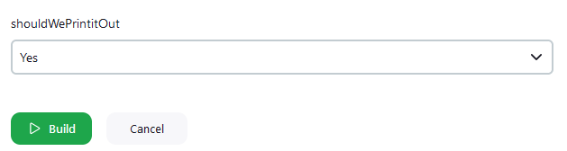

In the console output we now see

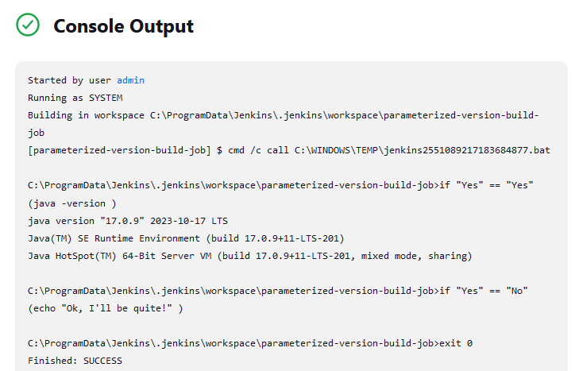

and we get the correct output on No

# User input Jenkins pipeline

- Create a new item
- name it
    - input-check-version-info
- Type:
    - pipeline
- ok
- scroll down to the script section, and select the “Hello world ” example

He adds in and extra stage, with the following:

```bash
pipeline {
    agent any

    stages {
        stage('Hello') {
            steps {
                echo 'Hello World'
            }
        }
        stage('Software Versions') {
            steps {
                bat "mvn --version"
                bat "gradle --version"
                bat "git --version"
            }
        }
        
    }
}
```

- click save
- Build Now

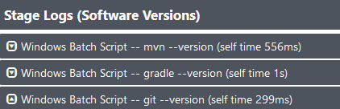

So the tutor, says sometimes you want to be asked “do you want to print out x, y, etc”, or other possible times, it could be ask the user as the pipeline runs, “do you want to deploy to production / do you want to commit to main” etc

Inside the “software version” steps, he adds script {} (will be shown in the below image)

The tutor says that it’s a bad idea to have a lot of script(s) inside the Jenkins pipeline, there used to be scripted pipelines and declarative pipelines. When you’ve got a Jenkins pipeline that starts with the word *pipeline* that's known as a declarative pipeline, you’re not supposed to put a lot of code into it, if you do, you should but that into a *shared library* and reference it (more on those later!)

So the tutor copies in some script, that looks for a response from the user

An input window will come up to the user when the build runs, and we’re gonna get input from the user

NOTE: The if statement in the below code is slightly different from the if statement in the windows batch we did in a previous example, and that's because this time it’s written in the Groovy language

```groovy
pipeline {
    agent any

    stages {
        stage('Hello') {
            steps {
                echo 'Hello World'
            }
        }
        stage('Software Versions') {
            steps {
                script {
                    def response = input message: "Should we print the Java version?",
                    parameters: [choice(choices: "Yes\nNo",
                    description: "Proceed or Abort",
                    name: "What to do???")]
                    if (response=="Yes"){
                        bat "mvn --version"
                        bat "gradle --version"
                        bat "git --version"
                        }
                    }
                }
        }
        
    }
}
```

- click Save & build now

Notice, the job has paused, as underlined below:

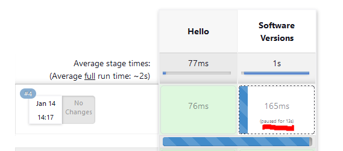

when you click the paused area, it pops up a submenu:

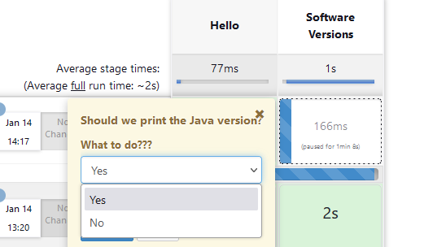

Now when we look at logs, we can see “wait for interactive input”

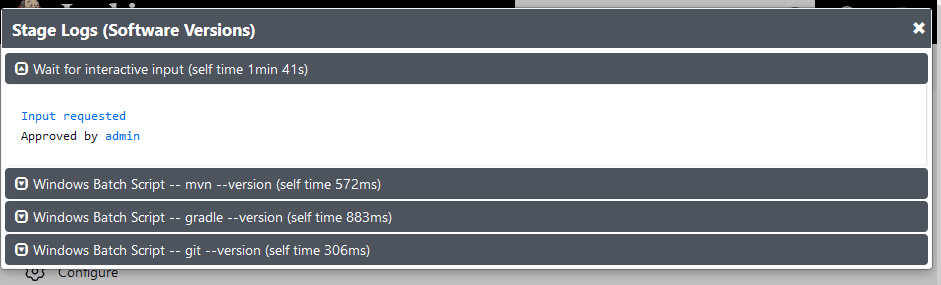

There is a a typo in the input question “Should we print the java version?” It should read software versions

# How to call a job from a pipeline

So the tutor opens the “**parameterized-version-build-job**” and adds a post-build action

- select “Build other projects”
- This has 3 options:
    - Trigger only if build is stable
    - Trigger even if the build is unstable
    - Trigger even if the build fails
- Assuming the “Project to build” textbox, requires the exact name of the other build, you put that name here
    - input-check-version-info
- select the condition:
    - Trigger only if build is stable
    
    What this does, is it “daisy chains” the “input-check…” together with the “parameterized….” job
    
- click save, and run build

So this prints out all the info about java, and when we go back into the other Jenkins build job

we can see the other job is waiting for out input to proceed or otherwise.

**So we have used one build to call another (as it’s successful), that has some interesting possibilities**

**If git has been updated / commits made, then run this build, then get that build to call another build to do something!**

“Pipeline of Pipelines!”
# Jenkins Github Integration

The tutor has a publicly available repo (https://github.com/cameronmcnz/spock-lizard-docker.git) , the demo below, will get Jenkins to pull the repo, call on Maven to test & compiled, get the code packaged and make sure everything is working

- name:
    - build-spock-lizard
- type:
    - freestyle project (we’ll do as a pipeline after)
- Source control management
    - input the git url
    - because it’s public we don’t need credentials
    - it’ll ask for the branch specifier, however the tutor says “we dont really use the master branch anymore, now we use the main branch
        - If your using your own repos, you will need to double check to see if it says Master or Main
- Build steps
    - the tutor adds “Invoke top-level maven target”
        - under goals:
    
    “*For projects that use Maven as the build system. This causes Jenkins to invoke Maven with the given goals and options. A non-zero exit code from Maven makes Jenkins mark the build as a failure. Some Maven versions have a bug where it doesn't return the exit code correctly.*”
    
    - clean compile test
- Click apply & save

This means the code will be pulled down and then it’ll be compiled and tested

- click Build now

if you go to Console output, you can see everything in realtime

The below has been snipped to only show the bottom lines:

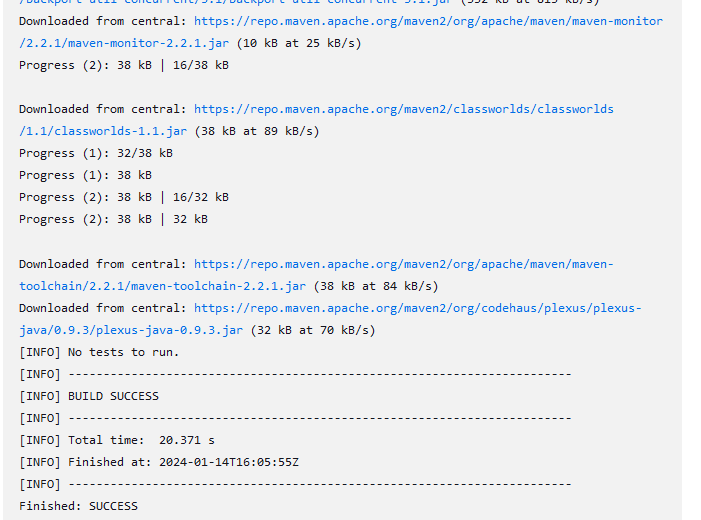

So we could reconfigure this build to look for commit changes in repos, or after another build has completed

The tutor removes a semi colon from his repos code (obviously breaking the code), hit’s build again, and because there was a commit change on the repo, jenkins knows to pull for the latest repo. When he builds it this time, he gets an error

It should be noted, this runs faster than last time, as Jenkins has already pulled down what it needs from maven, and so this part if cached.

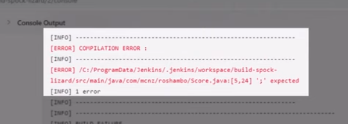

which is very very cool!

The tutor goes and pops the semi colon back in, commits the changes, and builds it once again. and once again it succeeds successfully

The tutor adds, that you would typically have it configured that Jenkins sends emails one fails, etc

You can do the above on Pipelines, but a few tools need to be configured
# Jenkins Tools (aka plugins)

So anytime you need to work with apps like, gradle, docker, sonarQube (*continuous inspection of code quality to perform automatic reviews*), you go to Manage Jenkins > Tools.

There’s a good chance that anytime you add plugins you’ll need to come in here and configure them

**NOTE: Jenkins can sometimes automatically pickup tools installed locally**

When you open up tools, for the first time, you’ll see an option to for JDK installations, I’ll add the location of my installed JDK (java)

It can be a good idea to call (in this example) java Default, and when newer version come out instead of having to change multiple builds to the new version, you only need to change it in a single place

(These look more like pointers, than anything else - you can get Jenkins to download these tools, but I’m holding them all in a specific folder)

NOTE: *We can reference these tools by Name (they need to be referenced exactly how they are in tools within a pipeline*)

# Maven, Github Jenkins Pipeline

- name
    - build-spock-lizard-pipeline
- Type:
    - Pipeline
- copy the url of spock-lizard-docker again ([here](https://github.com/cameronmcnz/spock-lizard-docker.git))
- Head to “Pipeline” area
- From the drop down menu on the left, select “Github + Maven”

This is a larger code sample than the Hello world

```groovy
pipeline {
    agent any

    tools {
        // Install the Maven version configured as "M3" and add it to the path.
        maven "M3"
    }

    stages {
        stage('Build') {
            steps {
                // Get some code from a GitHub repository
                git 'https://github.com/jglick/simple-maven-project-with-tests.git'

                // Run Maven on a Unix agent.
                sh "mvn -Dmaven.test.failure.ignore=true clean package"

                // To run Maven on a Windows agent, use
                // bat "mvn -Dmaven.test.failure.ignore=true clean package"
            }

            post {
                // If Maven was able to run the tests, even if some of the test
                // failed, record the test results and archive the jar file.
                success {
                    junit '**/target/surefire-reports/TEST-*.xml'
                    archiveArtifacts 'target/*.jar'
                }
            }
        }
    }
}
```
Notice under tools, it’s using the M3 (we applied this to the Maven configurations in Tools) so anytime we reference Maven, it will use M3

Below that, it sees the steps for the build

first step will be to pull the repo

- we add the spock-lizard repo here
    - You’ll notice the command that is being used is not actually a git command (using it with git it will throw and error)
    - What this is, is a DSL (Domain specific language) that Jenkins provides you to help you do things

It then goes and runs Maven, in this case as we are on a windows device, we need to comment out that line (*sh "mvn -Dmaven.test.failure.ignore=true clean package"*) and enable the the line starting with “bat” - for batch 

Next it, records & archives the test results from the junit tests to a xml file

Now we have a build that is:

Stages: Build

1. going to pull from git
2. Package (includes compile and Test)

Stage: Post

1. record & archive the results as a Jar file

The code bloc know looks like the below:

```groovy
pipeline {
    agent any

    tools {
        // Install the Maven version configured as "M3" and add it to the path.
        maven "M3"
    }

    stages {
        stage('Build') {
            steps {
                // Get some code from a GitHub repository
                git 'https://github.com/cameronmcnz/spock-lizard-docker.git'

                // Run Maven on a Unix agent.
                //sh "mvn -Dmaven.test.failure.ignore=true clean package"

                // To run Maven on a Windows agent, use
                bat "mvn -Dmaven.test.failure.ignore=true clean package"
            }

            post {
                // If Maven was able to run the tests, even if some of the test
                // failed, record the test results and archive the jar file.
                success {
                    junit '**/target/surefire-reports/TEST-*.xml'
                    archiveArtifacts 'target/*.jar'
                }
            }
        }
    }
}
```
- Click Save & Build

This fails due to “`ERROR: No test report files were found. Configuration error?`"

I have commented out Post completely

NOTE: Pipelines are stateful, so if they fail halfway through, they can startup again, before the failure

Inside the pipelines configurations settings, you can set the “Pipeline speed/durability override”

“*This setting allows users to change the default durability mode for running Pipelines. In most cases this is a trade-off between performance and the ability for running pipelines to resume after unplanned Jenkins outages.*”

When enabled, the following submenu appears:

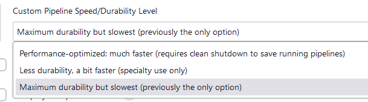

If we go into the Jenkins folder, we can (for this workspace) see all the artifacts. You might set it up, where these files are deployed to an application server, for Continuous Deployment
# Pipeline-as-code

Can be added to repos, and become part of source control, this allows to keep a record of changes, if changes were made and there was an error you can roll back, can see who made the change that caused it.

Doing everything in Jenkins (adding the code to pipelines), we have no way of controlling versions. The tutor looks at one of his repos called https://github.com/cameronmcnz/rock-paper-scissors.git and points to a Jenkinsfile right in there

NOTE: It’s best practice to **NOT** code your pipeline inside of Jenkins but to instead put it in a Jenkins file on your repo

The difference between the code in a pipeline, is that it starts with the keyword “pipeline”, where as the JenkinsFile starts off with the word “node”, this is a **Scripted pipeline.** So there’s:

- Scripted Pipelines
- Declarative Pipelines
- (soon to be) Yaml Pipelines

The things we do today, is with declarative pipelines, we like to avoid using scripted Pipelines as people would put too much code into a script and having a simple lightweight build file is lost

Demo:

Create a new item

- name:
    - build-**rock-paper-scissors-pipeline**
- type
    - pipeline
- Scroll down to the pipeline code area, and from the drop down select “Pipeline script from SCM” (SCM - Source control management)
    - change the SCM type to git, and input the git url
        - **[rock-paper-scissors](https://github.com/cameronmcnz/rock-paper-scissors)**
        - No credentials needed as its public
- Click apply, save & Build now

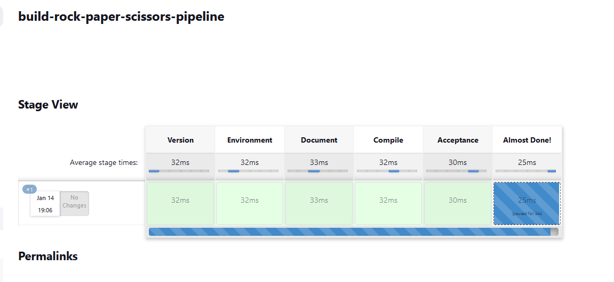

As you can see it uses the JenkinsFile on git to, go through the labelled stages (each stage has no items, on the last stage, there is an option:

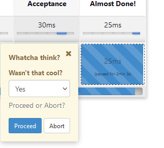

in the JenkinsFile (the last stage step):

```groovy
stage('Almost Done!') {
      def response = input message: 'Whatcha think?', parameters: [choice(choices: 'Yes\nNo', description: 'Proceed or Abort?', name: 'Wasn\'t that cool?')]
        
      if (response=="Yes") {
         echo "I agree!"
      } else {
         echo "You are hard to please."
      }
   }
```
In my version it fails due to not being able to find “static-code-analysis”

But still, it shows we can create a build from a JenkinsFile and call it from Git

# Jenkins Plugins

Not much to say here, need a plugin to do something, run tests on python, find the plugin, need to allow the storing of AWS credentials, find it install it (dont forget, you may need to restart Jenkins)

You will also need to go into Manage Jenkins > Tools and make some configurations for the Plugins installed

I have installed ShinningPanda (which does unit tests on Python apps) 

The tutor installs a plugin that does Static code analysis (this didnt fix the previous demos error)

This plugin, attempts to find bugs, looks at style, etc

The plugin is called “Warnings”

## Demo: Static Code Analysis Results

Create a new freestyle project, name it “static-code-analysis”, head down git, pop in the repo url (for rock-paper-scissors), head to Build steps & Invoke top-level Maven Target, use M3, under goals:

type:

- Package (recall this includes: compile & test)
- pmd:pmd (programmer mistake detection)
- findbugs:findbugs
- checkstyle:checkstyle

So these are Maven plugins and will download these plugins and make them available locally

We also add a “post-build” step

So with the installation of the Warnings plugin, it has added new options to the post build menu

namely “record complier warnings and static analysis results”

so this adds the below:

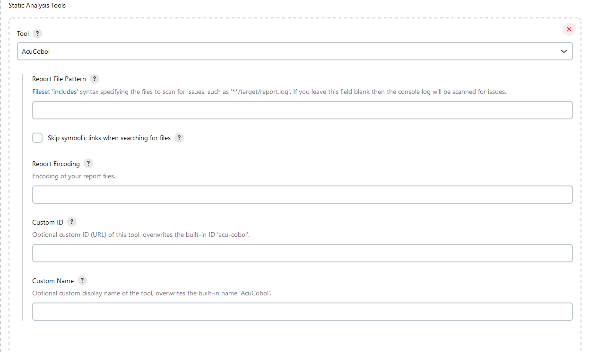

so the tutor adds the tools we listed in “Invoke top-level Maven Target”

- Checkstyle
- findbugs
- checkstyle

clicking the “Advanced” option, adds even more abilities

The tutor adds a “quality gate” (apart of Thresholds)

so from here, you can put in rules, if the code has 10 warnings, dont push to production, or if a build passes all tests push, and everything in-between

- Click apply & save & Build now

The 1st build failed, as I enabled thresholds, which looks like below:

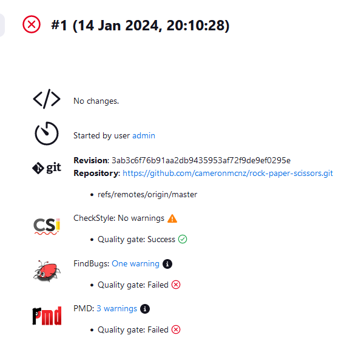

I removed the thresholds, and now the build has no errors:

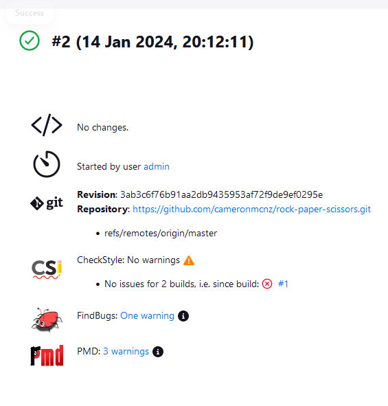

The left and side menu has also changed, and now has new options:

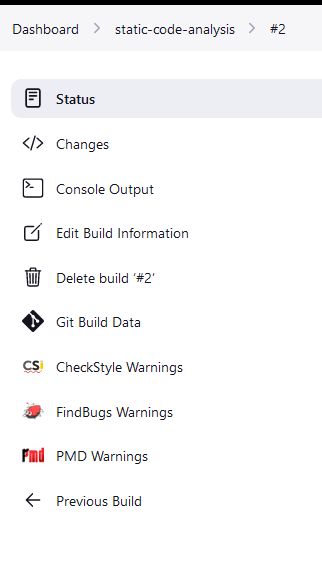

The “FindBugs” now displays the below:

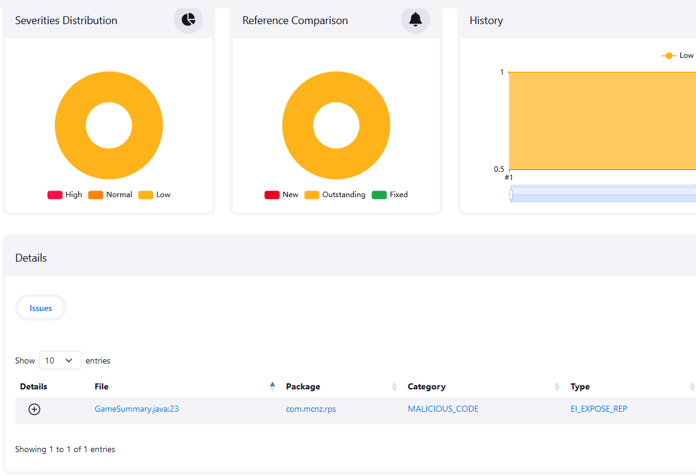

clicking the “GameSummary.java”

will show exactly where in the code the bug was found, and why you shouldn't

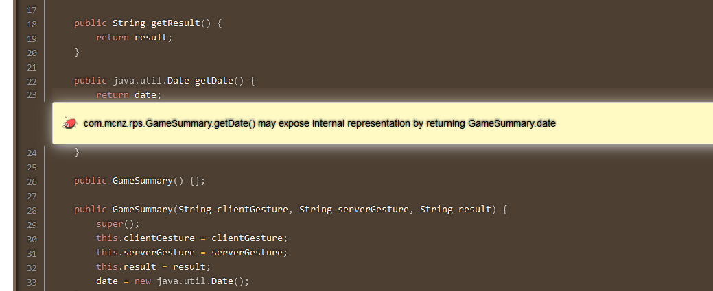

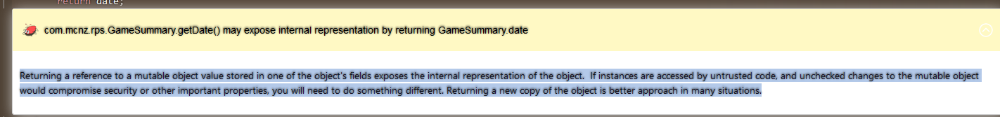

The tutor gets asked frequently, “Can I call a Jenkins build from a pipeline?”, which he replies with **Of course you can**

So the tutor adds a stage to the Jenkins file, as below:
(*indentation changed due to issues with MD file becoming executable*)
```groovy
}
stage('Static Code Analysis'){
build job: 'static-code-analysis'
   }
```

This is added to the bottom of the file

So the reference of “build job: 'static-code-analysis’” is taken as the other build, like saving a variable. So if we changed build job: static… to build job: Build-spock-lizard Jenkins would pull that build and use it at the end of that pipeline

“build-job” is DSL syntax

So when you look at the “build-rock-paper-scissors-pipeline” it passes all

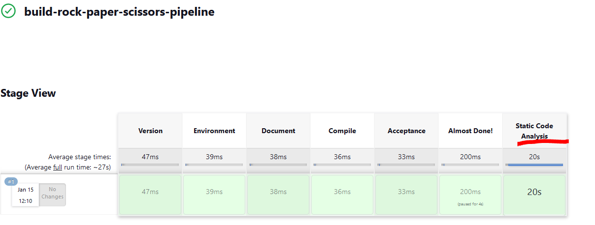

when we go into “static-code-analysis” job we can see warnings etc

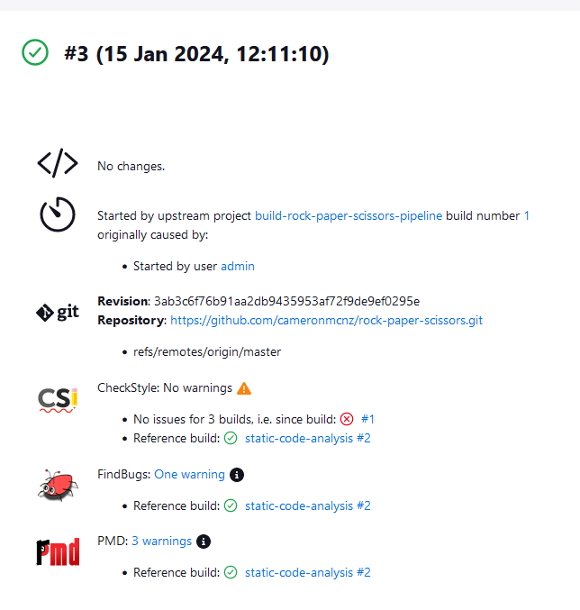

just by referencing “build job: …”

# Advanced CI/CD Jenkins Pipelines
## Jenkins Credentials & Security (**VIP**)

We will create a credential, pull down a spring boot app, compiling it, testing it, packaging it up as an executable jar file, creating a Docker image, then doing a deployment and pushing that docker image right into Docker hub (public)

Managing Jenkins > Credentials > click system > click Global credentials > click add credentials

*NOTE: I’m setting up my Docker account info here*

- Kind (SSH, username, etc)
    - click Username & Password (default)

There is a few options here:

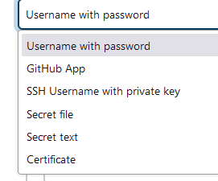

- Scope:
    - Global
- Username:
    - Jadedjelly
- Password
- ID:
    - This is a unique ID, so if I want to reference it, Jenkins will know what it is
    - dockerhub-credentials

We’ll create a new Jenkins pipeline

- name:
    - credentials-pipeline
- type:
    - pipeline

We want to see if we can print out the credentials 

- heading down to the pipeline area, we select the “Hello World” example and add a little bit of script
```groovy
pipeline {
    agent any

    stages {
        stage('Hello') {
            steps {
                script {
                    withCredentials([usernamePassword(credentialsId: 'dockerhub-credentials',
                        usernameVariable: 'USERNAME', passwordVariable: 'PASSWORD')]){
                            
                            bat "echo $PASSWORD"
                            bat "echo $USERNAME"
                        }
                }
            }
        }
    }
}
```

the syntax “withCredentials” will go in and take a look at a credential that you have created and using the usernameVariable & passwordVariable will save them to USERNAME & PASSWORD (you can have these as any variables you want) and then print them to the output

- Save and Build now

When we look at the logs, we can see the output (with Password, this is not shown in the tabable point and needs to be clicked

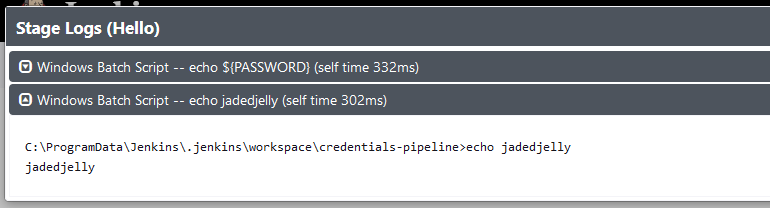

## Spring boot & Jenkins

***Spring Boot is an open-source, microservice-based Java web framework offered by Spring***

We will create a credential, pull down a spring boot app, compiling it, testing it, packaging it up as an executable jar file, creating a Docker image, then doing a deployment and pushing that docker image right into Docker hub (public)

**REPO**: We will be using the https://github.com/cameronmcnz/spock-lizard-docker.git repo for this

## Jenkins, Docker, Maven & Github

- Create a new item
- Name:
    - spring-boot-jenkins-deployment
- type:
    - pipeline
- head down to Pipeline
    - select “Github + Maven Pipeline”

1st stage:

Compile and test

- so we pull the git
- run maven to compile it and test it
```groovy
pipeline {
    agent any

    stages {
        stage('Compile and Test') {
            steps {
                // Get some code from a GitHub repository
                git 'https://github.com/cameronmcnz/spock-lizard-docker.git'

                // Run Maven on a Unix agent.
                // sh "mvn -Dmaven.test.failure.ignore=true clean package"

                // To run Maven on a Windows agent, use
                bat "mvn clean compile test"
            }
        }
```

2nd stage:

create the jar file

- again use Maven and a little spring “booty” syntax
    - clean package spring-boot:repackage

```groovy
stages {
        stage('Build Spring Boot jar file') {
            steps {

                bat "mvn clean package spring-boot:repackage"
            }
        }        
    }
```

3rd Stage:

We create the Docker Image

without the Docker plugin:

- we run
    - bat "docker build -t cameronmcnz/rps-for-jenkins-tutorial:latest .”

with the Docker plugin

- we run
    - docker.build “cameronmcnz/rps-for-jenkins-tutorial:latest .”

Since I dont have the plugin installed, we’ll need to do it without

```groovy
stages {
        stage('Creating the Docker Image') {
            steps {
                bat "docker build -t cameronmcnz/rps-for-jenkins-tutorial:latest ."   
            }
        }         
    }
```

4th stage:

we deploy to Docker Hub

- Using the Script from our testing docker pipeline, we did earlier, didn’t work for me, so the below example is after 17 attempts
- this will be how Jenkins uses our credentials to push to Docker Hub

```groovy
script{
                    docker.withRegistry('https://index.docker.io/v1/', 'dockerhub-credentials') {
                            bat 'docker push jadedjelly/rps-for-jenkins-tutorial:latest'
                }
            }
```

NOTE: I changed the push target to my own repo

- Click save & Build now

(after some {} issues, it’s now running)

(some more issues with single vs double quotes)
----------------------------------------------------------------------------------------------------------------------
# Nana - Devops Bootcamp - Jenkins Module

## Intro to build automation
What is build automation?
Process of automating: (at the heart of Devops)
- Retrival of source code
- execution of automated tests
- compiling into binary code/ build docker image
- pushing of artifacts to a repo
- deploying of artifacts

Doing this manually, is a pain and takes time... who the hell wants that?
- stashing work changes to main
- logging into correct docker repo
- setting up test enrio's to run tests
- executing tests
- building images and pushing to a repo
(no thank you!)

We setup a dedicated server to do the above for us, leaving us to do other tasks
Test code > Build app > push to repo > deploy to server
- test enviro prep'd
- docker creds configured
- all required tools installed
- trigger automatically

What is Jenkins & what can you do with it?
- Build automation tool
- Installed to a dedicated server
- has a UI
- Install what you need (docker, maven, gradle, etc)
- config tasks (run test, build, deploy etc)
- config for auto trigger of workflow
- build, publish & deploy artifacts
- send notifications (pass, fail, etc)

Integration with many tools:
This is done via plugins
- Docker, repos, deployment servers, build tools
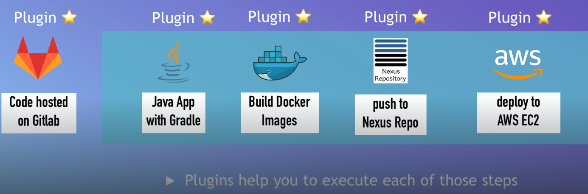

How does it work & what do we need to config?
Run test > Build tools need to be available / installed
- with build tools (maven, gradle, etc), we run things like:
    - npm test, gradlew test, nvm test, etc
- config test enviros (test DB)

Build apps > Build tools or Docker available

- w/ Docker execute docker commands:
    - docker build
- with build tools you execute build commands: 
    - npm package, gradlew build, etc

Publish Docker image > store creds in Jenkins

- Jenkins user must have access to all techs and platforms

## Install Jenkins
[demo here](https://github.com/jadedjelly/nana-techworld-devops-bootcamp/blob/main/demo_projects/M8_jenkins/M8_Jenkins_README.md#install-jenkins-on-digitalocean)

## Intro to Jenkins UI

2x roles in Jenkins:
Jenkins Administrator (has an additional menu option, "Manage jenkins" - system, Install plugins, tools, creates users, view logs, credentials, etc)
- Admins & manages 
- Sets up Clusters
- Installs plugins
- Backups jenkisn data

Jenkins User
- Creates item / jobs / workflows

## Install Build tools in Jenkins

[demo here](https://github.com/jadedjelly/nana-techworld-devops-bootcamp/blob/main/demo_projects/M7_Docker/M8_Jenkins_README.md#Create-a-CI-Pipeline-with-Jenkinsfile-(Freestyle,-Pipeline,-Multibranch-Pipeline))

We have 2x examples:
- a Java app: 
    - this will need access to Maven tools in order to run test and package
- a Javascript app:
- this will need Node & npm tools, to run test, package & push to a repo

Obviosuly, pending on the language your app is developed will dictate on what tools you will need installed / available & configured on Jenkins.

2x ways to to install and configure these tools:
- Jenkins Plugins
    - Much easier to do, but is restrictive, done via the plugins menu
- installed directly inside the container / server (installation pending)
    - Longer to do, but far more flexible (more apparent during the demo)

Configure Plugin for Maven & Install npm and Node in Jenkins Container
[demo here](https://github.com/jadedjelly/nana-techworld-devops-bootcamp/blob/main/demo_projects/M7_Docker/M8_Jenkins_README.md#Create-a-CI-Pipeline-with-Jenkinsfile-(Freestyle,-Pipeline,-Multibranch-Pipeline))

## Jenkins Basics Demo - Freestyle job
[demo here](https://github.com/jadedjelly/nana-techworld-devops-bootcamp/blob/main/demo_projects/M8_jenkins/M8_Jenkins_README.md#Create-a-CI-Pipeline-with-Jenkinsfile-(Freestyle,-Pipeline,-Multibranch-Pipeline))

When you create a new item / job you have multiple optiosn to choose from: (*Taken from Jenkins 2: Up & Running*)

**Freestyle project**
- easiest to setup, relativley open way to projects can be constructed to do many differnt tasks, provides optiosn to execute shells
**Pipeline**

- Manages long running jobs that can span multiple build agents, steps & logic stucture in groovy (can be stored externally in a Jenkinsfile)

**Multi-configuration project**
- great for jobs that have different configs, like testing on multiple enviros / platform specific needs, over multiple nodes / slaves, uses "axes" to define a definition type (*Slaves, label expression, user-define axis - pg 290 exaplins this*)
***Recommend** - *testing with book code to see this in action if Nana doesn't*

**Folder**

- Creates a folder for nested items / jobs (not pipeline or a project, more of a way to organise things)

**Multibranch pipeline**

- Can automatically manage & build branches managed in SCM if it recognises them as Jenkins Projects, can also create new pipelines for each branch it detects in the repo, using a Jenkinsfile as a marker and scanning (aka branch indexing)

**Organization folder**

- Scans a repo, and groups projects as a "team", can setup triggers, or other parameters.
Easiest to think of it as a collection of *Multibranch pipeline projects*

The below demos are available )
- Install a plugin via the plugins option in "manage jenkins"
- Configure Git Repository
- Complete task from git repo in Jenkins job
- Run test & build Java Application

## Docker in Jenkins
So we need to have docker commands available to build docker images, so we need them available in Jenkins in order to be 
able to use them. A common way to do this is to attach a volume to jenkins from the host file. 
So we need to mount the docker.sock file to the container, but first we need to take the container down, and reattach it with this volume, as below (The demo linked below will show this )


)


